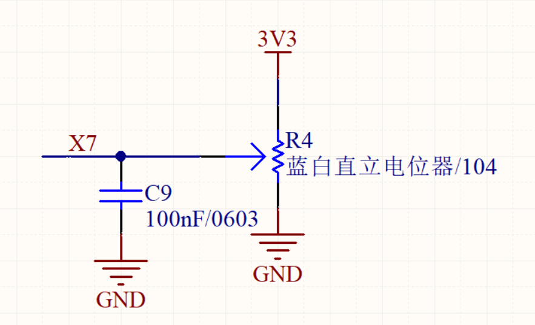
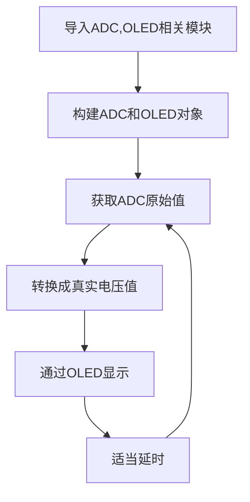
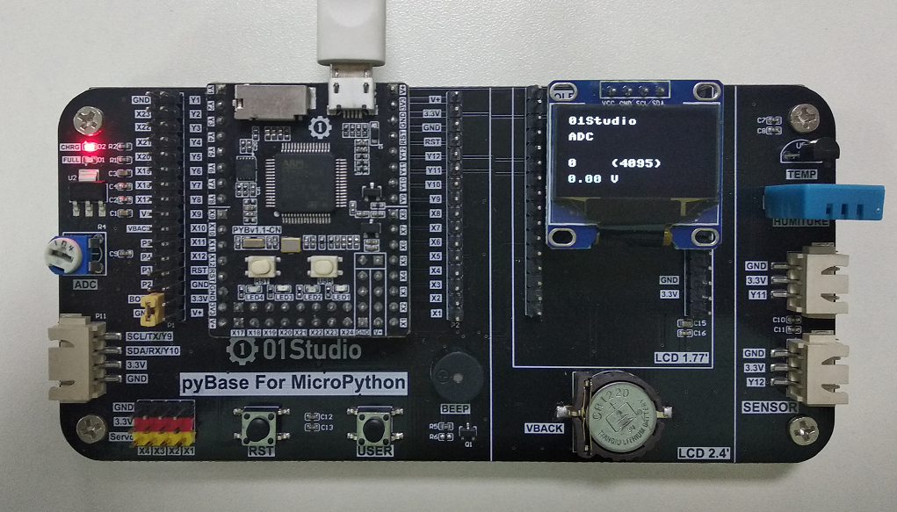
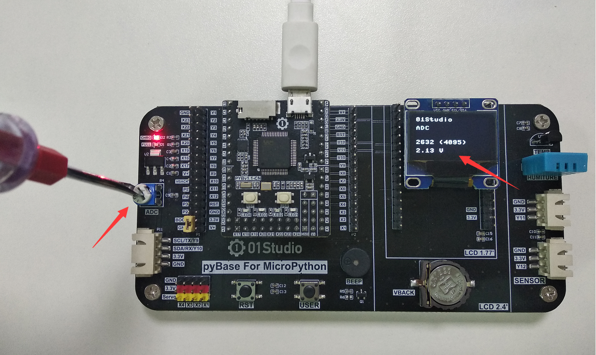

# ADC（电压测量）

## 前言
ADC(analog to digital conversion) 模拟数字转换。意思就是将模拟信号转化成数字信号，由于单片机只能识别二级制数字，所以外界模拟信号常常会通过ADC转换成其可以识别的数字信息。常见的应用就是将变化的电压转成数字信号实现对电压值测量。

## 实验平台
pyBoard开发套件。


## 实验目的
通过编程调用MicroPython的内置ADC函数，实现测量0-3.3V电压，并显示到屏幕上。

## 实验讲解

pyBoard的X7引脚连接到了pyBase的电位器，通过电位器的调节可以使得X7引脚上的电压变化范围实现从0-3.3V。



pyb内置了ADC对象，使用说明如下：

## ADC对象

### 构造函数
```python
adc = pyb.ADC(pin)
```
构建ADC对象，ADC引脚对应如下：

- `pin` ：支持ADC的Pin对象，如：'X7'。


### 使用方法
```python
adc.read()
```
获取ADC值，测量精度是12位，返回0-4095（对应电压0-3.3V）。

<br></br>

更多用法请阅读官方文档：<br></br>
https://docs.01studio.cc/library/pyb.ADC.html#pyb-adc

<br></br>

熟悉ADC使用方法后，我们通过代码实现周期性测量引脚电压，代码编程流程图如下：




## 参考代码

```python
'''
实验名称：ADC-电压测量
版本：v1.0
平台：pyBoard开发套件
作者：01Studio
说明：通过对ADC数据采集，转化成电压在显示屏上显示。ADC精度12位，电压0-3.3V。
'''

#导入相关模块
import pyb, time
from machine import Pin,SoftI2C
from ssd1306 import SSD1306_I2C

#初始化相关模块
i2c = SoftI2C(sda=Pin("Y8"), scl=Pin("Y6"))
oled = SSD1306_I2C(128, 64, i2c, addr=0x3c)
adc = pyb.ADC('X7') #Pin='X7'

while True:

    oled.fill(0)  # 清屏显示黑色背景
    oled.text('01Studio', 0, 0)  # 首行显示01Studio
    oled.text('ADC', 0, 15)      # 次行显示实验名称

    #获取ADC数值
    oled.text(str(adc.read()),0,40)
    oled.text('(4095)',40,40)

    #计算电压值，获得的数据0-4095相当于0-3V，（'%.2f'%）表示保留2位小数
    oled.text(str('%.2f'%(adc.read()/4095*3.3)),0,55)
    oled.text('V',40,55)

    oled.show()
    time.sleep(1) #延时1秒
```

## 实验结果

在Thonny IDE运行代码, 可以看到下面的实验结果：

- 电位器顺时钟拧到尽头是0V



通过调节电位器，可以发现电压在不断变化。



:::danger 警告
ADC测量输入电压请勿大于3.3V，有可能烧坏主控芯片。
:::
