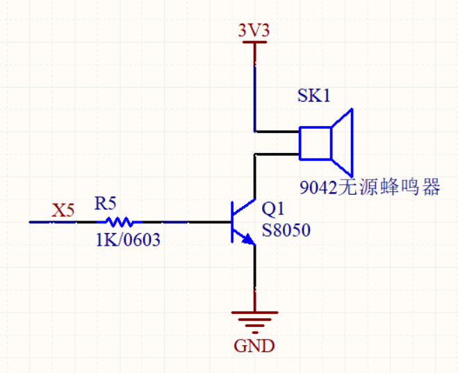
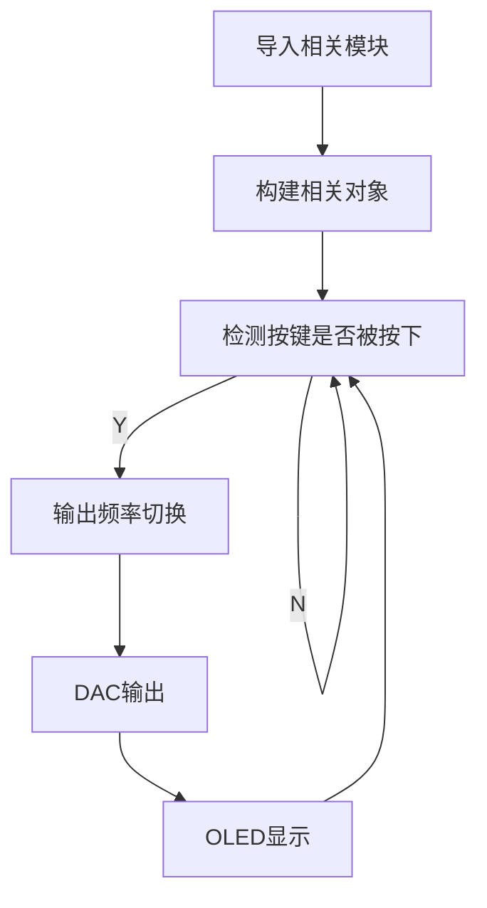
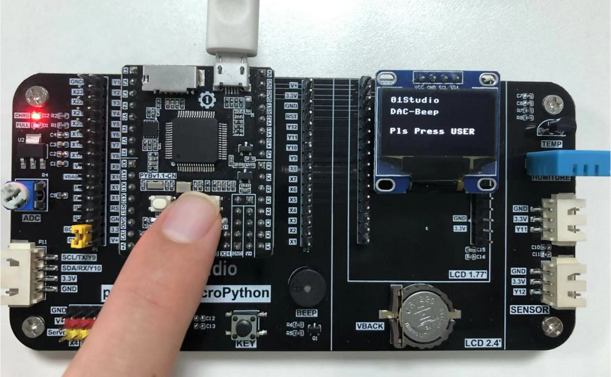
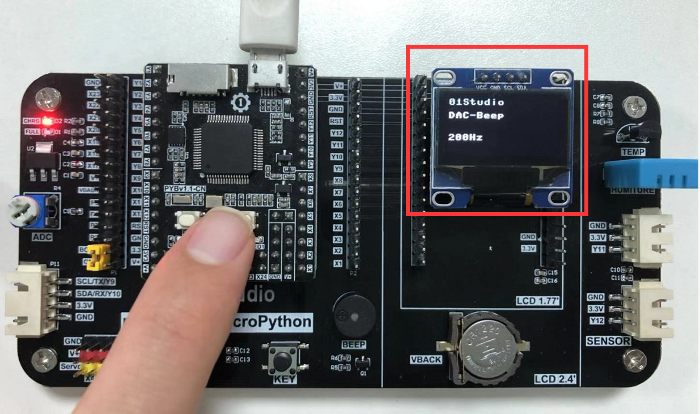

# DAC（无源蜂鸣器）

## 前言
DAC（Digital-to-Analog Converter）数字模拟转换器。我们前面做的ADC实验，是将模拟信号转化为了数字信号。这一节做的实验刚好是反转，我们将特定的数字信号通过DAC输出。输出的形式多种，如特定电压、信号波形（正弦波、方波、三角波等），有条件的用户可以用示波器来观看输出。本章节利用开发板上的无源蜂鸣器，通过DAC输出不同的频率来改变其音色。

## 实验平台
pyBoard开发套件。


## 实验目的
通过DAC输出不同频率的方波来驱动蜂鸣器。

## 实验讲解

蜂鸣器分有源蜂鸣器和无源蜂鸣器，有源蜂鸣器的使用方式非常简单，只需要接上电源，蜂鸣器就发声，断开电源就停止发声。而本实验用到的无源蜂鸣器，是需要给定指定的频率，才能发声的，而且可以通过改变频率来改变蜂鸣器的发声音色，以此来判定pyBoard的DAC输出频率是在变化的。

PyBoard上有2个DAC引脚，分别是X5和X6，其中X5连接了无源蜂鸣器。如下图所示：



在了解了原理图后，我们来看看内置ADC模块的函数使用方法。

## DAC对象

### 构造函数
```python
pyb.DAC(port, bits=8)
```
DAC对象位于pyb模块下。

- `port` ：1或者2;
- `bits` ：输出分辨率，8或12;

### 使用方法
```python
DAC.noise(freq)
```
产生特定频率的噪声信号。

- `freq` ：频率;

<br></br>

```python
DAC.triangle(freq)
```
产生特定频率的三角波信号。

- `freq` ：频率;

<br></br>

```python
DAC.write(value)
```
输出特定电压。

- `value` ：value值取决于前面bits参数，范围为 0 - 2^bits-1（例：8bits那么范围就是0-255）;

<br></br>

```python
DAC.write_timed(data, freq, mode)
```
将data(字节数组)的内容以特定频率输出。

- `data` ：字节数组;
- `freq` ：频率;
- `mode` ：模式;
    - `DAC.NORMAL` ：单次模式;
    - `DAC.CIRCULAR` ：循环模式;    

<br></br>

更多用法请阅读官方文档：<br></br>
https://docs.01studio.cc/library/pyb.DAC.html#pyb-dac

<br></br>

无源蜂鸣器我们可以用特定频率的方波来驱动，方波的原理很简单，就是一定频率的高低电平转换，使用**DAC.write(0)**和**DAC.write(255)**交替输出即可，可以通过延时函数来控制输出变换的次数。实际过程中我们没必要用低效率的延时函数，因为看到DAC模块里面已经定义好了特定格式输出的函数**DAC.write_timed(data,freq,mode)**，将mode设定成循环模式，就可以循环不断地输出指定频率的信号了。


结合我们前面的按键实验，我们可以通过USER按键按下来切换输出频率，并在OLED上直观体验。具体流程如下：



## 参考代码

```python
'''
实验名称：DAC-蜂鸣器
版本：v1.0
平台：pyBoard套件
作者：01Studio
说明：通过USER按键让DAC输出不同频率的方波来驱动蜂鸣器。
'''

#导入相关模块
from pyb import DAC,Switch
from machine import Pin,SoftI2C
from ssd1306 import SSD1306_I2C

#初始化相关模块
i2c = SoftI2C(sda=Pin("Y8"), scl=Pin("Y6"))
oled = SSD1306_I2C(128, 64, i2c, addr=0x3c)

sw = Switch()     #定义按键对象名字为sw
dac = DAC(1)     #定义DAC对象名字为dac，输出引脚为X5

#定义4组频率值：1Hz、200Hz、1000Hz、5000Hz
freq=[1,200,1000,5000]

# 定义8位精度下方波的值。0、255分别对应输出0V、3.3V。需要定义成字节数组。
buf = bytearray(2)
buf[0]=0
buf[1]=255

key_node = 0  #按键标志位
i = 0         #用于选择频率数组

##############################################
#  按键和其回调函数
##############################################
def key():
    global key_node
    key_node = 1

sw.callback(key)  #当按键被按下时，执行函数key()

##############################################
#  OLED初始显示
##############################################
oled.fill(0)  # 清屏显示黑色背景
oled.text('01Studio', 0, 0)  # 首行显示01Studio
oled.text('DAC-Beep', 0, 15)  # 次行显示实验名称
oled.text('Pls Press USER', 0, 40)  # 显示当前频率
oled.show()

while True:

    if key_node==1: #按键被按下
        i = i+1
        if i == 4:
            i = 0
        key_node = 0 #清空按键标志位
        # DAC输出指定频率
        dac.write_timed(buf, freq[i]*len(buf), mode=DAC.CIRCULAR)

        #显示当前频率
        oled.fill(0)  # 清屏显示黑色背景
        oled.text('01Studio', 0, 0)  # 首行显示01Studio
        oled.text('DAC-Beep', 0, 15)  # 次行显示实验名称
        oled.text(str(freq[i]) + 'Hz', 0, 40)  # 显示当前频率
        oled.show()

```

以上代码中DAC的函数使用非常简单，但为了让实验能更直观，加入按键和OLED模块后需要更多的代码来支持，但编程逻辑不变。以上代码有几个关键的地方需要补充说明一下：

（1）由于底层独特的操作方式，使得输入的数据buf必须是字节数组，所以需要加入bytearray()来定义；

（2）Key_node是全局变量，因此在key()函数里面用该变量必须添加global key_node代码，否则会在函数里面新建一个样的变量；

（3）变量i的作用是为了让DAC选择指定的频率数组freq输出。


## 实验结果

将示例程序文件夹的 ssd1306.py 上传到开发板文件系统，在Thonny IDE运行代码：

oled提示按下USER按键：



运行代码，可以听到蜂鸣器依次发出不同频率的响声。



有条件的朋友可以使用示波器连接X5，观察信号波形的变化：


到了这一节，我们发现实验对象函数使用方法非常简单，而随着要实现功能的复杂化让编程的代码数量变多，逻辑也略显复杂。这是好事，让我们可以将更多精力放在应用上，做出更多好玩的创意。而不需要过多的关注复杂的底层代码开发。