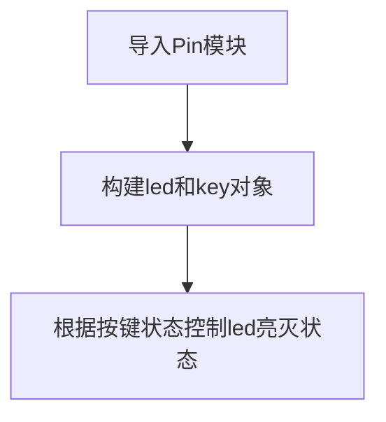
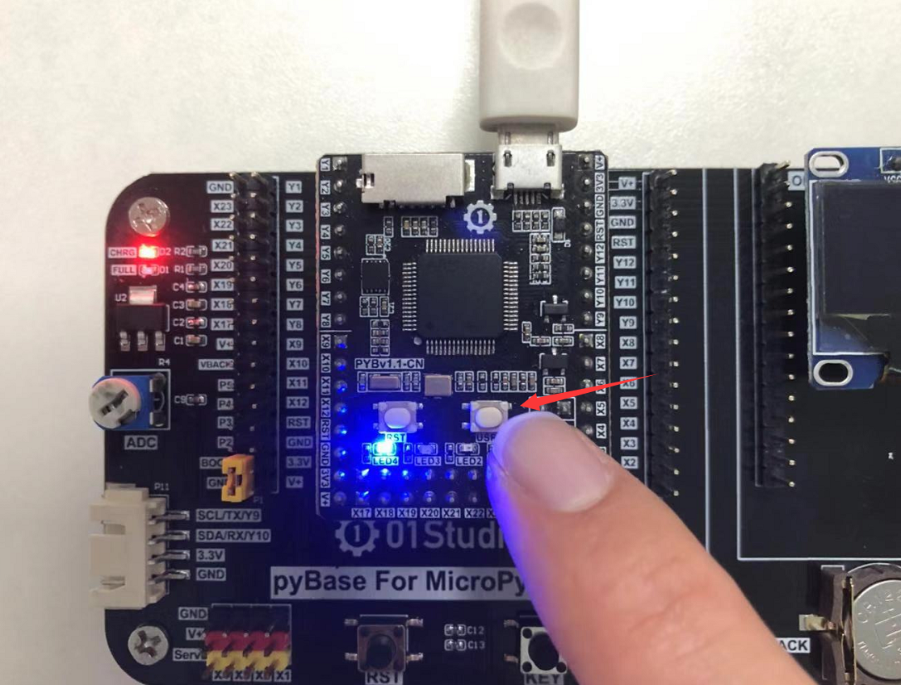

# GPIO

## 前言
我们能看到pyboard和MicroPython开发套件上引出了非常多的引脚和GPIO口（General Purpose Input/Output，通用输入输出口），前两节的LED和按键实验背后原理都是使用GPIO来实现的，只是被提前封装好了。今天我们来做一下GPIO口的实验。

## 实验目的
学会使用微处理器的GPIO的输入/输出，使用GPIO方式来操作LED和按键。

## 实验讲解

前面实验实验了pyb模块来控制LED和按键，pyb顾名思义就是早期用于pyBoard的专用模块，随着micropython移植到越来越多平台，逐渐改为更为通用的machine模块，基本上pyboard的每个IO口都可以配置成特定的GPIO方式来进行应用。使用Pin就需要看开发板原理图，确认要操作IO的编号。

- 按键的引脚是 B3或者X17


- LED蓝灯的引脚是 B4


:::tips 提示
PBx是STM32芯片引脚，X17是pyboard专门定义的引脚。都可以作为引脚编号使用。详情请看[PinOUT图](../intro/product.md#引脚图)
:::

我们先来了解一下machine中GPIO使用到的Pin对象的构造函数和使用方法：

## Pin对象

GPIO引脚对象。

### 构造函数
```python
machine.Pin(id, mode, pull)
```

machine模块下的Pin对象。

- `id` ：芯片引脚编号。如：X17, B4。
- `mode` ：输入/输出模式。
    - `Pin.IN` : 输入模式；
    - `Pin.OUT` : 输出模式；   
- `pull`: 上下拉电阻配置。
    - `None` : 无上下拉电阻；
    - `Pin.PULL_UP` : 上拉电阻启用；
    - `Pin.PULL_DOWN` : 下拉电阻启用。

### 使用方法

```python
Pin.value([X])
```
配置引脚电平值：
- `输出模式` ：输出电平值。
    - `0` : 输出低电平；
    - `1` : 输出高电平。
- `输入模式` ：无需参数，获取当前引脚输入电平值。

<br></br>

```python
Pin.high()
```
引脚输出高电平。

<br></br>

```python
Pin.low()
```
引脚输出低电平。

<br></br>

更多用法请阅读官方文档：<br></br>
https://docs.01studio.cc/library/machine.Pin.html#machine-pin

<br></br>

本节实现当按键按下时，LED蓝灯常亮，松开时熄灭。代码编写流程如下：



## 参考代码

```python
'''
实验名称：GPIO
版本：v1.0
实验平台：pyBoard
作者：01Studio
'''

from machine import Pin

#将LED(4)-"B4"配置成推挽输出模式
led=Pin('B4',Pin.OUT_PP)

#将USR按键-"X17"配置为输入方式
key = Pin('X17', Pin.IN, Pin.PULL_UP)

while True:

    if key.value()==0: #USR被按下接地
        led.high()  #点亮LED（4）蓝灯

    else:
        led.low()   #关闭LED（4）蓝灯

```

## 实验结果

在Thonny IDE中运行代码，可以看到当按键KEY按下时，LED点亮，松开时熄灭。



machine模块下的Pin对象，能调用所有GPIO，通用性更强。