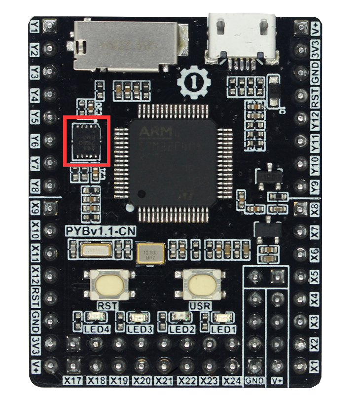
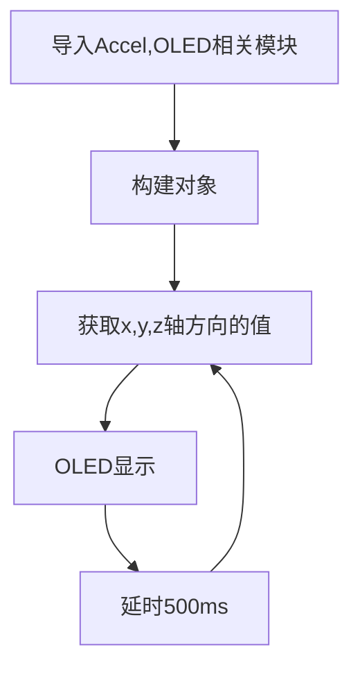
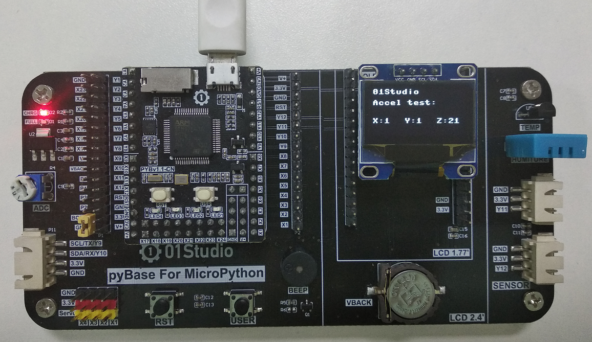
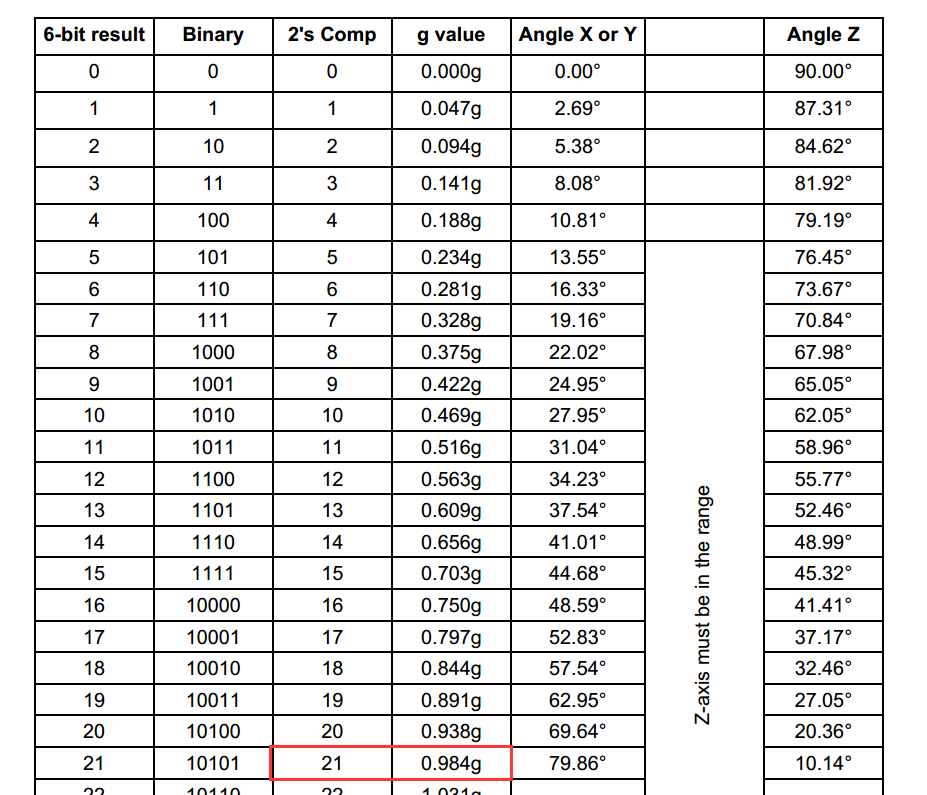

# 三轴加速度计

## 前言
三轴加速度传感器用途广泛，可以计算物体倾斜角度，加速度以及通过算法来计算步数，比如日常用的手环计步。Pyboard上集成了一款三轴加速度计芯片（MMA7660），可以直接通过编程使用。



## 实验平台
pyBoard开发套件。


## 实验目的
了解三轴加速传感器的工作原理，通过编程获取其各个方向的数值（X轴、Y轴、Z轴）并在OLED上显示。

## 实验讲解

MMA7660三轴加速度计的使用原理很简单，就是在x、y、z各个方向根据受力情况通过数据方式呈现。测量结果范围是-32至31，大约为-1.5g至1.5g（g为重力加速度，9.8m/s^2）。我们只需要知道以上3个方向的值，便可以计算出各个方向的加速度。


我们来了解一下加速度计对象的构造函数和使用方法：

## Accel对象

### 构造函数
```python
pyb.Accel()
```
Accel对象位于pyb库下。

### 使用方法

```python
Accel.x()
```
获取X轴上的值。

<br></br>

```python
Accel.y()
```
获取y轴上的值。

<br></br>

```python
Accel.z()
```
获取z轴上的值。

<br></br>

更多用法请阅读官方文档：<br></br>
https://docs.01studio.cc/library/pyb.Accel.html

<br></br>

在本实验中我们循环500ms采集一次数据，并在oled屏显示，代码编写流程图如下：




## 参考代码

```python
'''
实验名称：三轴加速度计
版本：v1.0
平台：pyBoard开发套件
作者：01Studio
说明：通过编程获取其各个方向的数值（X轴、Y轴、Z轴）并在OLED上显示。
'''

import pyb,time
from machine import Pin,SoftI2C
from ssd1306 import SSD1306_I2C

#初始化相关模块
i2c = SoftI2C(sda=Pin("Y8"), scl=Pin("Y6"))
oled = SSD1306_I2C(128, 64, i2c, addr=0x3c)

accel = pyb.Accel()

while True:

    oled.fill(0) #清屏
    oled.text('01Studio', 0, 0)
    oled.text('Accel test:',0,15)

    #获取x,y,z的值并显示
    oled.text('X:'+str(accel.x()),0,40)
    oled.text('Y:'+str(accel.y()),44,40)
    oled.text('Z:'+str(accel.z()),88,40)
    oled.show()

    time.sleep_ms(500) #延时500ms

```

## 实验结果

在Thonny IDE运行代码，可以看到OLED显示X/Y/Z的值，用户可以根据翻转、抖动开发板等方式来观察X/Y/Z的值的事实变化情况。



细心的用户或许会发现，当开发板静止在桌面水平面上，Z的值始终保持在20-21左右。查看MMA7660芯片手册，看到0.98g也就是重力加速度的值约为21，而板子平放静止的时候Z轴有个重力加速的，这不难理解。



在Python嵌入式编程中，有些时候我们需要学看芯片手册，手册不用全看，可以锻炼到的是学会从芯片手册中寻找关键信息，以理解实际产品的基本参数。
