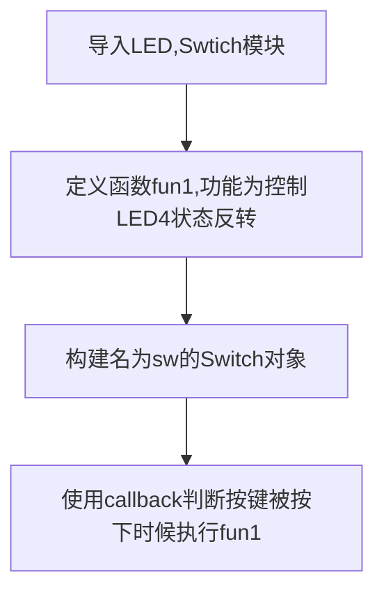

# 按键

## 前言
按键是最简单也最常见的输入设备，很多产品都离不开按键，包括早期的iphone，今天我们就来学习一下如何使用MicroPython来编写按键程序。有了按键输入功能，我们就可以做很多好玩的东西了。

## 实验目的
使用按键功能，通过检测按键被按下后，改变LED(4)蓝灯的亮灭状态。

## 实验讲解

pyBoard上有2个按键，RST和USER，RST顾名思义是复位用的，所以真正自带可以用的就只有1个按键USER。 

和LED一样，pyBoard的micropython固件也集成了一个按键对象Switch。

## Switch对象

按键对象。

### 构造函数
```python
from pyb import Switch

sw = Switch()
```

Switch位于pyb模块下。

### 使用方法
```python
sw.value()
```
按键状态：返回值：
- `0` : 按键没按下；
- `1` : 按键按下。

<br></br>

```python
sw.callback(fun)
```
注册按键按下时执行的函数。

更多用法请阅读官方文档：<br></br>
https://docs.01studio.cc/library/pyb.Switch.html#pyb-switch

<br></br>

跟之前的实验一样，首先导入LED和Swtich模块，先定义函数fun1()用来处理LED(4)反转。通过callback指令使按键被按下时候执行fun1()函数。代码编写流程如下：



## 参考代码

```python
'''
实验名称：按键
版本：v1.0
运行平台：pyBoard
作者：01Studio
'''

from pyb import LED,Switch

#LED4状态翻转函数
def fun1():
    LED(4).toggle()

sw = Switch()     #定义按键对象名字为sw
sw.callback(fun1) #当按键被按下时，执行函数fun1()
```

可以看到只需要三行代码就实现了我们想要的功能。


## 实验结果

在Thonny IDE中运行代码，可以看到当按键KEY每次被按下时候，LED蓝灯亮灭状态发生翻转。


按键作为我们学习的第一个输入设备，有了输入设备我们就可以跟硬件做人机交互了，这对后面的学习非常有意义。按键在MicroPython下开发也显得很简单，我们同样可以根据自己的理解和经验来优化代码。