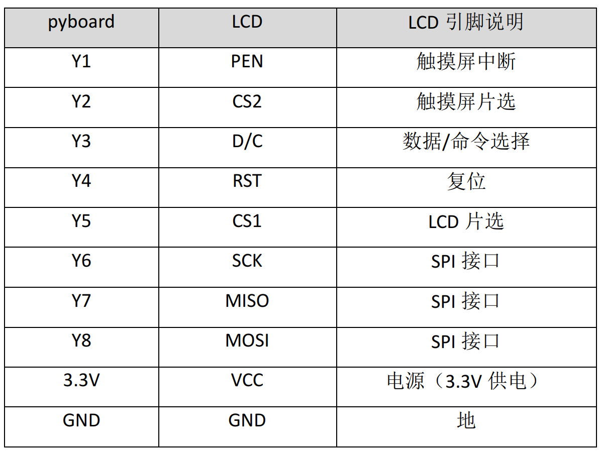
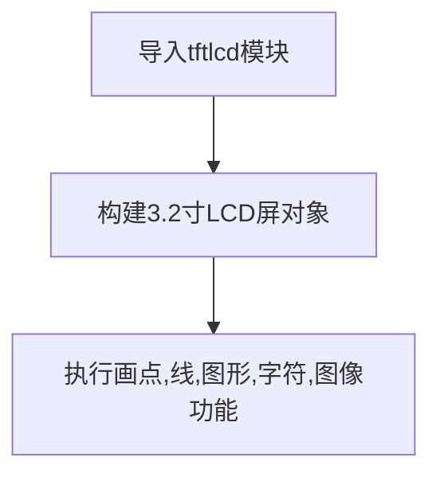
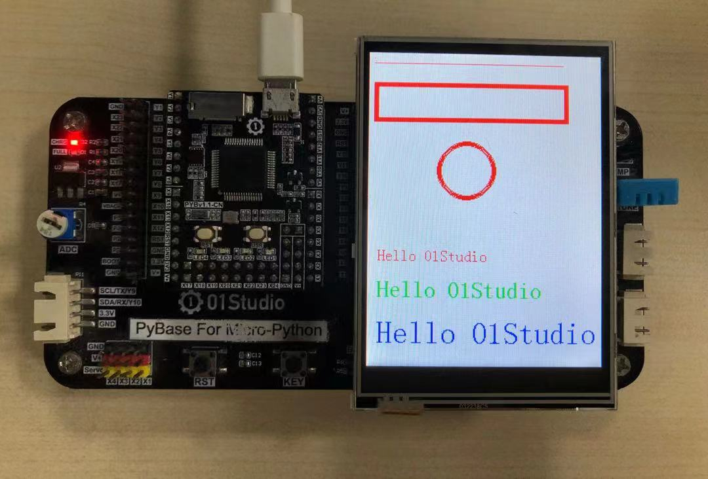
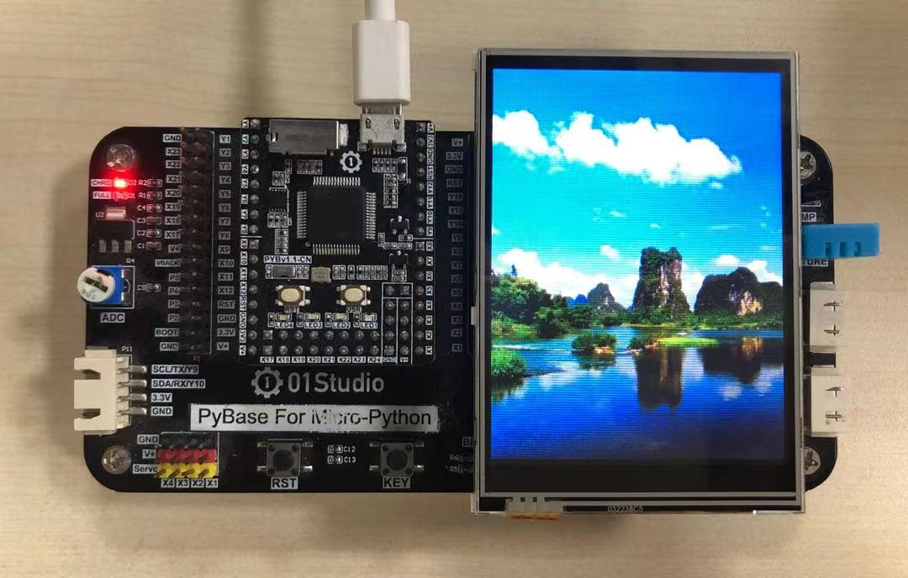
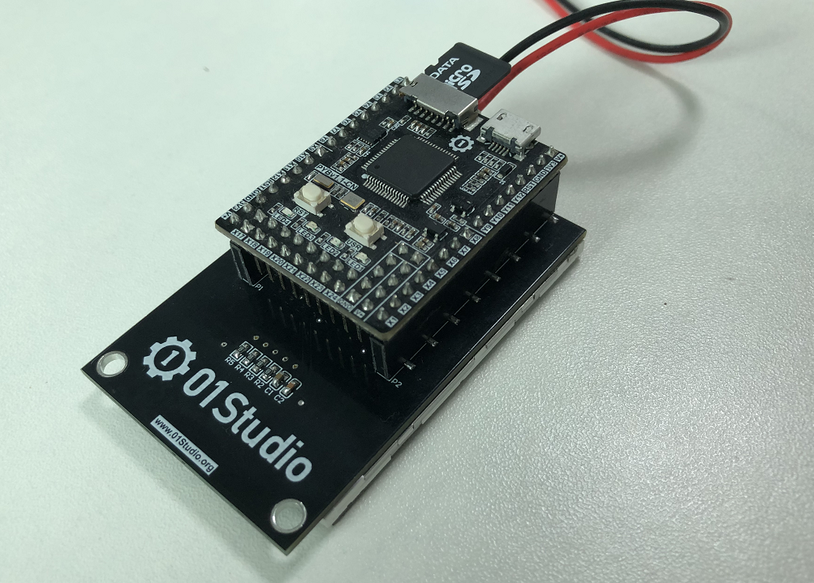

# LCD显示屏

## 前言
前面用到的OLED显示屏虽然能显示信息，但是颜色只有黑白，而且分辨率也比较低128x64，本节我们来学习3.2寸TFT_LCD彩色显示屏的使用方法。

LCD液晶显示屏是非常常见的一个外接显示设备，跟前面的OLED显示屏相比，LCD会更常用一些，我们看到的手持设备、小型电器，很多都用到LCD，部分配合触摸屏应用，能实现非常多的功能。

## 实验平台
pyBoard开发套件、3.2寸LCD（电阻触摸）。


## 实验目的
通过MicorPython编程方式实现LCD的各种显示功能，包括画点、线、矩形、圆形、显示英文、显示图片等。

## 实验讲解

我们先来看看实验所使用的3.2寸LCD的参数介绍：[**点击购买>>**](https://item.taobao.com/item.htm?id=624422901691)


|  产品参数 |
|  :---:  |  --- |
| 供电电压  | 3.3V |
| 屏幕尺寸  | 3.2寸 |
| 分辨率  | 320 x 240 |
| 驱动芯片  | ILI9341 + XPT2046(触摸) |
| 触摸方式  | 电阻触摸 |
| 通讯方式  | SPI总线 |
| 接口定义  | 2.54mm排母（兼容pyboard v1.1接口） |
| 整体尺寸  | 7.7*5.5 cm |

3.2寸LCD跟pyboard的的引脚连线如下表，从下表和图可以看到LCD实际连接到pyboard的Y1-Y8, SPI(2)接口。




实验用的LCD是3.2寸，驱动是常见的ILI9341，使用SPI接口跟pyboard通信，按以往嵌入式C语言开发，我们需要对ILI9341进行编程实现驱动，然后再建立各种描点、划线、以及显示图片函数。

使用MicroPython其实也需要做以上工作，但由于可读性和移植性强的特点，我们只需要搞清各个对象函数使如何使用即可。总的来说和之前一样，有构造函数和功能函数。构造函数解决的是初始化问题，告诉pyboard外设是怎么接线，是什么样的；而功能函数解决的则是使用问题，我们基于自己的需求直接调用相关功能函数，实现自己的功能即可！

我们管这些函数的集合叫驱动，驱动可以是预先在固件里面，也可以通过.py文件存放在开发板文件系统。也就是说工程师已经将复杂的底层代码封装好，我们顶层直接使用python开发即可，人生苦短。我们来看看pyBoard固件中3.2寸LCD的构造函数和使用方法。


## LCD32对象

### 构造函数
```python
tftlcd.LCD32(portrait=1)
```
构建3.2寸LCD对象。

- `portrait` ：屏幕显示方向：
    - `1`: 竖屏，240*320 ，默认
    - `2`: 横屏，320*240 ，1基础上顺时针旋转90° 
    - `3`: 竖屏，240*320 ，1基础上顺时针旋转180°
    - `4`: 横屏，320*240 ，1基础上顺时针旋转270°


### 使用方法

```python
LCD32.fill(color)
```
填充画面。
- `color`: RGB颜色数据；如(255,0,0)表示红色。

<br></br>

```python
LCD32.drawPixel(x, y, color)
```
画点。
- `x`: 横坐标；
- `y`: 纵坐标；
- `color`: RGB颜色数据；如(255,0,0)表示红色。

<br></br>

```python
LCD32.drawLine(x0, y0, x1, y1, color)
```
画线段。
- `x0`: 起点横坐标；
- `y0`: 起点纵坐标；
- `x1`: 终点横坐标；
- `y1`: 终点纵坐标；
- `color`: RGB颜色数据；如(255,0,0)表示红色。

<br></br>

```python
LCD32.drawRect(x, y, width, height, color, border=1, fillcolor=None)
```
画矩形。
- `x`: 左上角横坐标；
- `y`: 左上角纵坐标；
- `width`: 宽度；
- `height`: 高度；
- `color`: 颜色；如(255,0,0)表示红色；
- `border`: 边宽；
- `fillcolor`: 填充颜色，默认None为不填充。

<br></br>

```python
LCD32.drawCircle(x, y, radius, color, border=1, fillcolor=None)
```
画圆。
- `x`: 圆心横坐标；
- `y`: 圆心纵坐标；
- `width`: 宽度；
- `height`: 高度；
- `color`: 颜色；如(255,0,0)表示红色；
- `border`: 边宽；
- `fillcolor`: 填充颜色，默认None为不填充。

<br></br>

```python
LCD32.printStr(text, x, y, color, backcolor=None, size=2)
```
写字符。
- `text`: 字符；
- `x`: 起始横坐标；
- `y`: 起始纵坐标；
- `color`: 字体颜色；如(255,0,0)表示红色；
- `backcolor`: 字体背景颜色，默认None为无。
- `size`: 字体尺寸
    - `1`: 小号
    - `2`: 标准
    - `3`: 中号
    - `4`: 大号

<br></br>

```python
LCD32.Picture(x, y, filename)
```
显示图片。支持图片格式类型：jpg、bmp。
- `x`: 起始横坐标；
- `y`: 起始纵坐标；
- `filename`: 图片路径+名称，如："/flash/cat.jpg"，"/sd/dog.jpg"。。（‘/’表示开发板的板载flash或sd卡的根目录。）

<br></br>


更多用法请阅读官方文档：<br></br>
https://docs.01studio.cc/library/tftlcd/tftlcd.LCD32.html
<br></br>

有了上面的对象构造函数和使用说明，编程可以说是信手拈来了，我们在使用中将以上功能都跑一遍先看看编程流程图：




## 参考代码

```python
'''
实验名称：3.2寸LCD液晶显示屏
版本：v1.0
作者：01Studio
实验平台：pyBoard + 3.2寸屏
说明：通过编程实现LCD的各种显示功能，包括填充、画点、线、矩形、圆形、显示英文、显示图片等。
'''

#导入相关模块
from tftlcd import LCD32
import time

#定义常用颜色
RED = (255,0,0)
GREEN = (0,255,0)
BLUE = (0,0,255)
BLACK = (0,0,0)
WHITE = (255,255,255)

########################
# 构建3.2寸LCD对象并初始化
########################
d = LCD32(portrait=1) #默认方向竖屏

#填充白色
d.fill(WHITE)

#画点
d.drawPixel(5, 5, RED)
 
#画线段
d.drawLine(5, 10, 200, 10, RED)
 
#画矩形
d.drawRect(5, 30, 200, 40, RED, border=5)

#画圆
d.drawCircle(100, 120, 30, RED, border=5)
 
#写字符,4种尺寸
d.printStr('Hello 01Studio', 10, 200, RED, size=1)
d.printStr('Hello 01Studio', 10, 230, GREEN, size=2)
d.printStr('Hello 01Studio', 10, 270, BLUE, size=3)

time.sleep(3) #等待3秒

#显示图片
d.Picture(0,0,"/flash/picture/1.jpg")
time.sleep(3)
d.Picture(0,0,"/flash/picture/2.jpg")
time.sleep(3)
d.Picture(0,0,"/flash/picture/01studio.jpg")
```

## 实验结果

将示例程序的素材文件上传到pyBoard开发板。（也可以直接用U盘拷贝然后复位开发板，速度更快。）


在Thonny IDE运行程序，可以看到LCD依次显示相关内容。

- 点、线、字符等显示



- 显示图片



由于我们LCD接口兼容pyboard，因此也可以直接将pyboard v1.1-CN插到LCD背面，以及使用锂电池供电。如下图所示：




:::tip 提示
由于MicroPython的可移植性非常强，所以使用本实验代码简单修改即可用起01Studio配套的1.5、1.8、2.4寸各类LCD，使用方法高度一致，详细可以看资料包配套代码。
:::

通过本实验我们体验到了LCD使用micropython开发的简单和灵活性。我们轻松实现了LCD的各种常规操作，让用户将精力放在应用。相信随着micropython库函数的日益成熟，其性能和可玩性将变得更强大！
