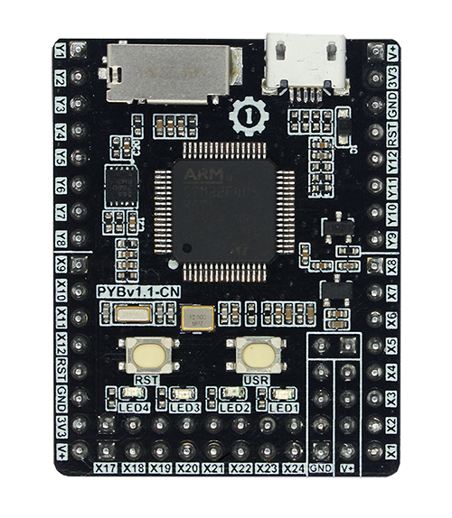
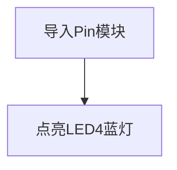

# 点亮第1个LED

## 前言
相信大部分人开始学习嵌入式单片机编程都会从点亮LED开始，基于核桃派PicoW平台的MicroPython的学习也不例外，通过点亮第一个LED能让你对编译环境和程序架构有一定的认识，为以后的学习和更大型的程序打下基础，增加信心。

## 实验目的
学习LED的点亮，点亮LED（蓝灯）。

## 实验平台

pyBoard 或 pyBoard + pyBase 开发套件。




## 实验讲解

pyboard上总共有4个LED，分别是LED1(红色)、LED2(绿色)、LED3(黄色)、LED4(蓝色)；

这里控制LED使用到pyb的LED对象。使用说明如下：

## LED对象

### 构造函数
```python
pyb.LED(id)
```

LED对象位于pyb模块下:

- `id` ：LED编号。1-4。

### 使用方法
```python
LED.off()
```
关闭LED

<br></br>

```python
LED.on()
```
打开LED

<br></br>

```python
LED.toggle()
```
翻转LED状态。

<br></br>

更多用法请阅读官方文档：<br></br>
https://docs.01studio.cc/library/pyb.LED.html#class-led-led-object


上面对MicroPython的LED对象做了详细的说明，pyb是大模块，LED是pyb下面的其中一个小模块，在python编程里有两种方式引用相关模块:

- 方式1是：import pyb，然后通过pyb.LED来操作；
- 方式2是：from pyb import LED,意思是直接从pyb中引入LED模块，然后直接通过LED来操作。显然方式2会显得更直观和方便，本实验也是使用方式2来编程。

代码编写流程如下：



## 参考代码

```python
'''
实验名称：点亮LED(4)蓝灯
版本：v1.0
作者：01Studio
'''

from pyb import LED

LED(4).on() #点亮LED4蓝灯
```

## 实验结果

在Thonny IDE中运行上述代码：


可以看到LED4蓝灯被点亮。


从第一个实验我们可以看到，使用MicroPython来开发关键是要学会**构造函数和使用方法**，便可完成对相关对象的操作，在强大的模块函数支持下，实验只用了简单的两行代码便实现了点亮LED灯。