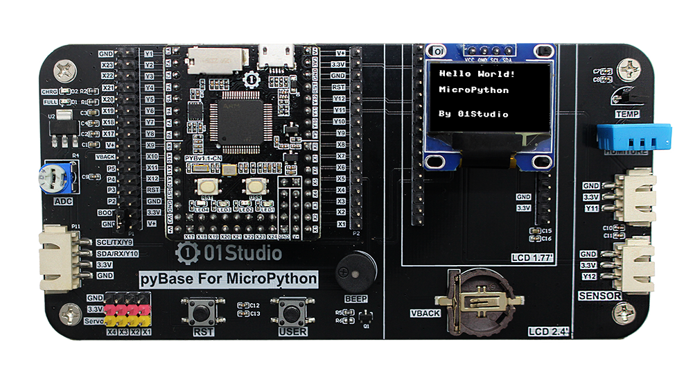
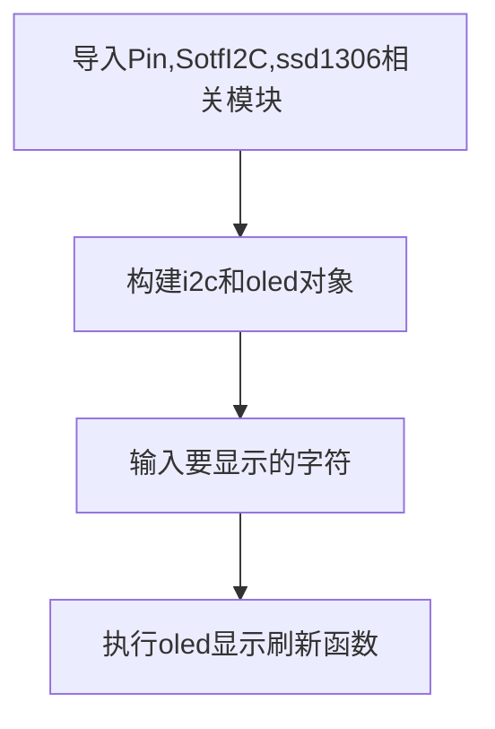
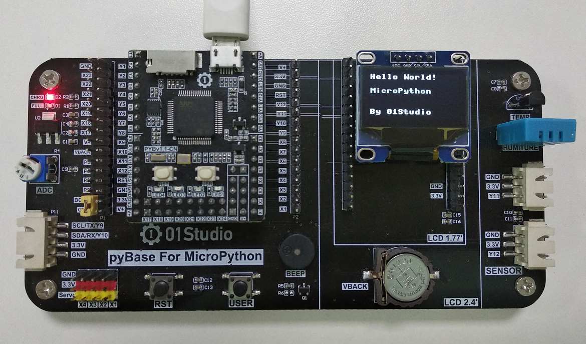

# I2C总线（OLED显示屏）

## 前言

在上一节学习了按键输入设备后，我们这一节先来学习输出设备OLED显示屏，其实之前的LED灯也算是输出设备，因为它们确切地告诉了我们硬件的状态。只是相对于只有亮灭的LED而言，显示屏可以显示更多的信息，体验更好。

本章节的OLED显示屏学习，实际上是在使用I2C的总线接口，pyBoard是通过I2C总线与OLED显示屏通讯的。这章稍微复杂一点，我们把它放在了前面来学习，是因为学会了显示屏的使用，那么在后面的实验中可玩性就更强了。

## 实验平台

pyBoard开发套件。



## 实验目的

学习使用MicroPython的I2C总线通讯编程和OLED显示屏的使用。

## 实验讲解

- 什么是I2C？

I2C是用于设备之间通信的双线协议，在物理层面，它由2条线组成：SCL和SDA，分别是时钟线和数据线。也就是说不通设备间通过这两根线就可以进行通信。

- 什么是OLED显示屏？

OLED的特性是自己发光，不像TFT LCD需要背光，因此可视度和亮度均高，其次是电压需求低且省电效率高，加上反应快、重量轻、厚度薄，构造简单，成本低等特点。简单来说跟传统液晶的区别就是里面像素的材料是由一个个发光二极管组成，因为密度不高导致像素分辨率低，所以早期一般用作户外LED广告牌。随着技术的成熟，使得集成度越来越高。小屏也可以制作出较高的分辨率。


在了解完I2C和OLED显示屏后，我们先来看看开发板的原理图，也就是MicroPython上的OLED接口是如何连线的。pyBoard有2个自带I2C接口，但1个用于三轴加速度传感器（X9,X10），另外一个(Y9,Y10)保留了日后其他设备接入使用。

- OLED接口原理图


本节使用会用到Pin、SoftI2C和ssd1306对象，介绍如下：

## Pin对象

GPIO引脚对象。

### 构造函数
```python
machine.Pin(id, mode, pull)
```

machine模块下的Pin对象。

- `id` ：芯片引脚编号。如：X17, B4。
- `mode` ：输入/输出模式。
    - `Pin.IN` : 输入模式；
    - `Pin.OUT` : 输出模式；   
- `pull`: 上下拉电阻配置。
    - `None` : 无上下拉电阻；
    - `Pin.PULL_UP` : 上拉电阻启用；
    - `Pin.PULL_DOWN` : 下拉电阻启用。

### 使用方法

```python
Pin.value([X])
```
配置引脚电平值：
- `输出模式` ：输出电平值。
    - `0` : 输出低电平；
    - `1` : 输出高电平。
- `输入模式` ：无需参数，获取当前引脚输入电平值。

<br></br>

```python
Pin.high()
```
引脚输出高电平。

<br></br>

```python
Pin.low()
```
引脚输出低电平。

<br></br>

更多用法请阅读官方文档：<br></br>
https://docs.01studio.cc/library/machine.Pin.html#machine-pin

<br></br>


## SoftI2C对象

MicroPython内部集成I2C和SoftI2C对象，均用于I2C设备控制，区别是I2C跟硬件引脚强关联，而SoftI2C则支持任意GPIO引脚模拟。在对速度响应不是特别高的场合更通用。

### 构造函数
```python
machine.SoftI2C(scl, sda, freq=400000, timeout=255)
```

machine模块下的SoftI2C对象。

- `slc` ：指定SCL引脚。
- `sda` ：指定SDA引脚。
- `freq`: 通讯频率，默认400KHz。
- `timeout` : 超时。

### 使用方法

```python
SoftI2C.scan()
```
扫描 0x08 到 0x77（含）之间的所有 I2C 地址，并返回响应设备的列表。

<br></br>

```python
SoftI2C.deinit()
```
注销I2C。

<br></br>

```python
SoftI2C.write(buf)
```
写数据到I2C设备。

<br></br>

更多用法请阅读官方文档：<br></br>
https://docs.01studio.cc/library/machine.I2C.html#machine-softi2c

<br></br>

## SoftI2C对象

定义好I2C后，还需要驱动一下OLED。这里我们已经写好了OLED的库函数，在ssd1306.py文件里面。开发者只需要拷贝到pyBoard文件系统里面，然后在main.py里面调用函数即可。人生苦短，大部分情况下我们只需要学会调用函数即可，也就是注重顶层的应用，想深入的小伙伴也可以自行研究ssd1306.py文件代码。OLED显示屏的使用方法如下： 

### 构造函数
```python
oled = SSD1306_I2C(width = 128, height = 64, i2c, addr=0x3c)
```
构建1个oled对象。

- `width` ：显示屏宽像素，这里使用的屏为128；
- `height` ：显示屏高像素，这里使用的屏为64；
- `i2c`: 前面构建好的I2C对象;
- `addr` : 显示屏i2c地址，这里使用的屏为0x3c。

### 使用方法

```python
oled.text(str , x, y)
```
写字符。

- `str` ：写的内容，格式为string；
- `x` ：显示屏高像素，这里使用的屏为64；
- `y`: 前面构建好的I2C对象;

<br></br>


```python
oled.fill(clolr)
```
清屏。
- `color` ：清屏颜色；
    - `0`: 黑色;
    - `1`: 白色;

<br></br>

```python
oled.show()
```
刷新显示内容。

<br></br>

代码编程流程图如下：




## 参考代码

```python
'''
实验名称：OLED显示屏（I2C总线）
版本：v1.0
平台：pyBoard开发套件
作者：01Studio
'''

from machine import SoftI2C,Pin         #从machine模块导入I2C、Pin子模块
from ssd1306 import SSD1306_I2C     #从ssd1306模块中导入SSD1306_I2C子模块

i2c = SoftI2C(sda=Pin("Y8"), scl=Pin("Y6"))   #pyBoard I2C初始化：sda--> Y8, scl --> Y6
oled = SSD1306_I2C(128, 64, i2c, addr=0x3c) #OLED显示屏初始化：128*64分辨率,OLED的I2C地址是0x3c

oled.text("Hello World!", 0,  0)      #写入第1行内容
oled.text("MicroPython",  0, 20)      #写入第2行内容
oled.text("By 01Studio",  0, 50)      #写入第3行内容

oled.show()   #OLED执行显示
```

上述代码中OLED的I2C地址是0x3C,不同厂家的产品地址可能预设不一样，具体参考厂家的说明书。或者也可以通过I2C.scan()来获取设备地址。

## 实验结果

本节实验需要用到ssd1306.py里面的库，所以需要将提供的示例代码中的ssd1306.py文件拷贝到pyboard文件系统下，跟main.py保持同一个路径。


在Thonny IDE运行代码，可以看到oled显示相关信息。



这一节我们学会了驱动OLED显示屏，换着以往如果从使用单片机从0开发的话你需要了解I2C总线原理，了解OLED显示屏的使用手册，编程I2C代码，有经验的嵌入式工程师搞不好也要弄个几天。现在基本半个小时解决问题。当然前提是别人已经给你搭好桥了，有了强大的底层驱动代码支持，我们只做好应用就好。

这一节学习的意义不仅在完成实验。在学习完OLED显示屏实验后，接下来我们的实验都可以使用这个OLED来跟用户交互了。这大大提高了实验的可观性。

