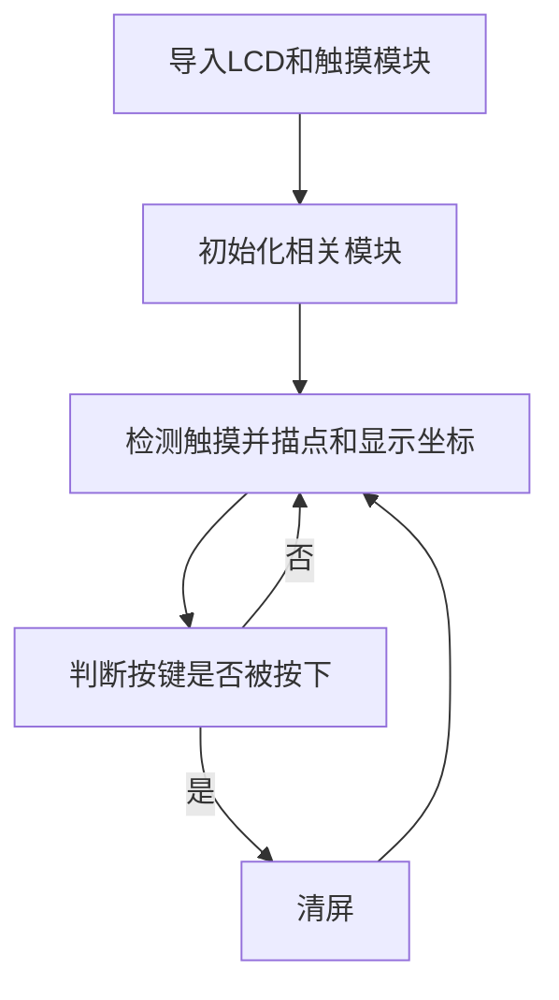
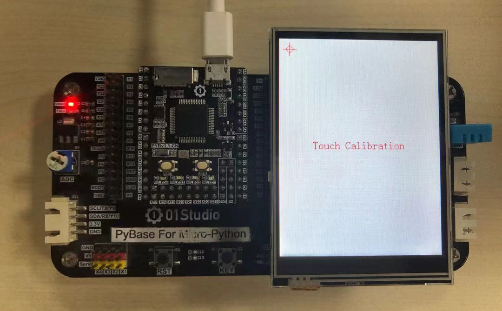

# 电阻触摸屏

## 前言
上一节我们学习了LCD实验，但LCD只能显示相关内容，跟人是缺乏交互的。好比我们的智能手机，如果只有显示不能触碰，那么就没有可玩性了。因此本节学习一下3.2寸LCD的电阻触摸屏使用方法。

## 实验平台
pyBoard开发套件、3.2寸LCD（电阻触摸）。


## 实验目的
获取电阻触摸屏的坐标并画点标记。

## 实验讲解

01Studio配套的3.2寸 LCD上带电阻触摸屏,驱动芯片为XPT2046。当手指按下时候，通过简单的编程即可返回一个坐标，我们来看看其micropython构造函数和使用方法：

## XPT2046对象

### 构造函数
```python
tftlcd.XPT2046(portrait=1)
```
构建触摸屏对象。XPT2046表示驱动芯片型号。

- `portrait` ：屏幕方向：
    - `1`: 竖屏，240*320 ，默认
    - `2`: 横屏，320*240 ，1基础上顺时针旋转90° 
    - `3`: 竖屏，240*320 ，1基础上顺时针旋转180°
    - `4`: 320*240 ，1基础上顺时针旋转270°


### 使用方法

```python
XPT2046.tick_inc()
```
手动刷新触摸。

<br></br>

```python
XPT2046.read()
```
读取触摸屏数据，返回（states,x,y）
- `states`: 当前触摸状态：0：按下；1：移动；2：松开。；
- `x`: 触摸点横坐标；
- `y`: 触摸点纵坐标；

<br></br>

更多用法请阅读官方文档：<br></br>
https://docs.01studio.cc/library/tftlcd/tftlcd.LCD32.html
<br></br>

学会了触摸对象用法后，我们可以编程实现触摸后屏幕打点表示，然后左上角显示当前触摸的坐标。另外再加入一个按键，按下清空屏幕。编程流程图如下：




## 参考代码

```python
'''
实验名称：电阻触摸屏
版本：v1.0
作者：01Studio
实验平台：pyBoard + 3.2寸显示屏（电阻触摸）
说明：电阻触摸屏采集触摸信息
'''

from touch import XPT2046
from tftlcd import LCD32
from machine import Pin
import time

#定义颜色
BLACK = (0,0,0)
WHITE = (255,255,255)
RED=(255,0,0)

#LCD初始化
d = LCD32(portrait=1) #默认竖屏
d.fill(WHITE) #填充白色

#电阻触摸屏初始化，方向和LCD一致
t = XPT2046(portrait=1)

while True:

    data = t.read() #获取触摸屏坐标
    print(data) #REPL打印

    #当产生触摸时
    if data[0]!=2: #0：按下； 1：移动； 2：松开

        #触摸坐标画圆
        d.drawCircle(data[1], data[2], 5, BLACK, fillcolor=BLACK)
        d.printStr('(X:'+str('%03d'%data[1])+' Y:'+str('%03d'%data[2])+')',10,10,RED,size=1)

    time.sleep_ms(20) #触摸响应间隔

```

## 实验结果

运行程序，首次运行会自动提示进行触摸校准（电阻屏需要校准），按提示分别点击四个角落进行校准，如校准失败会自动重复。校准成功会自动保存一个“touch.cail”文件到开发板flash，下次无须再校准。

:::tip 提示
3.2寸显示屏配套的是电阻屏，需要使用支架或笔尖等硬物进行触摸。跟手机电容屏不一样。
:::

- 进入触摸校准，依次点击十字中心点



校准成功后出现空白画面，用手指触摸屏幕或者在屏幕上滑动，可以看到描点并在LCD左上角显示当前坐标。


重启开发板，可以看到文件系统多了一个`touch.cail`文件，在运行电阻屏初始化时候会检测这个文件，如果存在则不进行校准，若想重新校准的用户可以把这个文件删除即可！


没有触摸屏的LCD就失去了灵魂，有了触摸屏，跟开发板的交互就变得有意思了。