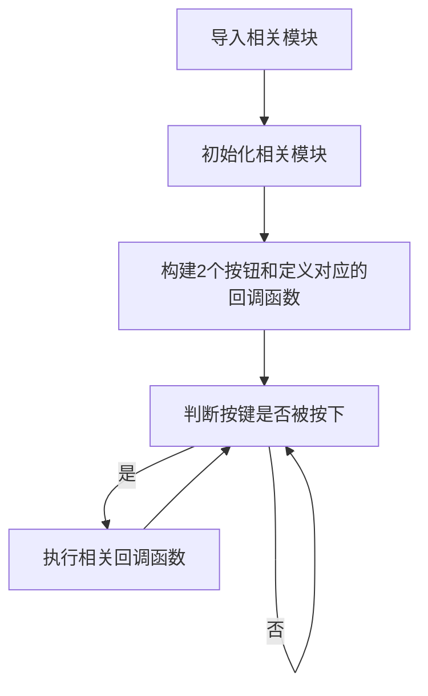

# 触摸屏按钮

## 前言
上两节我们分别学习了LCD显示和触摸屏操作，这一节我们就来整合一下，做一个好玩的东西，那就是生成触摸按钮。由于pyBoard开发板上只有1个功能按键，而使用LCD和触摸屏则可以创建非常多的按钮来执行我们的任务。而且操作更直观。

## 实验平台
pyBoard开发套件、3.2寸LCD（电阻触摸）。


## 实验目的
生成触摸按钮，实现触摸控制LED灯状态变换。

## 实验讲解

学习到现在的你可以思考一下，会用什么方法来实现这个功能呢？你或许会想在LCD上画一个填充矩形，然后获取触摸坐标，跟这个矩形位置对上后就判断这个按钮被按下了。

没错，这个原理是可行的，看似很简单，但我们还需考虑很多问题，比如触摸后用什么方式执行任务效率最高？如果区分不同按钮以及它们之间是否存在冲突。当你这么思考的时候，就是在开始构建一个简单GUI（图形用户界面）。

还是那句，人生苦短，01studio已经将底层封装好，用户只需要直接学会对象的使用即可。我们来看看触摸按钮对象：

## TouchButton对象

### 构造函数
```python
gui.TouchButton(x, y, width, height, color, label, label_color, callback)
```
构建触摸按钮对象。构建前需要先初始化LCD和触摸屏。

- `x`: 按钮起始横坐标
- `y`: 按钮起始纵坐标 
- `width`: 按钮宽度
- `height`: 按钮高度
- `color`: 按钮颜色
- `label`: 按钮标签
- `label_color`: 标签字体颜色
- `callback`:  按钮回调函数，按下松开后触发；


### 使用方法

```python
gui.task_handler()
```
执行所有任务。也就是执行按钮回调函数里面的代码。

<br></br>

```python
TouchButton.ID()
```
获取当前触摸ID的编号。

<br></br>

更多用法请阅读官方文档：<br></br>
https://docs.01studio.cc/library/gui/gui.html#touchbutton
<br></br>

从上表可以看到只需要简单的语句便实现了触摸按钮的构建，我们可以构建2个按钮，分别控制LED和打印信息，编程思路如下：



## 参考代码

```python
'''
实验名称：触摸按钮
版本：v1.0
作者：01Studio
实验平台：pyBoard + 3.2寸显示屏（电阻触摸）
说明：编程实现触摸按钮控制LED。
'''

from tftlcd import LCD32
from touch import XPT2046
from machine import Pin
from pyb import LED,Timer
import gui,time

#定义常用颜色
BLACK = (0,0,0)
WHITE = (255,255,255)
RED = (255,0,0)
GREEN = (0,255,0)
BLUE = (0,0,255)
ORANGE =(0xFF,0x7F,0x00) #橙色

#LCD初始化
d = LCD32() #默认方向
d.fill(WHITE) #填充白色

#触摸屏初始化
t = XPT2046()#默认方向

#####################
#定义2个按键和回调函数
#####################
def fun1(B1):
    
    #LED灯状态翻转
    LED(4).toggle()

def fun2(B2):
    
    print('Button is pressed!')


B1 = gui.TouchButton(80,50,80,50,BLUE,'LED',WHITE,fun1)
B2 = gui.TouchButton(80,120,80,50,RED,'Button',WHITE,fun2)

#############################
#### 定时器用于触发按钮事件 ##
#############################
tim_flag = 0

def count(tim):
    global tim_flag
    tim_flag = 1

tim = Timer(1,freq=50) #20ms刷新一次
tim.callback(count)

while True: 

    #执行按钮触发的任务
    if tim_flag == 1:
        
        t.tick_inc()
        gui.task_handler()
        tim_flag = 0
```

:::tip 提示
Micropython所有中断回调函数都不支持新的内存分配语句，否则会报错，因此可以通过定义全局变量（global），在回调函数修改，然后在主循环函数判断然后做出相应的控制。
:::

## 实验结果

运行程序，首次运行会自动提示进行触摸校准（电阻屏需要校准），按提示分别点击四个角落进行校准，如校准失败会自动重复。校准成功会自动保存一个“touch.cail”文件到开发板flash，下次无须再校准。

:::tip 提示
3.2寸显示屏配套的是电阻屏，需要使用支架或笔尖等硬物进行触摸。跟手机电容屏不一样。
:::

- 进入触摸校准，依次点击十字中心点


校准成功后出现2个按钮。

- 点击LED按钮，可以看到LED蓝灯状态发生翻转。


- 点击“Button”按钮，可以看到串口打印出“Button is Pressed!”信息。


触摸按钮实现简单但却是用途非常广泛的功能，有了自定义按键，我们就可以通过触摸按键来实现所有外设设备的交互。让设备的控制变得更简单有趣。当前颜色、尺寸、标签等都为可修改项，大大提高了用户编程的灵活性。