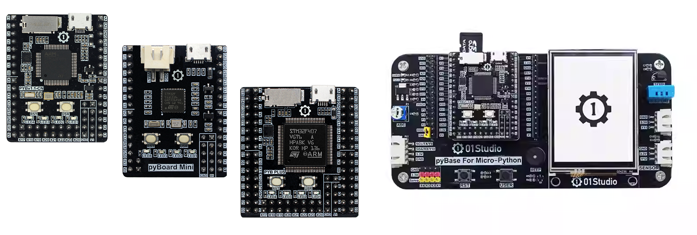

# 目录

### pyBoard开发套件介绍

- [产品参数](./intro/product.md)

### [开发板资料下载](./download.md)

### [Python3基础知识](./python_learn.md)

### 开发环境搭建

- [Thonny IDE开发软件安装](./getting_start/thonny_ide.md)
- [驱动安装](./getting_start/driver.md)
- [REPL串口交互](./getting_start/repl.md)
- [文件系统](./getting_start/file_system.md)
- [例程测试](./getting_start/demo.md)
- [代码离线运行](./getting_start/run_offline.md)
- [固件更新](./getting_start/firmware_update.md)

### 基础实验

- [点亮第1个LED](./basic_examples/led.md) 
- [流水灯](./basic_examples/leds.md) 
- [按键](./basic_examples/key.md) 
- [GPIO](./basic_examples/gpio.md)
- [外部中断](./basic_examples/exti.md) 
- [定时器](./basic_examples/timer.md) 
- [ADC（电压测量）](./basic_examples/adc.md) 
- [DAC（无源蜂鸣器）](./basic_examples/dac.md) 
- [三轴加速度计](./basic_examples/imu.md) 
- [UART（串口通讯）](./basic_examples/uart.md) 
- [LCD显示屏](./basic_examples/lcd.md) 
- [电阻触摸屏](./basic_examples/touch.md) 
- [触摸屏按钮](./basic_examples/touch_button.md) 
- [thread（线程）](./basic_examples/thread.md) 
- [看门狗](./basic_examples/watchdog.md) 
- [文件读写](./basic_examples/file.md) 

### 传感器

- [温度传感器（DS18B20）](./sensor/ds18b20.md) 
- [温湿度传感器（DHT11）](./sensor/dht11.md) 
- [人体感应传感器](./sensor/human_induction.md) 
- [光敏传感器](./sensor/photosensitive.md)
- [土壤湿度传感器](./sensor/soil_wet.md) 
- [液位传感器](./sensor/liquid_level.md) 
- [超声波测距（HC-SR04）](./sensor/hcsr04.md) 
- [大气压强传感器（BMP280）](./sensor/bmp280.md) 
- [红外测温（MLX90614）](./sensor/mlx90614.md) 

### 拓展模块

- [继电器](./module/relay.md) 
- [舵机](./module/servo.md) 
- [Neopixel彩灯](./module/neopixel.md) 

### 网络应用

- [连接网络](./ethernet/connect.md) 
- [Socket通讯](./ethernet/socket.md) 
- [MQTT通讯](./ethernet/mqtt.md) 

### [更新说明](./update.md)

