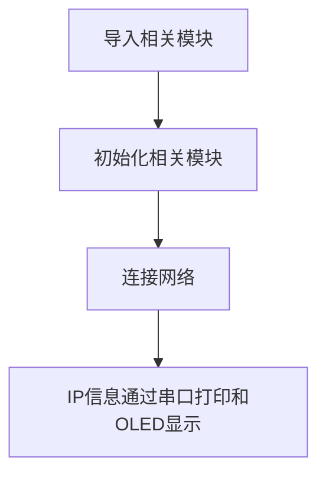
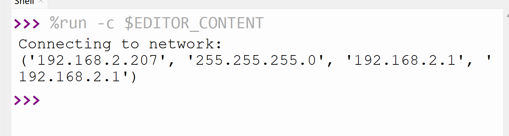

# 连接网络

## 前言
万物互联是趋势，pyBaord不具备WiFi功能，但其强大的库基础了W5500以太网模块函数代码，我们可以轻松通过MicroPython编程实现pyboard连接互联网。

## 实验平台
pyBoard开发套件和W5500以太网模块。（可以选配OLED）


## 实验目的
编程实现连接路由器，将IP地址等相关信息通过串口终端打印和OLED显示。

## 实验讲解

连接路由器上网是我们每天都做的事情，日常生活中我们只需要知道路由器的账号和密码，就能使用电脑或者手机连接到无线路由器，然后上网冲浪。

pybaord带network固件已经集成了network模块，开发者使用内置的network模块函数可以非常方便地连接上路由器。我们先来看看network模块的构造函数和使用方法。

## network对象

### 构造函数
```python
wlan = network.WIZNET5K(spi, pin_cs, pin_rst)
```
构建W5500以太网模块连接对象。

- `spi`: SPI引脚
- `pin_cs`: 模块片选引脚
- `pin_rst`: 模块中断引脚 

### 使用方法
```python
nic.active(value)
```
激活或停用网络接口。
- `True`: 激活网络接口;
- `False`: 关闭网络接口。

<br></br>

```python
nic.isconnected()
```
检查设备是否已经连接上。返回 `Ture`:已连接；`False`:未连接。

<br></br>

<br></br>

```python
nic.ifconfig([(ip, subnet, gateway, dns)])
```
配置网络IP等信息，当参数为空时表示查看网络连接信息。
- `ip`: IP地址；
- `subnet` : 子网掩码；
- `gateway`: 网关地址；
- `dns` : DNS信息。

**例：nic.ifconfig(('192.168.1.110', '255.255.255.0', '192.168.1.1', '8.8.8.8')) 。**

<br></br>


更多用法请阅读官方文档：<br></br>
https://docs.01studio.cc/library/network.WIZNET5K.html

从上表可以看到MicroPython通过模块封装，让联网变得非常简单。代码编写流程如下：



## 参考代码

```python
'''
实验名称：W5500以太网模块连接网络
版本：v1.0
平台：pyBoard开发套件
作者：01Studio
说明：通过Socket编程实现pyBoard+W5500以太网模块连接网络。
'''

import network,usocket,machine
from machine import SoftI2C,Pin,SPI
from ssd1306 import SSD1306_I2C

#初始化相关模块，OLED引脚换成了Y9、Y10
i2c = SoftI2C(sda=Pin('Y10'), scl=Pin('Y9'))
oled = SSD1306_I2C(128, 64, i2c, addr=0x3c)

#以太网模块初始化
nic = network.WIZNET5K(SPI(2), 'Y5', 'Y4')
nic.active(True)
nic.ifconfig('dhcp')

print('Connecting to network:')

#判断网络是否连接成功
if nic.isconnected():
    
    print(nic.ifconfig()) #打印IP信息

    #OLED数据显示
    oled.fill(0)   #清屏背景黑色
    oled.text('IP/Subnet/GW:',0,0)
    oled.text(nic.ifconfig()[0], 0, 20)
    oled.text(nic.ifconfig()[1],0,38)
    oled.text(nic.ifconfig()[2],0,56)
    oled.show()

else:
     
     print('Connect Error!')
```

## 实验结果

运行程序，可以观察到成功联网串口终端打印IP等信息:



OLED屏同时也显示IP信息:


本节是联网应用的基础，成功连接到路由器的实验后，后面就可以做socket和MQTT等相关网络通信的应用了。