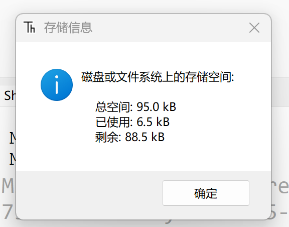
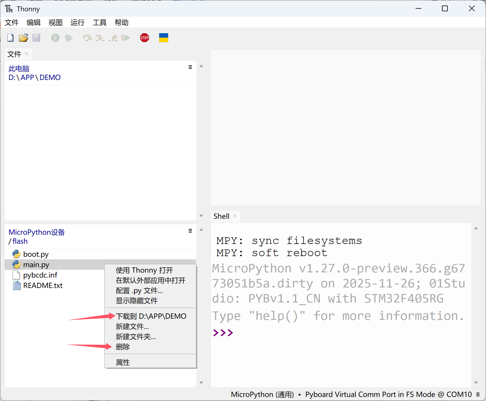
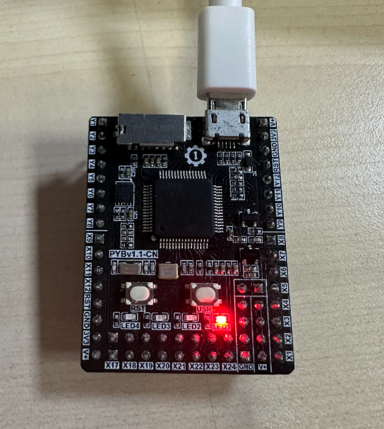
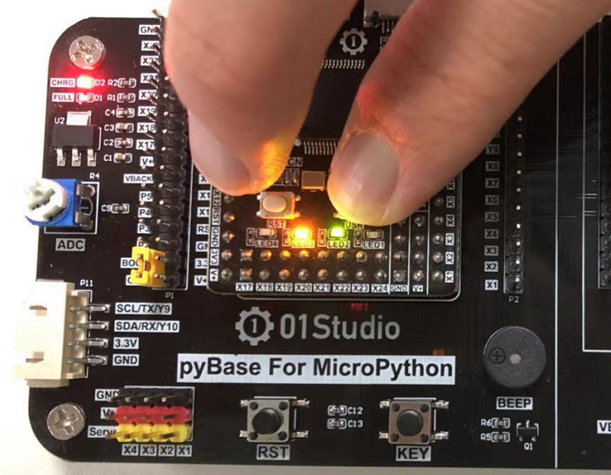
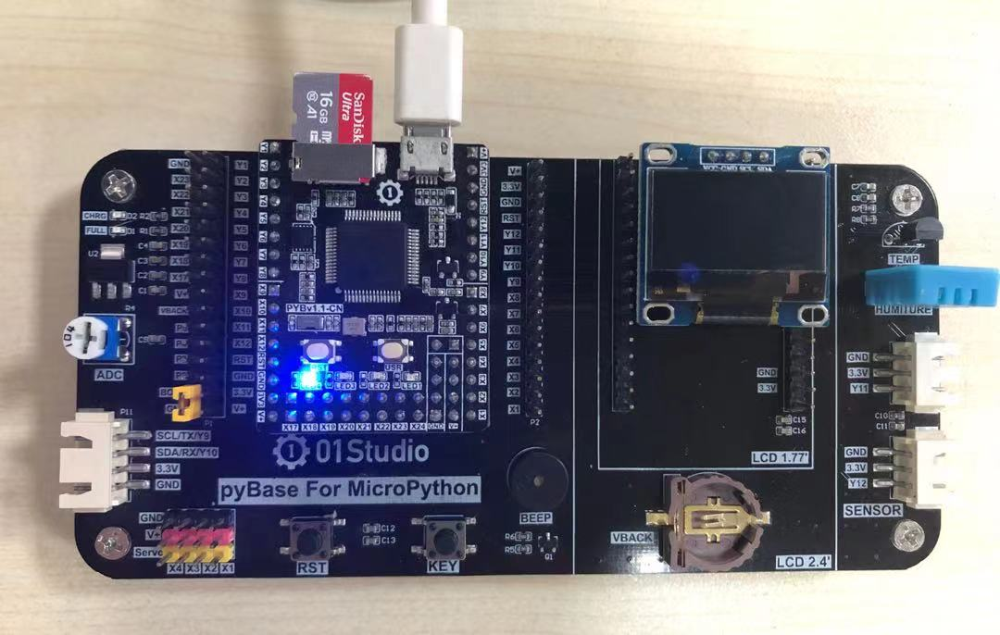
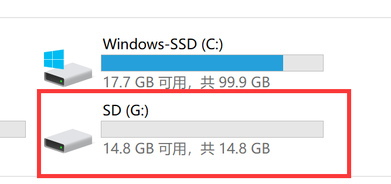

# 文件系统

pyBoard内置了文件系统，可用于存放代码脚本和图片等文件，这个可以通过U盘直接操作或Thonny IDE的文件功能非常方便地浏览或读写。

## 文件读写

### 通过U盘读写文件

U盘读写方式比较简单，跟我们在电脑里面操作文件一样。

### 通过Thonny IDE读写文件

连接开发板后，在thonny ide 选择 **视图 -- 文件** ：

可以看到左边出现本地和开发板的实时文件浏览窗口：

点击MicroPython设备右侧拓展栏，选择存储空间，可以看到开发板总空间和剩余空间，这是用来放代码、图片等其它文件。

在本地文件点击右键—上传到即可将相关文件发送到开发板

也可以将开发板上的文件下载到本地或删除等功能，非常方便。

:::tip 警告
传输文件过程中红灯亮表示正在传输文件，这个过程请勿进行其它操作，否则容易导致文件系统损坏。

:::

## 恢复出厂设置

当文件系统意外损坏或想恢复出厂时状态，可以通过以下方式操作。

按着pyBoard上的USER键不放，再按一下RST键，LED灯会持续交替闪烁，当闪烁达到你想要的模式时候，松开user键，LED灯会快速闪烁，板子会接着重新启动。
- 模式1：只有绿灯亮，正常模式：先启动``boot.py``然后``main.py``。
- 模式2：只有橙色灯亮，安全模式：启动时候不运行任何脚本。(仅1次有效)
- 模式3：绿灯和橙灯同时亮，文件系统重置：文件系统恢复出厂状态，然后以安全模式启动。
如果你的文件系统损坏了，可以通过模式3启动修复它。

## SD卡文件系统

D卡插入后开发板自动识别，并以SD卡的boot.py和main.py为启动文件，屏蔽自带Flash里面文件。**其它使用方式和功能完全不变**！

:::tip 提示
SD卡文件系统不支持恢复出厂设置。
:::

这里使用16G MicroSD卡，可以看到接入电脑后自动识别出对应容量的文件系统。

