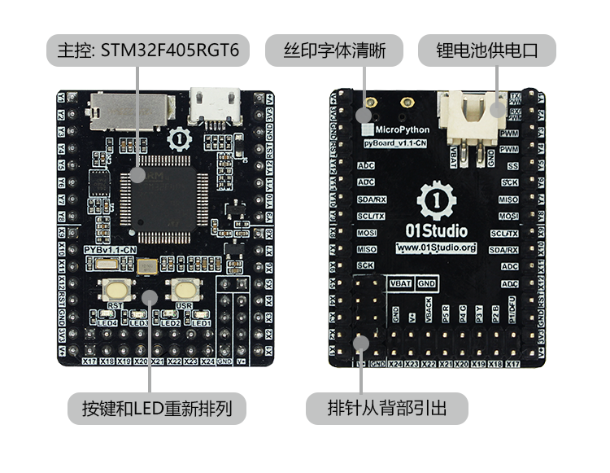
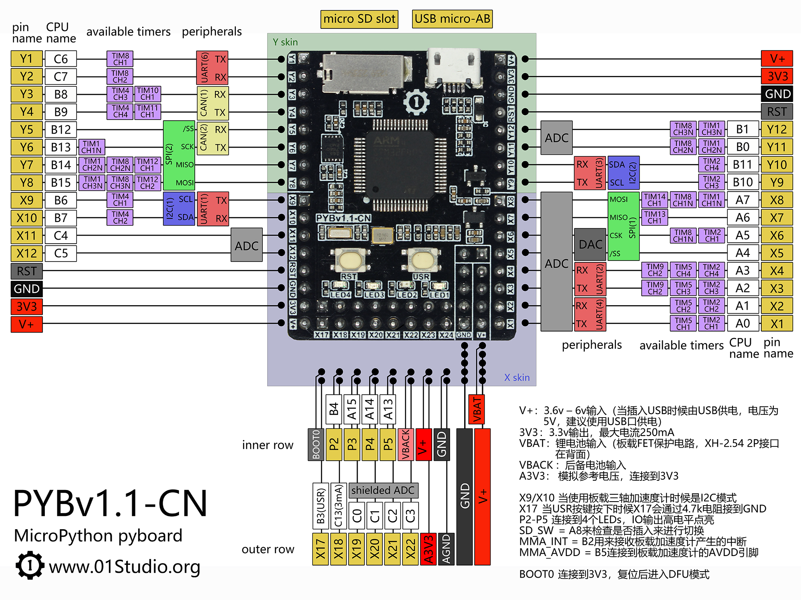
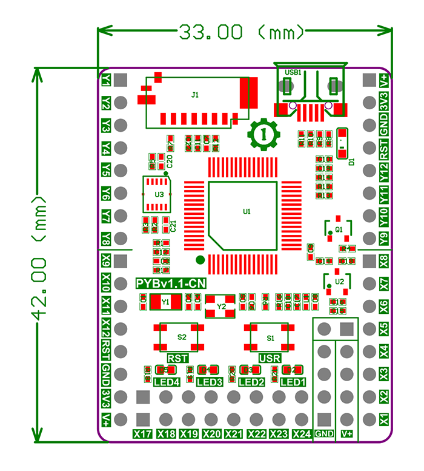
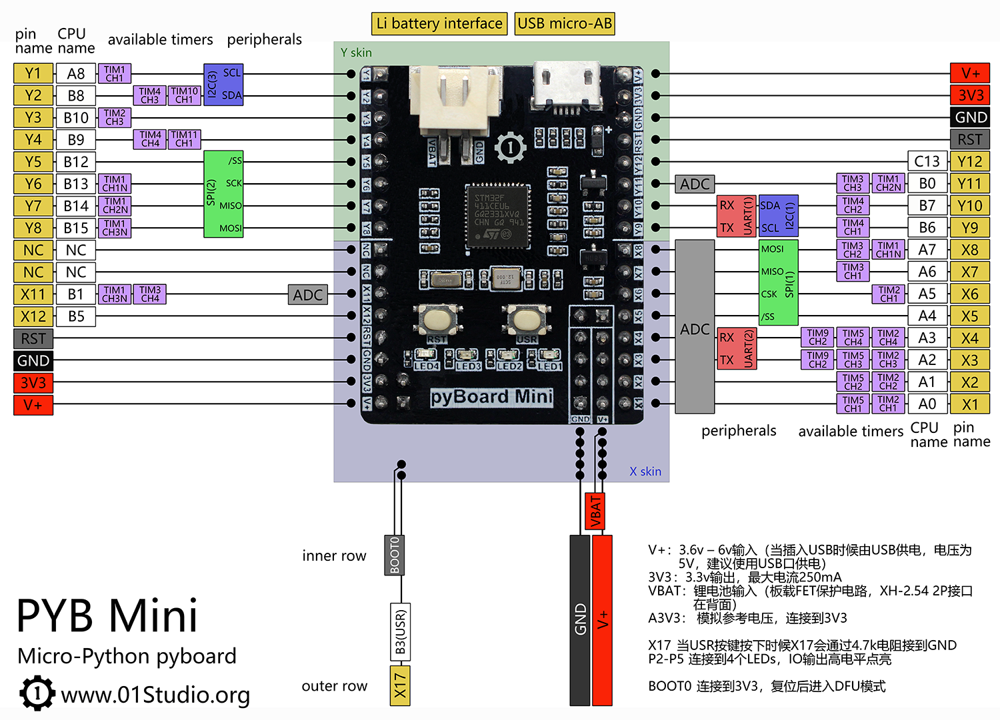
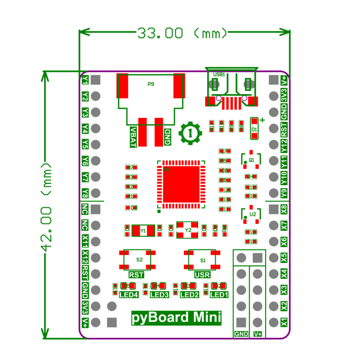
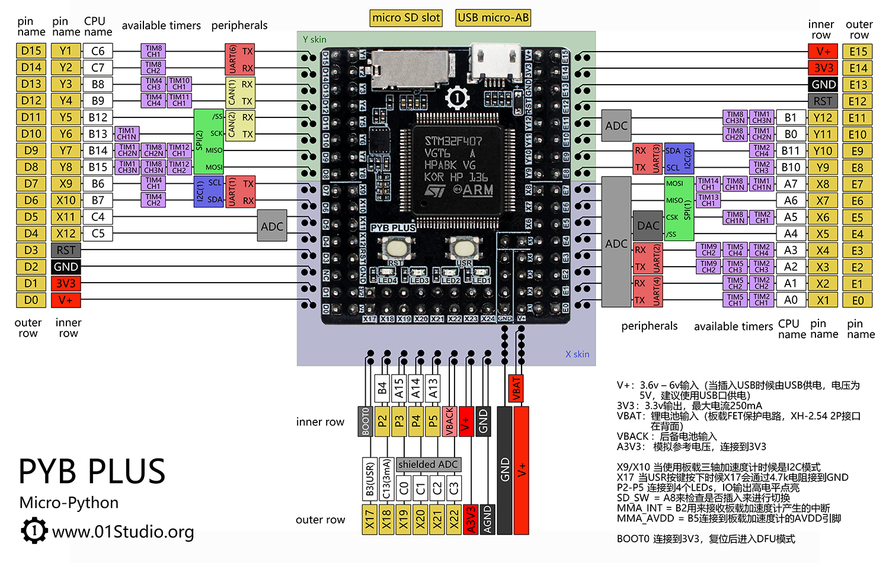
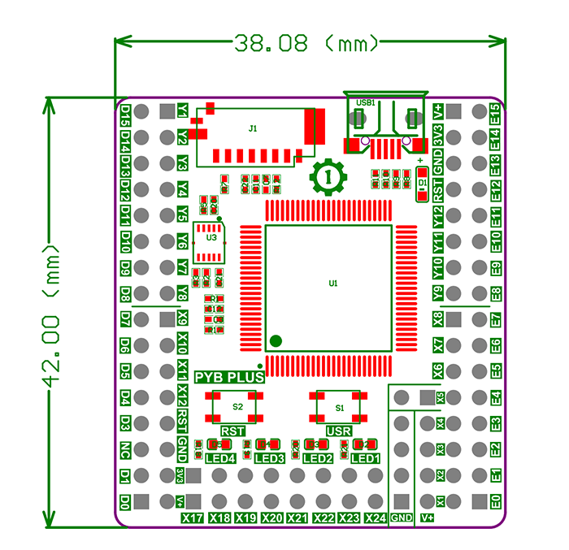
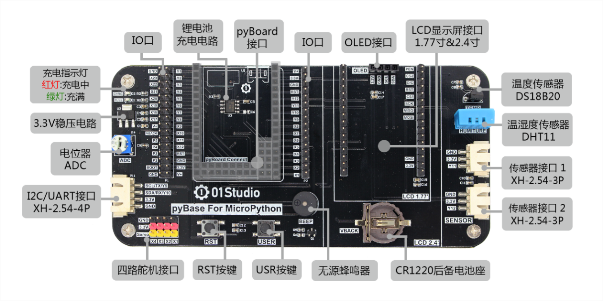
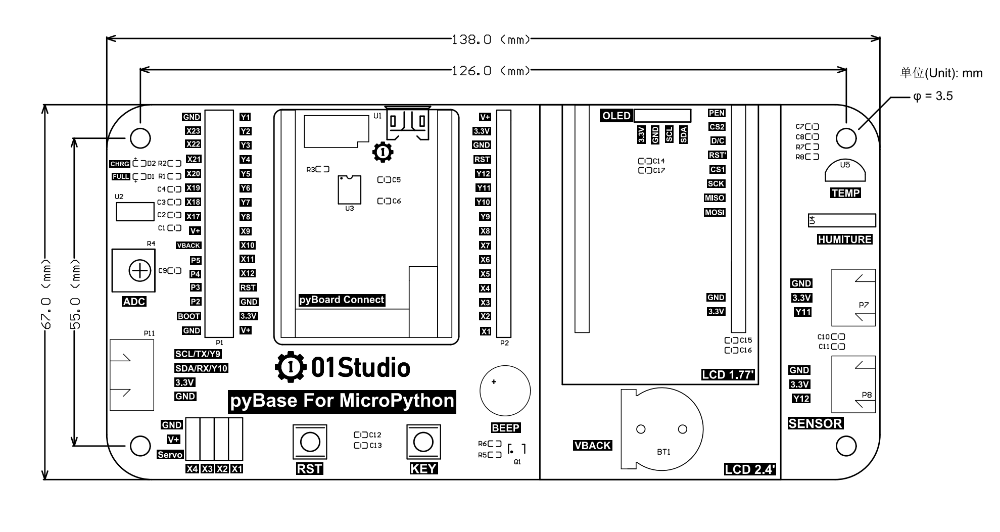
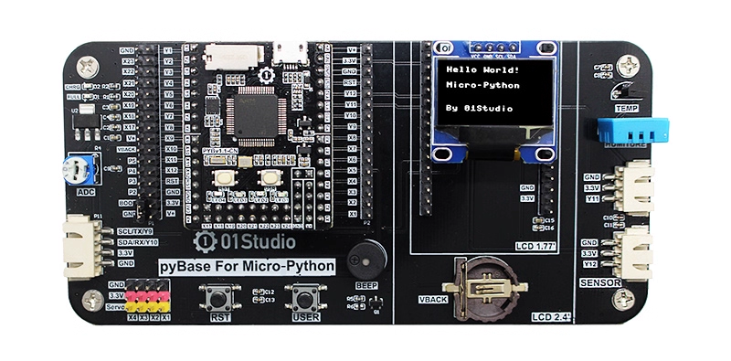

# 产品参数

## pyBoard

pyBaord v1.1-CN主控芯片使用STM32F405RGT6，即基于STM32平台，是01Studio在兼容官方pyBoard v1.1的情况下，对部分功能进行了改进，CN代表China中国版，具体改进如下：
- 按键和LED重新排列，让开发者使用更直观；
- 增加锂电池输入接口（XH-2.54 2P接口），位于板子背部；
- 改进丝印方式，提高了清晰度。

### 硬件资源

### 引脚图

### 详细参数

|  产品参数 |
|  :---:  | ---  |
| 主控 | **STM32F405RGT6** / ARM 32-bit Cortex-M4 @ 168MHz |
| 内存 | 192+4 KBytes SRAM |
| FLASH  | 1M Bytes | 
| SD卡槽  | 最大支持64GB | 
| LED  |  ● 可编程LED1（红色）   ● 可编程LED2（绿色）   ● 可编程LED3（黄色）   ● 可编程LED4（蓝色） |
| 按键  |  ● 可编程按键（USR）   ● 复位键 (RST) |
| GPIO  | 29 x GPIO  (包含ADC/DAC/PWM/UART/I2C/SPI等功能) |
| 加速度计  | 三轴加速度计MMA7660 |
| USB  | MicroUSB, USB2.0, 下载固件/编程/调试/供电 多合一 |
| 锂电池接口  | XH-2.54 2P接口在背面 / 3.7V锂电池 |

|  外观规格 |
|  :---:  | ---  |
| 尺寸  | 42 x 33mm  (长宽为PCB尺寸) |

### 尺寸图

## pyBoard mini

pyBaord minii主控芯片使用STM32F411CEU6，是pyBoard的mini版本，简单了部分功能，提高了性价比。[**点击购买>>**](https://item.taobao.com/item.htm?id=629555382322)

### 硬件资源

### 引脚图

### 详细参数

|  产品参数 |
|  :---:  | ---  |
| 主控 | **STM32F411CEU6** / ARM 32-bit Cortex-M4 @ 100MHz |
| 内存 | 128 KBytes SRAM |
| FLASH  | 512K Bytes | 
| LED  |  ● 可编程LED1（红色）   ● 可编程LED2（绿色）   ● 可编程LED3（黄色）   ● 可编程LED4（蓝色） |
| 按键  |  ● 可编程按键（USR）   ● 复位键 (RST) |
| GPIO  | 24 x GPIO  (包含ADC/DAC/PWM/UART/I2C/SPI等功能) |
| USB  | MicroUSB, USB2.0, 下载固件/编程/调试/供电 多合一 |
| 锂电池接口  | XH-2.54 2P接口 / 3.7V锂电池 |

|  外观规格 |
|  :---:  | ---  |
| 尺寸  | 42 x 33mm  (长宽为PCB尺寸) |

### 尺寸图

## pyBoard Plus

pyBaord Plus主控芯片使用STM32F407VGT6，是pyBoard的加强版本，相对于pyboard增加32个通用GPIO。[**点击购买>>**](https://item.taobao.com/item.htm?id=732801507647)

### 硬件资源

### 引脚图

### 详细参数

|  产品参数 |
|  :---:  | ---  |
| 主控 | **STM32F407VGT6** / ARM 32-bit Cortex-M4 @ 168MHz |
| 内存 | 192+4 KBytes SRAM |
| FLASH  | 1M Bytes | 
| SD卡槽  | 最大支持64GB | 
| LED  |  ● 可编程LED1（红色）   ● 可编程LED2（绿色）   ● 可编程LED3（黄色）   ● 可编程LED4（蓝色） |
| 按键  |  ● 可编程按键（USR）   ● 复位键 (RST) |
| GPIO  | 61 x GPIO  (包含ADC/DAC/PWM/UART/I2C/SPI等功能) |
| 加速度计  | 三轴加速度计MMA7660 |
| USB  | MicroUSB, USB2.0, 下载固件/编程/调试/供电 多合一 |
| 锂电池接口  | XH-2.54 2P接口在背面 / 3.7V锂电池 |

|  外观规格 |
|  :---:  | ---  |
| 尺寸  | 42 x 33mm  (长宽为PCB尺寸) |

### 尺寸图

## pyBase底板

[**点击购买>>**](https://item.taobao.com/item.htm?id=624200370196)

pyBase是01Studio针对多款micropython开发平台量身定制的底板，可以使用它可以做更多的MicroPython实验，pyBase同时设计了外设接口，扩展性非常强。以下是详细的功能说明：

### 详细参数

|  产品参数 |
|  :---:  | ---  |
| pyBoard接口 | 兼容个系列pyBoard核心板 |
| 2.54mm排针 | 引出pyBoard全部引脚 |
| 按键  |  ● 可编程按键   ● 复位键 (RST) |
| 电位器  | ADC输入 | 
| 无源蜂鸣器  | DAC输出 | 
| 纽扣电池  |  可安装CR1220纽扣电池 |
| Servo接口  | 舵机接口X1-X4 (连接舵机需要外接隔离电路) |
| OLED接口  | 0.96寸OLED显示屏 |
| LCD接口  | 支持01Studio 1.54/1.77/2.4/3.2等多款LCD显示屏 |
| 温度传感器  | DS18B20 |
| 温湿度传感器  | DHT11 |
| Sensor接口1  | 3P防呆接口，用于外接传感器 |
| Sensor接口2  | 3P防呆接口，用于外接传感器 |
| 通讯接口  | 4P防呆接口，用于外接UART/I2C设备 |
| 锂电池充电电路  | 对pyBoard外接锂电池（3.7V）进行充电，**红灯->充电中，绿灯->充满** |

|  外观规格 |
|  :---:  | ---  |
| 尺寸  | 138 x 67mm  (长宽为PCB尺寸) |

### 尺寸图

### 组合使用图

