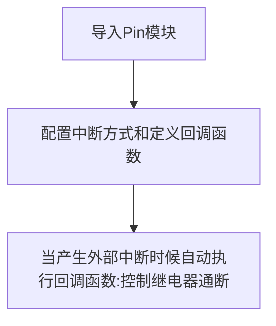

# 继电器

## 前言
我们知道我们的开发板GPIO输出的电平是3.3V的，这是不能直接控制一些高电压的设备，比如电灯（220V）。这时候就可以使用我们常用的低压控制高压元件—继电器。

## 实验平台
pyBoard开发套件和继电器模块


## 实验目的
使用按键控制继电器通断。

## 实验讲解

下图是01Studio的继电器模块，可以使用3.3V供电，IO驱动电压为3.3V。[**点击购买>>**](https://item.taobao.com/item.htm?id=624484399665)

:::tip 提示
务必使用3.3V电平控制的继电器，因为pyBoard的GPIO耐压值为3.3V，使用5V控制的继电器可能会反向烧坏开发板。
:::


|  产品参数 |
|  :---:  |  --- |
| 供电电压  | 3.3V |
| 触发方式  | 低电平触发 |
| 接口定义  | XH2.54防呆接口（3Pin）【GND、VCC、Single】 |
| 模块尺寸  | 4.5*2.5cm |

继电器可以理解成是一个开关，相当于我们平时家里面的电灯开关面板一样，只是现在使用单片机的GPIO来控制。继电器低压控制高压电器一个比较典型的接线图如下图所示：


01Studio的继电器模块的控制原理非常简单，跟LED控制方式一样，只是使用低电平‘0’表示继电器开，高电平‘1’表示继电器关。

我们可以使用按键 [**外部中断**](../basic_examples/exti.md) 来使用继电器。继电器连接到pyBase的’Y11’引脚，相当于连接到，编程流程图如下：

代码编写流程如下：



## 参考代码

```python
'''
实验名称：继电器
版本：v1.0
平台：pyBoard开发套件
作者：01Studio
社区：www.01studio.cc
'''

#导入相关模块
from machine import Pin
import time

relay=Pin('Y11',Pin.OUT,value=1) #构建继电器对象,默认断开
KEY=Pin('Y1',Pin.IN,Pin.PULL_UP) #构建KEY对象
state=0  #LED引脚状态

#LED状态翻转函数
def fun(KEY):
    global state
    time.sleep_ms(10) #消除抖动
    if KEY.value()==0: #确认按键被按下
        state = not state
        relay.value(state)

KEY.irq(fun,Pin.IRQ_FALLING) #定义中断，下降沿触发
```

## 实验结果

运行代码，可以通过按键来控制继电器通断：


继电器的控制方式非常简单，用途非常广。只需要一个简单的GPIO高低电平即可实现控制。