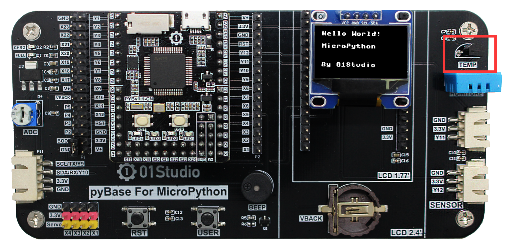
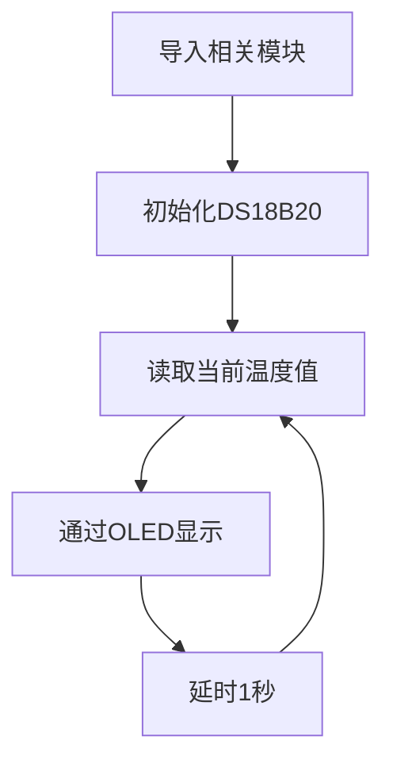
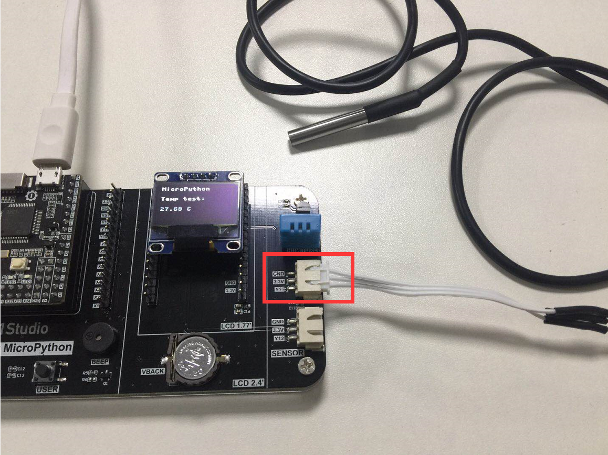
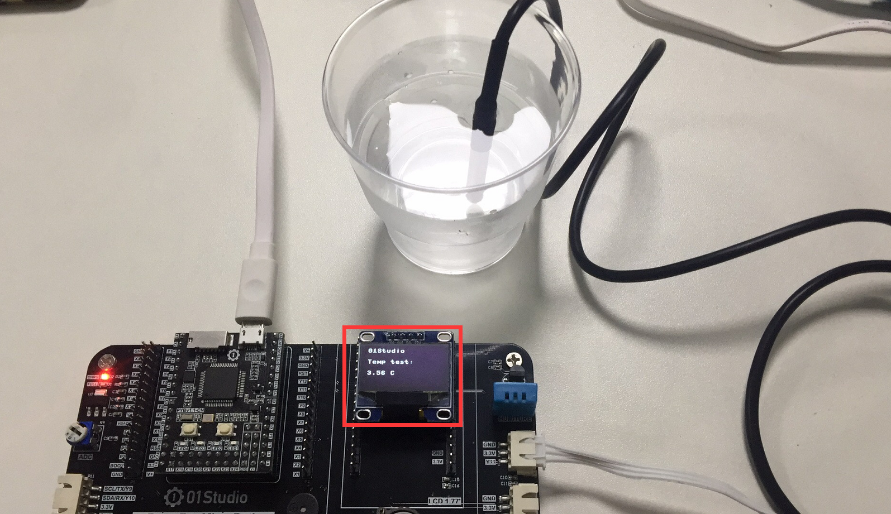

# 温度传感器（DS18B20）

## 前言
相信没有电子爱好者不知道DS18B20的，DS18B20是常用的数字温度传感器，其输出的是数字信号，具有体积小，硬件开销低，抗干扰能力强，精度高的特点。DS18B20数字温度传感器接线方便，封装成后可应用于多种场合，如管道式，螺纹式，磁铁吸附式，不锈钢封装式，型号多种多样。

主要根据应用场合的不同而改变其外观。封装后的DS18B20可用于电缆沟测温，高炉水循环测温，锅炉测温，机房测温，农业大棚测温，洁净室测温，弹药库测温等各种非极限温度场合。耐磨耐碰，体积小，使用方便，封装形式多样，适用于各种狭小空间设备数字测温和控制领域。


**DS18B20温度传感器**


**DS18B20金属探头封装** - [**点击购买>>**](https://item.taobao.com/item.htm?id=624137846668)

## 实验平台
pyBoard开发套件。DS18B20温度传感器位于右上角。



## 实验目的
通过MicroPython编程采集温度数据，并在OLED上显示。

## 实验讲解

DS18B20是单总线驱动（onewire）传感器，也就是说只占用1个IO口。我们来看看原理图：


可以看到连接到DS18B20传感器是pyBoard的X11引脚。也就是说针对该引脚编写程序来驱动DS18B20。那么我们需要自己来编写驱动么？如果你有兴趣的可以自己尝试一下。这部分我们01Studio已经收集整理和编写好了，当然也包括DS18B20。单总线模块文件是：onewire.py，DS18B20模块的文件是DS18X20.py，将示例程序文件夹里面以上这两个文件拷贝到pyboard文件系统中。

## onewire对象

### 构造函数
```python
ow = onewire.OneWire(machine.Pin(id))
```
构建单总线对象

- `id` ：芯片引脚编号。如: 'x11'。


### 使用方法
```python
ow.scan()
```
扫描总线上的设备。返回设备地址，支持多设备同时挂载。

<br></br>

```python
ow.reset()
```
总线设备复位。

<br></br>

```python
ow.readbyte()
```
读1个字节。

<br></br>

```python
ow.readbyte()
```
读1个字节。

<br></br>

```python
ow.writebyte(0x12)
```
写入1个字节。

<br></br>

```python
ow.write('123')
```
写入多个字节。

<br></br>

```python
ow.select_rom(b'12345678')
```
根据ROM编号选择总线上指定设备。

<br></br>

## ds18x20对象

### 构造函数
```python
ds = ds18x20.DS18X20(ow)
```
构建DS18B20传感器对象。

- `ow` ：定义好的单总线对象。


### 使用方法
```python
ds.scan()
```
扫描总线上的DS18B20设备。返回设备地址，支持多设备同时挂载。

<br></br>

```python
ds.convert_temp()
```
温度转换。

<br></br>

```python
ds.read_temp(rom)
```
获取温度值。rom：表示对应的设备号。

<br></br>

大部分场景下温度的变化不会太频繁，我们可以每隔1秒采集一次，显示精度为小数点后2位，基本满足大部分应用需求。代码编写流程如下：




## 参考代码

```python
'''
实验名称：温度传感器DS18B20
版本：v1.0
平台：pyBoard开发套件
作者：01Studio
说明：通过编程采集温度数据，并在OLED上显示。
'''

#引用相关模块
import time
from machine import Pin,SoftI2C
from ssd1306 import SSD1306_I2C
from onewire import OneWire
from ds18x20 import DS18X20

#初始化相关模块
i2c = SoftI2C(sda=Pin("Y8"), scl=Pin("Y6")) # 软件模拟I2C
oled = SSD1306_I2C(128, 64, i2c, addr=0x3c)

#初始化DS18B20
ow= OneWire(Pin('X11')) #使能单总线
ds = DS18X20(ow)        #传感器是DS18B20
rom = ds.scan()         #扫描单总线上的传感器地址，支持多个传感器同时连接

while True:

    ds.convert_temp()   #温度采集转换
    temp = ds.read_temp(rom[0]) #温度显示,rom[0]为第1个DS18B20

    #数据显示
    oled.fill(0)   #清屏背景黑色
    oled.text('01Studio', 0, 0)
    oled.text('Temp test:',0,20)
    oled.text(str('%.2f'%temp)+' C',0,40) #显示temp,保留2位小数
    oled.show()

    time.sleep(1) #延时1秒

```

## 实验结果

本实验需要将示例程序文件夹的 `ds18x20.py`, `onewire.py` 和 `ssd1306.py` 库文件上传到开发板文件系统。


运行代码，可以看到oled屏显示采集的温度数据：


MicroPython开发板预留了外界传感器接口，只要接线正确就可以进行更多的传感器实验。我们将带金属探头的DS18B20传感器接到中间的传感器母座，其连接的IO是“Y11”,所以要将原程序代码的：

```python
ow=OneWire(Pin(‘X19’)) 
```
改成下面引脚代码，运行即可。
```python
ow=OneWire(Pin(‘Y11’))
```



我们将金属探头放在冰水里面，可以见到测试到的温度是3点多℃。



DS18B20作为我们第一个实验传感器，使用MicroPython编程非常容易就用起来了，而且精度和稳定性丝毫没有影响。温度传感器只是一个敲门砖，接下来我们将会学习更多的传感器应用。


