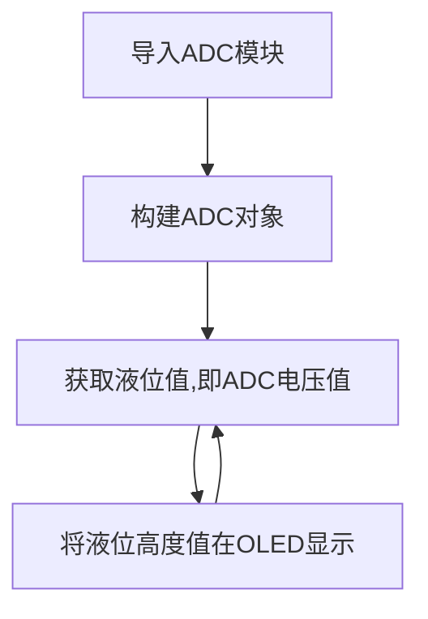

# 液位传感器

## 前言
水位（液位）传感器是一款简单易用、小巧轻便、水位/水滴识别检测传感
器，传感器通过一系列的暴露的平行导线线迹测量其水滴/水量大小使得传感器输出的模拟信号产生相应的变化，轻松完成水量到模拟信号的转换，从而判断水位。


## 实验平台
pyBoard开发套件和液位传感器模块。

 

## 实验目的
测量水位高度并在OLED显示，显示方式为：0-4cm。

## 实验讲解

我们先来看看水位传感器的介绍：[**点击购买>>**](https://item.taobao.com/item.htm?id=623859169795)

 

 

|  产品参数 |
|  :---:  |  --- |
| 供电电压  | 3.3V |
| 工作电流  | <20mA |
| 接口定义  | XH2.54防呆接口（3Pin）【GND、VCC、Single】 |
| 输出信号  | 模拟信号：0-3.3V （VCC=3.3V时）|
| 模块尺寸  | 6.6*2.0cm |

:::tip 提示
水位传感器接口旁元件不能接触水，否则容易短路。所以测量时候要注意液体水位的高度。
:::

从上表可以看到，水位传感器的量程为4cm，输出的是模拟信号：0-3.3V，这代表水位高度情况。接近0V时湿度为0cm或没有放进液体，电压升高，意味着水位升高。因此我们可以使用基础实验-ADC学习过的内容来编程。

水位传感器接在传感器接口1，对应的引脚是“Y11”。ADC使用12bit精度，即最大值为2^12-1=4095。我们使用的是普通桶装水，根据实际测试数据将检测到的数值0-4095分成5档。分别代表水位高度0cm：【0-600】，1cm：【600-900】，2cm：【900-1200】，3cm：【1200-1300】，4cm：【>1300】。

当然开发者可以根据自己测量液体不同或其它情况来调整数值。代码编写流程如下：



## 参考代码

```python
'''
实验名称：水(液)位传感器
版本：v1.0
平台：pyBoard开发套件
作者：01Studio
说明：通过水位传感器对水位测量并显示。
'''

#导入相关模块
import pyb, time
from machine import Pin,SoftI2C
from ssd1306 import SSD1306_I2C

#初始化相关模块
i2c = SoftI2C(sda=Pin("Y8"), scl=Pin("Y6"))
oled = SSD1306_I2C(128, 64, i2c, addr=0x3c)

#初始化ADC,Pin='Y11'
Water_level = pyb.ADC('Y11')

while True:

    oled.fill(0)  # 清屏显示黑色背景
    oled.text('01Studio', 0, 0)  # 首行显示01Studio
    oled.text('Water Level test', 0, 15)      # 次行显示实验名称

    value=Water_level.read() #获取ADC数值

    #显示数值
    oled.text(str(value)+' (4095)',0,40)
    #计算电压值，获得的数据0-4095相当于0-3V，（'%.2f'%）表示保留2位小数
    oled.text(str('%.2f'%(value/4095*3.3))+' V',0,55)

    #判断水位，分5档显示，0-4cm
    if 0 <= value <=600:
        oled.text('0cm', 60, 55)

    if 600 < value <= 900:
        oled.text('1cm', 60, 55)

    if 900 < value <= 1200:
        oled.text('2cm', 60, 55)

    if 1200 < value <= 1300:
        oled.text('3cm', 60, 55)

    if 1300 < value:
        oled.text('4cm', 60, 55)

    oled.show()
    time.sleep(1)
```

## 实验结果

使用Thonny IDE运行代码，当没插入水中时，OLED显示当前水位为0cm:

 

将水位传感器模块慢慢放入水中，可以看到OLED显示从1cm-4cm变化。**（注意量程是4cm，请勿将超出的电路部分放置水中以免发生短路。）**

- 水位接近1cm
 

- 水位接近3cm

 

从实验可以见到，这款水位传感器出了可以用来测量水位（液位）高度外，还可以用来测量室外下雨情况和家里的淹水情况。有兴趣的小伙伴可以动手制作一下！
