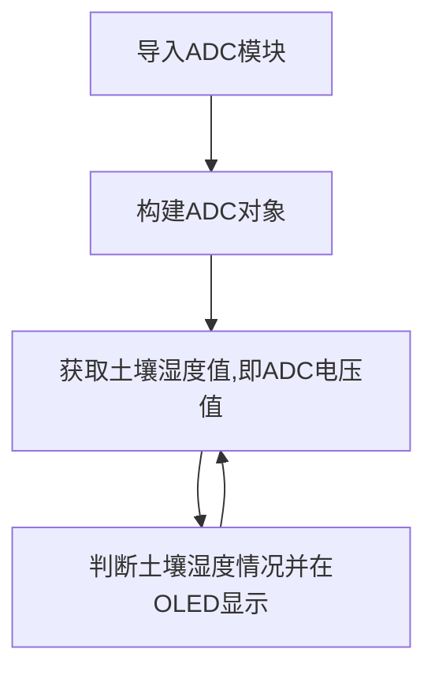
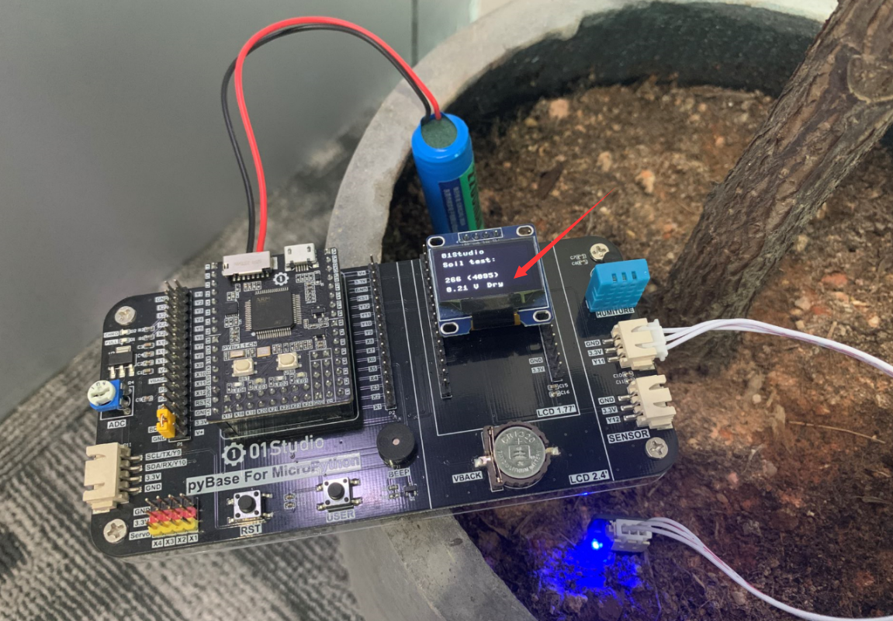
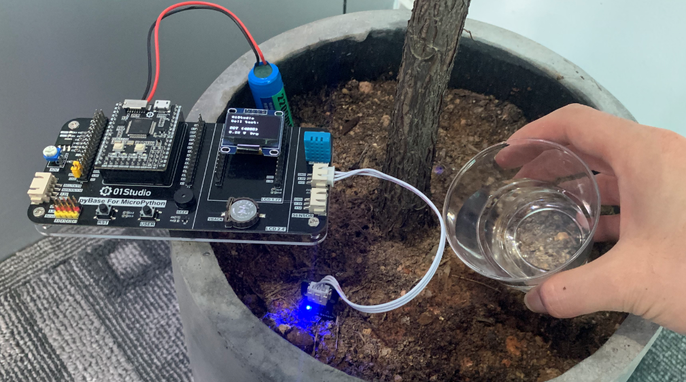
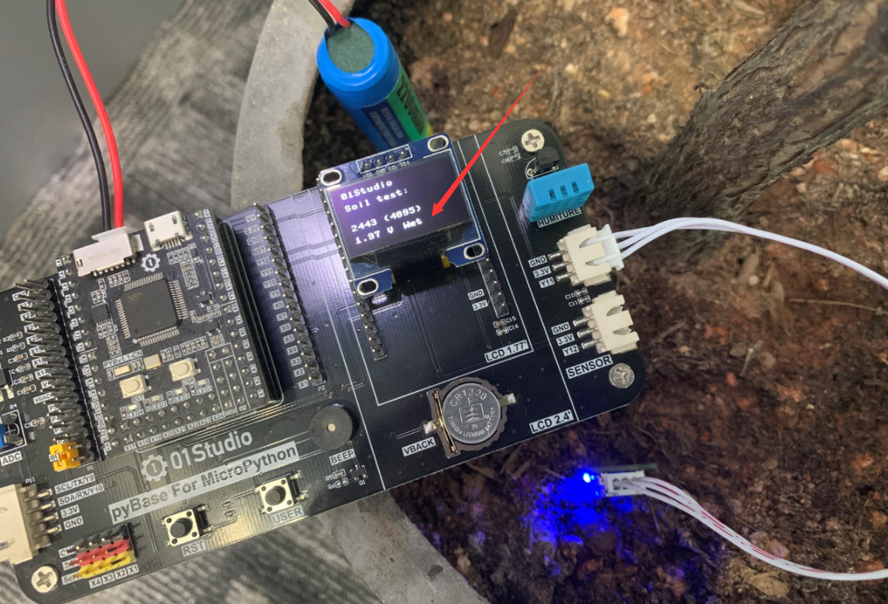

# 土壤湿度传感器

## 前言
土壤湿度传感器用于检测盆栽泥土的湿度，当泥土干枯时候，我们就需要给植物浇水了。这个用途非常广泛，如自动灌溉。

## 实验平台
pyBoard开发套件和土壤传感器模块。

 

## 实验目的
采集盆栽土壤的的光照强度并在OLED显示，显示方式为：Dry-干，Normal-中等，Wet-湿。

## 实验讲解

我们先来看看土壤湿度传感器模块的介绍：[**点击购买>>**](https://item.taobao.com/item.htm?id=623551896206)

 

|  产品参数 |
|  :---:  |  --- |
| 供电电压  | 3.3V |
| 工作电流  | <20mA |
| 接口定义  | XH2.54防呆接口（3Pin）【GND、VCC、Single】|
| 输出信号  | 模拟信号：0-3.3V （VCC=3.3V时） |
| 模块尺寸  | 4.5*2.5cm |

从上表可以看到，土壤湿度传感器输出的是模拟信号：0-3.3V，这代表土壤的湿度情况。接近0V时湿度为干燥，接近3.3V时，湿度情况为湿润。因此我们可以使用基础实验-ADC学习过的内容来编程。

土壤湿度传感器接在传感器接口1，对应的引脚是“Y11”。ADC使用12bit精度，即最大值为2^12-1=4095。然后我们根据实际测试数据将检测到的数值0-4095分成三段，分别代表土壤干燥：【0-1247】，中等：【1247-2238】，湿润：【2238-4095】。当然开发者可以根据自己实际情况来调整数值。编程流程图如下：


代码编写流程如下：



## 参考代码

```python
'''
实验名称：土壤湿度传感器
版本：v1.0
平台：pyBoard开发套件
作者：01Studio
说明：通过土壤湿度传感器对土壤湿度测量并显示。
'''

#导入相关模块
import pyb,time
from machine import Pin,SoftI2C
from ssd1306 import SSD1306_I2C

#初始化相关模块
i2c = SoftI2C(sda=Pin("Y8"), scl=Pin("Y6"))
oled = SSD1306_I2C(128, 64, i2c, addr=0x3c)

#初始化ADC,Pin='Y11'
Soil = pyb.ADC('Y11')

while True:

    oled.fill(0)  # 清屏显示黑色背景
    oled.text('01Studio', 0, 0)  # 首行显示01Studio
    oled.text('Soil test:', 0, 15)      # 次行显示实验名称

    value=Soil.read() #获取ADC数值

    #显示数值
    oled.text(str(value)+' (4095)',0,40)
    #计算电压值，获得的数据0-4095相当于0-3V，（'%.2f'%）表示保留2位小数
    oled.text(str('%.2f'%(value/4095*3.3))+' V',0,55)

    #判断土壤湿度，分3档显示。
    if 0 <= value <=1247:
        oled.text('Dry', 60, 55)

    if 1247 < value <= 2238:
        oled.text('Normal', 60, 55)

    if 2238 < value <= 4095:
        oled.text('Wet  ', 60, 55)

    oled.show()
    time.sleep(1)
```

## 实验结果

使用Thonny IDE运行代码，将传感器插到干燥的土壤中，可以见到OLED显示干燥-Dry：

 

从传感器侧面往土壤浇水，让土壤变得湿润。**注意不要浇到传感器电路上！**

 

可以看到OLED显示湿润-Wet:

 

从实验可以看到，土壤湿度传感器背后的原理是对ADC的应用，实现了该功能后。我们可以自行扩展深入，制作自己喜欢的电子产品。

