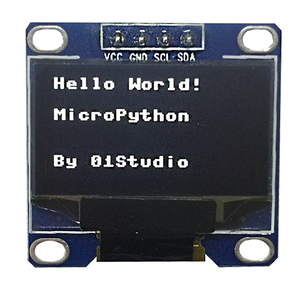
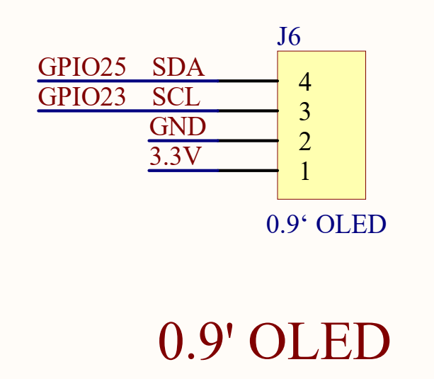
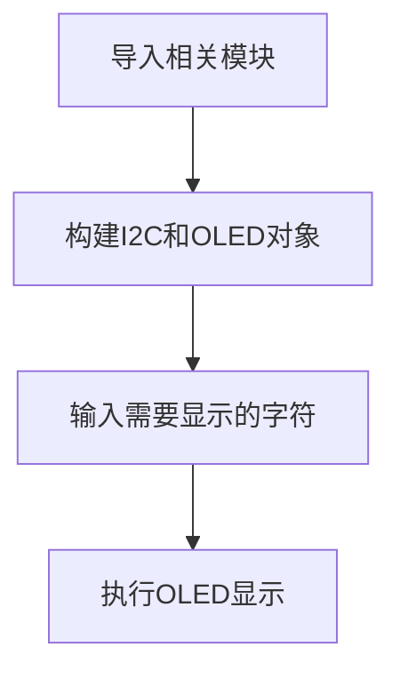
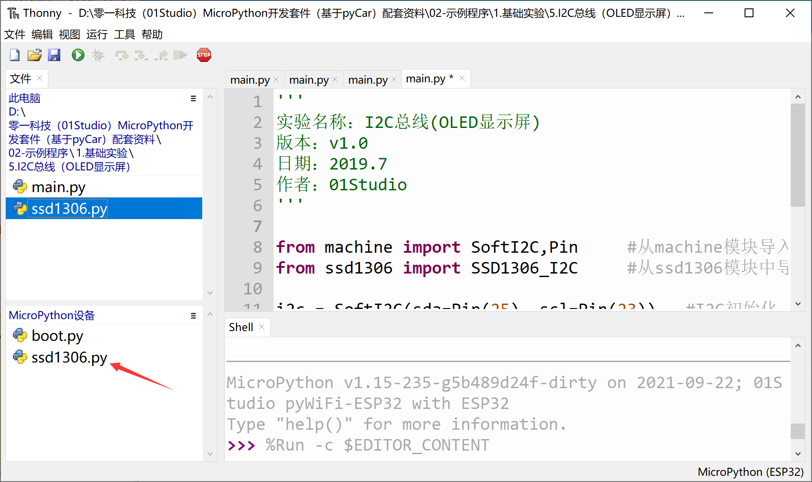
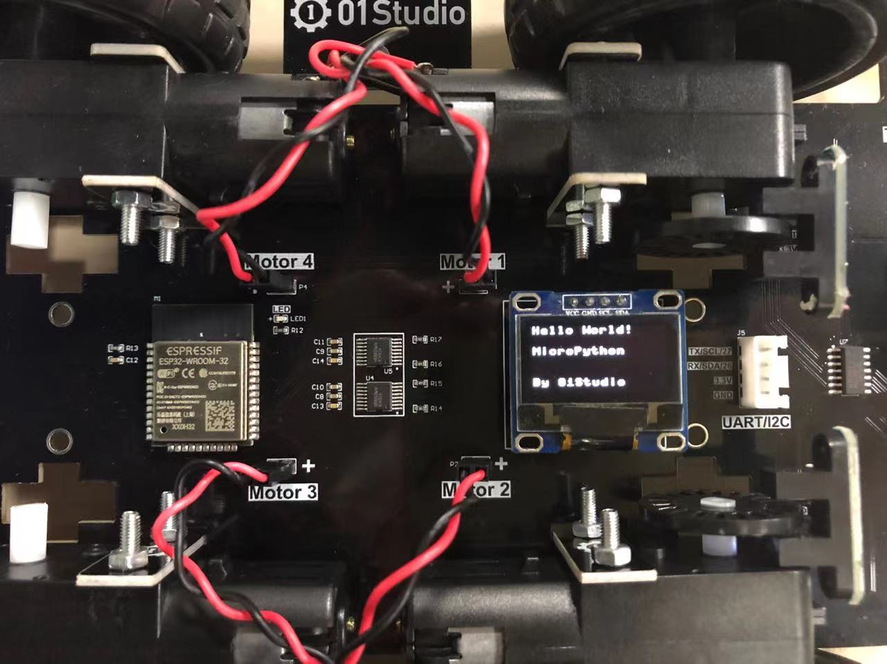

# OLED显示屏（I2C）

## 前言

前面学习了按键输入设备后，这一节我们来学习输出设备OLED显示屏，其实之前的LED灯也算是输出设备，因为它们确切地告诉了我们硬件的状态。只是相对于只有亮灭的LED而言，显示屏可以显示更多的信息，体验更好。

本章节的OLED显示屏学习，实际上是在使用I2C的总线接口，pyCar是通过I2C总线与OLED显示屏通讯的。这章稍微复杂一点，但我们把它放在了前面来学习，是因为学会了显示屏的使用，那么在后面的实验中可玩性就更强了。

## 实验目的

学习使用MicroPython的I2C总线通讯编程和OLED显示屏的使用。

## 实验讲解

- 什么是I2C？

I2C是用于设备之间通信的双线协议，在物理层面，它由2条线组成：SCL和SDA，分别是时钟线和数据线。也就是说不通设备间通过这两根线就可以进行通信。

- 什么是OLED显示屏？

OLED的特性是自己发光，不像TFT LCD需要背光，因此可视度和亮度均高，其次是电压需求低且省电效率高，加上反应快、重量轻、厚度薄，构造简单，成本低等特点。简单来说跟传统液晶的区别就是里面像素的材料是由一个个发光二极管组成，因为密度不高导致像素分辨率低，所以早期一般用作户外LED广告牌。随着技术的成熟，使得集成度越来越高。小屏也可以制作出较高的分辨率。



在了解完I2C和OLED显示屏后，我们先来看看pyCar开发板的原理图，也就是上面的OLED接口是如何连线的。



从上图可见连接到OLED的别是 GPIO23->SCL和 GPIO25->SDA。ESP32的micropython库里提供硬件I2C和软件I2C，硬件I2C直接使用原生硬件I2C，软件I2C则可以使用任意IO口来模拟，相对灵活。由于OLED屏性能不高，因此这里我们使用软件I2C（SoftI2C）来驱动。对象说明如下：

## SoftI2C对象

### 构造函数
```python
i2c = machine.SoftI2C(scl, sda, freq=400000)
```
构建一个软件I2C对象，参数如下：

- ``scl``：时钟引脚
- ``sda``：数据引脚
- ``freq``：I2C	

### 使用方法
```python
i2c.scan()
```
扫描I2C总线的设备。返回地址，如：0x3c；

<br></br>

```python
i2c.readfrom(addr, nbytes)
```
从指定地址读数据。
- `addr`:指定设备地址；
- `nbytes`:读取字节数；

<br></br>

```python
i2c.write(buf)
```
写数据。
- `buf`: 数据内容；

<br></br>

更多用法请阅读官方文档：<br></br>
https://docs.01studio.cc/library/machine.I2C.html#machine.SoftI2C

## OLED对象

定义好I2C后，还需要驱动一下OLED。这里我们已经写好了OLED的库函数，在ssd1306.py文件里面。开发者只需要拷贝到pyBoard文件系统里面，然后在main.py里面调用函数即可。人生苦短，我们学会调用函数即可，也就是注重顶层的应用，想深入的小伙伴也可以自行研究ssd1306.py文件代码。OLED显示屏对象介绍如下：

### 构造函数
```python
oled = SSD1306_I2C(width, height, i2c, addr)
```
构OLED显示屏对象。

- `width`:屏幕宽像素；
- `height`: 屏幕高像素；
- `i2c`:定义好的I2C对象; 
- `addr`:显示屏设备地址。	

### 使用方法
```python
oled.text(string,x,y)
```
将string字符写在指定为位置。

- `string`：字符；
- `x`:横坐标；
- `y`:纵坐标。

<br></br>

```python
oled.show()
```
执行显示。

<br></br>

```python
oled.fill(RGB)
```
清屏。
- `RGB`：
    - `0`:表示黑色，
    - `1`:表示白色。

<br></br>

学习了I2C、OLED对象用法后我们通过编程流程图来理顺一下思路：




## 参考代码

```python
'''
实验名称：I2C总线(OLED显示屏)
版本：v1.0
作者：01Studio
'''

from machine import SoftI2C,Pin     #从machine模块导入SoftI2C、Pin子模块
from ssd1306 import SSD1306_I2C     #从ssd1306模块中导入SSD1306_I2C子模块

i2c = SoftI2C(sda=Pin(25), scl=Pin(23))   #I2C初始化：sda--> 25, scl --> 23
oled = SSD1306_I2C(128, 64, i2c, addr=0x3c) #OLED显示屏初始化：128*64分辨率,OLED的I2C地址是0x3c

oled.text("Hello World!", 0,  0)      #写入第1行内容
oled.text("MicroPython",  0, 20)      #写入第2行内容
oled.text("By 01Studio",  0, 50)      #写入第3行内容

oled.show()   #OLED执行显示
```

上述代码中OLED的I2C地址是0x3C,不同厂家的产品地址可能预设不一样，具体参考厂家的说明书。或者也可以通过I2C.scan()来获取设备地址。

## 实验结果

先将我们提供的示例代码中的ssd1306.py驱动文件拷贝到pyCar的文件系统下。



运行代码，可以看到OLED显示相关字符信息。



这一节我们学会了驱动OLED显示屏，换着以往如果从使用单片机从0开发的话你需要了解I2C总线原理，了解OLED显示屏的使用手册，编程I2C代码，有经验的嵌入式工程师搞不好也要弄个几天。现在基本半个小时解决问题。当然前提是别人已经给你搭好桥了，有了强大的底层驱动代码支持，我们只做好应用就好。

这一节学习的意义不仅在完成实验。在学习完OLED显示屏实验后，接下来我们的实验都可以使用这个OLED来跟用户交互了，这大大提高了实验的可观性。
