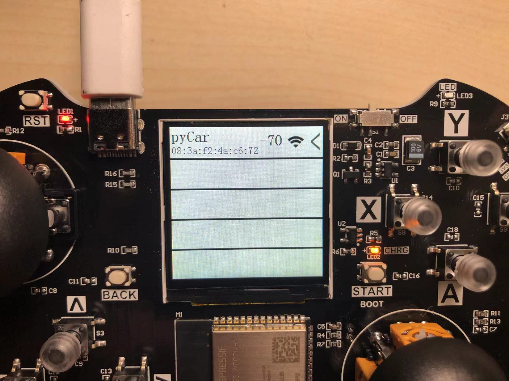

# 蓝牙遥控车

## 前言

pyCar基于乐鑫ESP32，这款主控支持WiFi和蓝牙（BLE），本节我们就结合01科技pyController遥控手柄，实现蓝牙通讯，打造一台蓝牙遥控车。

## 实验平台

pyCar和pyController。


## 实验目的

编程实现手柄通过蓝牙方式控制pyCar。

## 实验讲解

ESP32固件集成了BLE库，支持低功耗蓝牙（BLE）主从机功能。关于BLE的应用细节不会在本节内容展开，这里我们只需要搞清楚主机(central)和从机（peripheral）的概念区别即可，蓝牙设备在连接过程如下：

**从机发起广播 – 主机搜索广播的设备 – 发起连接 – 连接成功后通讯**

一般来说子设备通常作为从机，控制设备作为主机，比如我有一个蓝牙耳机（从机），开机后发起广播，而手机（主机）在搜索，搜索到这个蓝牙耳机后就发起连接，连接成功后相互通讯。

本节中，我们将小车设定从机，上电后发出广播，广播名称设为“pyCar”，然后pyController手柄作为主机，上电后不断搜索周围的小车设备，搜索后发起连接，连接成功后将手柄摇杆和按键原始数据发送给小车，小车接收到数据后执行各种动作。

关于小车移动动作前面章节已经有详细讲解，这里不再重复，具体参考：

[pyCar移动动作教程>>](../sub_modules/movement.md)

代码编写流程如下：


## 参考代码

### pyCar小车（蓝牙从机）代码

- `main.py`代码

```python
'''
实验名称：pyCar蓝牙遥控车（pyCar代码）
版本：v1.0
日期：2022.4
作者：01Studio
说明：pyController做蓝牙主机，pyCar做从机，手柄搜索到'pyCar'后发起连接，然后控制。
'''

import bluetooth,ble_simple_peripheral,time
from car import CAR

#初始化pyCar
Car = CAR()
time.sleep_ms(300) #等待稳定

#初始化蓝牙BLE从机,广播名称为pyCar
ble = bluetooth.BLE()
p = ble_simple_peripheral.BLESimplePeripheral(ble,name='pyCar')

#车灯状态
light_state = 0

#接收到蓝牙数据处理函数
def on_rx(v):

    global light_state
    
    #串口打印接收到的数据
    #print("RX:", v)
    
    #对收到的手柄8字节数据进行判断
    
    if v[5]==40: #B键被按下，开车灯
        Car.light(1)
        
    if v[5]==72: #A键被按下，关车灯
        Car.light(0)
        
    if v[5]==0: #上键被按下，前进
        Car.forward()
        
    if v[5]==4: #下键被按下，后退
        Car.backward() 
        
    if v[5]==6: #左键被按下，左转
        Car.turn_left(mode=1)
        
    if v[5]==2: #右键被按下，右转
        Car.turn_right(mode=1)
        
    if v[5]==8: #没按键按下，停止
        Car.stop()

#注册从机接收回调函数，收到数据会进入on_rx函数。
p.on_write(on_rx)

#系统会自动广播, 连接断开后重新自动广播。
while True:
    
    pass

```

### pyController遥控手柄（蓝牙主机）代码

- `main.py`代码
```python
'''
实验名称：pyCar蓝牙遥控车（pyController代码）
版本：v1.0
日期：2022.4
作者：01Studio
说明：pyController做蓝牙主机，pyCar做从机，手柄搜索到'pyCar'后发起连接，然后控制。
'''

#导入BLE主机模块
import ble_simple_central

while True:
    
    #执行主机扫描连接代码
    ble_simple_central.ble_connect()
```

- `ble_simple_central.py`关键代码：


```python

...

#扫描连接函数
def ble_connect():
    
    ble = bluetooth.BLE()
    central = BLESimpleCentral(ble)

    not_found = False
    
    def on_scan(addr_type, addr, name):
        if addr_type is not None:
            print("Found peripheral:", addr_type, addr, name)
            central.connect()
        else:
            global not_found
            not_found = True
            print("No peripheral found.")

    central.scan(callback=on_scan)

    # Wait for connection...
    while not central.is_connected():
        time.sleep_ms(100)
        if not_found:
            break

    print("Connected")

    
    #接收信息处理
    def on_rx(v):
        print("RX", len(v))
        for i in range(len(v)):
            print(v[i])

    central.on_notify(on_rx)

    with_response = False
    
    #构建手柄对象
    gamepad = controller.CONTROLLER()

    while central.is_connected():

        try:
            a = gamepad.read() #读取手柄数据
            print("TX", a)
            central.write(bytes(a), with_response) #发送手柄数据
        except:
            print("TX failed")
        time.sleep_ms(400 if with_response else 30) #30ms发送一次
        
    print("Disconnected")

...

```

## 实验结果

将示例程序文件夹所有库代码文件分别发送到pyController和pyCar。


复位小车，等待启动。然后启动手柄，可以看到搜索到pyCar，信息包含mac地址和信号强度。（支持多台pyCar同时搜索）。


信号强的范围是 0 ~ -99, 值越接近0表示信号越好。



如果搜索到多台，可以通过按手柄的上、下键来选择，点击**START**键即可连接小车。


连接成功后出现小车界面，这时候即可遥控小车。**当前控制功能是上下左右4个按键分别控制小车的4个运动方向，B键开车灯，A键关车灯。**

如需更多的控制方式，修改pyCar的信息接收代码即可。


本节例程的扩展性非常强，只需要修改一下pyCar(蓝牙从机)代码即可控制小车各类功能，建议手柄传输给小车的是原始数据，将数据判断处理交给受控设备（小车），这样通用性会更强一点。