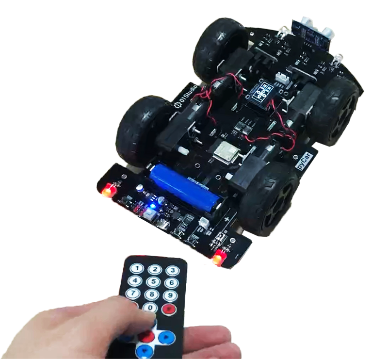
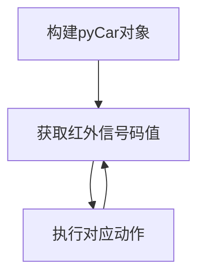

# 红外遥控车

## 前言

我们在前面学习了小车的移动动作和红外遥控器解码实验，本节我们就来整合一下，打造一辆红外遥控小车！



## 实验目的

编程实现红外遥控器控制小车的各种移动。

## 实验讲解

关于小车移动和红外遥控实验前面章节已经有详细讲解，这里不再重复，具体参考：

[pyCar移动动作教程>>](../sub_modules/movement.md)

[pyCar红外遥控器教程>>](../sub_modules/ir.md)

本节我们使用遥控器的上下左右和OK键，分别代表pyCar的前进、后退、左转、右转已经开关车头灯。代码编写流程如下：



## 参考代码

```python
'''
实验名称：红外遥控车
版本：v1.0
作者：01Studio
说明：使用红外遥控器控制pyCar小车
'''

#导入相关模块
from car import CAR
import time

#初始化pyCar
Car = CAR()
time.sleep_ms(300) #等待稳定

#车灯状态
light_state = 0 

while True:
    
    key = Car.getIR() #读取红外传感器

    if key != None: #有按键按下
        
        #按键上，前进
        if key == 0x18:
            
            Car.forward()
            time.sleep(1)
            Car.stop()
        
        #按键下，后退
        if key == 0x52:
            
            Car.backward()
            time.sleep(1)
            Car.stop()

        #按键左，左转
        if key == 0x8:
            
            Car.turn_left(mode=1)
            time.sleep_ms(250)
            Car.stop()

        #按键右，右转
        if key == 0x5A:
            
            Car.turn_right(mode=1)
            time.sleep_ms(250)
            Car.stop()                                            
        
        #按键OK，车灯开关
        if key == 0x1C: 
            
            light_state = not light_state
            Car.light(light_state)

```

## 实验结果

将相关示例程序的所有代码文件和car.py库文件发送至pyCar文件系统，通过遥控器便可控制小车各种动作。


使用micropython结合car.py库非常轻松就打造一台红外遥控车，给家里的小朋友玩，估计可以玩一整天。有需要的用户可以自行编程，使用更多的按键实现更多的功能。