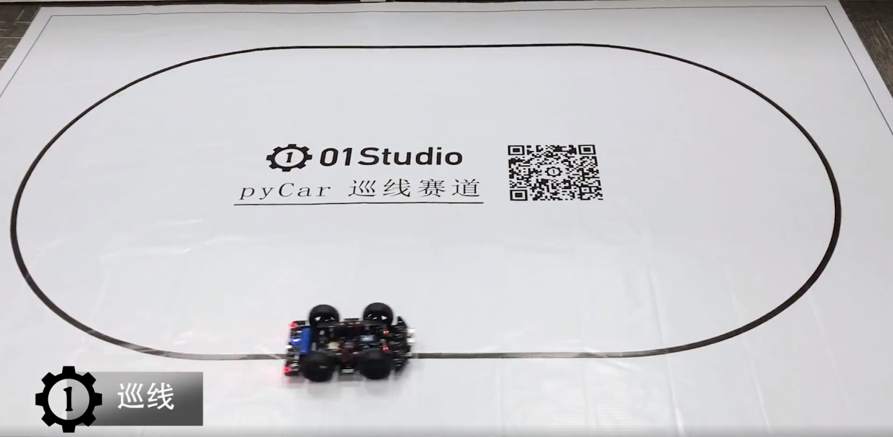
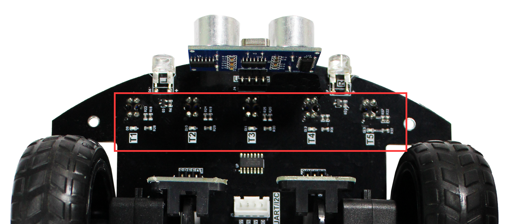
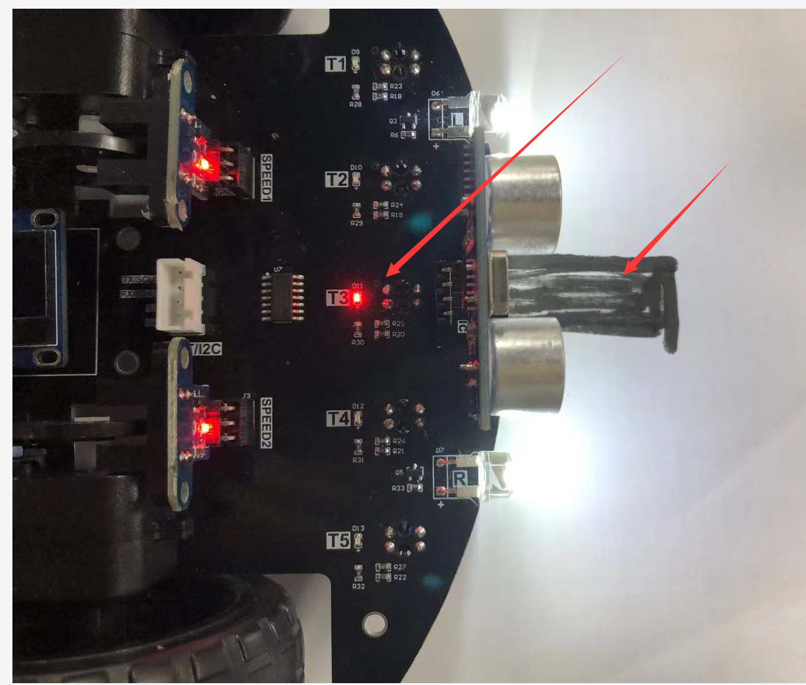
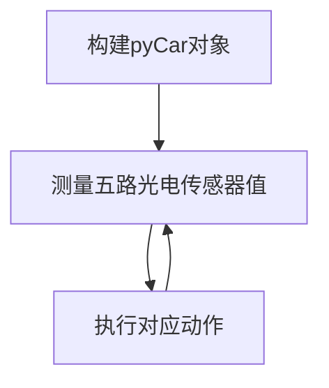

# 巡线小车

## 前言

相信大家都有在网上看到过可以跟着黑线行走的小车，也就是我们说的巡线小车，本节我们就实验pyCar编程实现巡线行驶。



## 实验目的

编程实现小车巡线（黑线）行驶。

## 实验讲解

pyCar的车头有5路光电传感器，当车在白色路面行驶时（反光性比较好），全部指示灯熄灭，输出高电平。当遇到黑色赛道（无反光），对应的传感器指示灯亮，输出低电平。






关于小车光电传感器检测实验前面章节已经有详细讲解，这里不再重复，具体参考：

[pyCar光电传感器检测教程>>](../sub_modules/photoelectric.md)

控制方式是正常情况小车走直线，当小车偏左时候右转调整，当小车偏右时候左转调整，代码编写流程如下：



## 参考代码

```python
'''
实验名称：pyCar巡线例程
版本：v1.0
作者：01Studio
说明：使用pyCar的光电传感器实现黑线巡线
'''

#导入相关模块
from car import CAR
import time

#初始化pyCar
Car = CAR()
time.sleep_ms(300) #等待稳定

'''
########巡线检测###########
T1-T2-T3-T4-T5 光电传感器
11011  直线
10111  偏右，往左调整
01111  严重偏右，往左调整
11101  偏左，往右调整
11110  严重偏左，往右调整
'''

while True:
    
    #偏右，往左调整
    if Car.T1()==0 or Car.T2()==0:
        time.sleep_ms(10) #消抖
        if Car.T1()==0 or Car.T2()==0 :
            Car.turn_left()
            while Car.T4()==1 and Car.T5()==1:
                if Car.T3() == 0:
                    time.sleep_ms(10)
                    if Car.T3() == 0:
                        break

            Car.forward()
    
    #偏左，往右调整
    elif Car.T4()==0 or Car.T5()==0 :
        time.sleep_ms(10)
        if Car.T4()==0 or Car.T5()==0 :
            Car.turn_right()
            while Car.T1()==1 and Car.T2()==1:
                if Car.T3() == 0:
                    time.sleep_ms(10)
                    if Car.T3() == 0:
                        break

            Car.forward()

    #普通情况走直线
    else:
        Car.forward()
```

## 实验结果

本教程需要一条黑线的赛道，用户可以自行设计或者[点击购买>>](https://item.taobao.com/item.htm?id=663173309335)

将相关示例程序的所有代码文件和car.py库文件发送至pyCar文件系统，便可实现上电运行小车巡线功能。


小车巡线原理简单，有兴趣用户可以深入研究，实现更快的行驶速度。