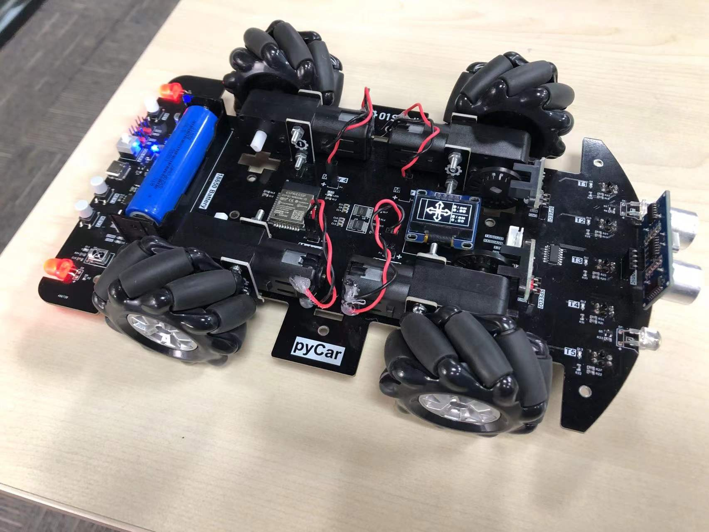
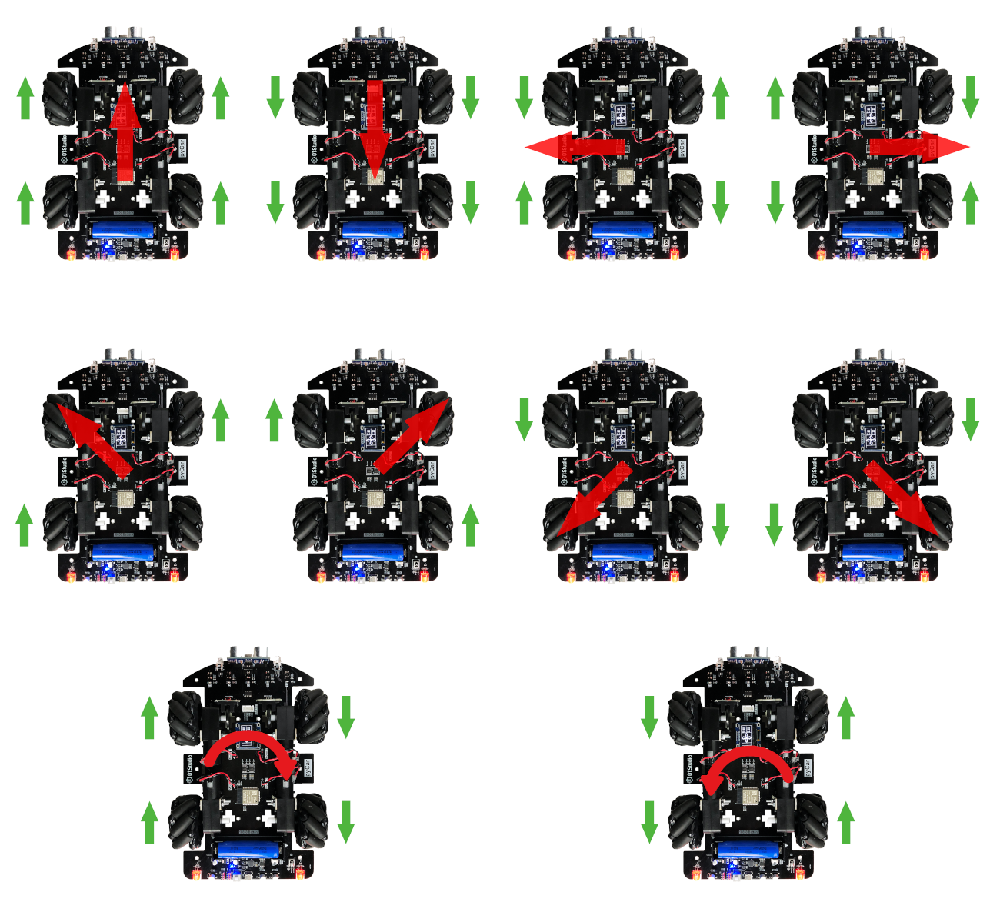
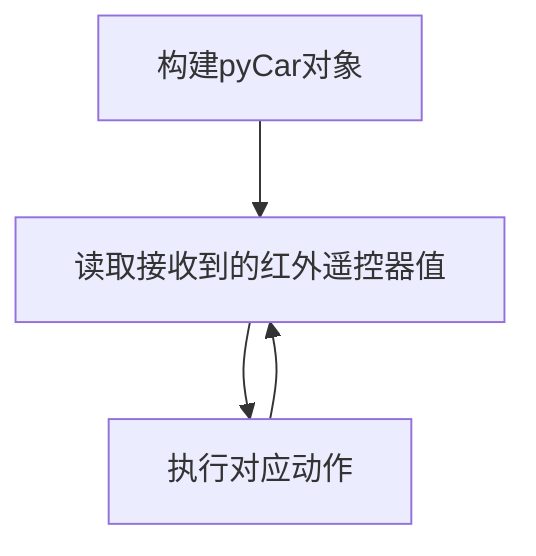
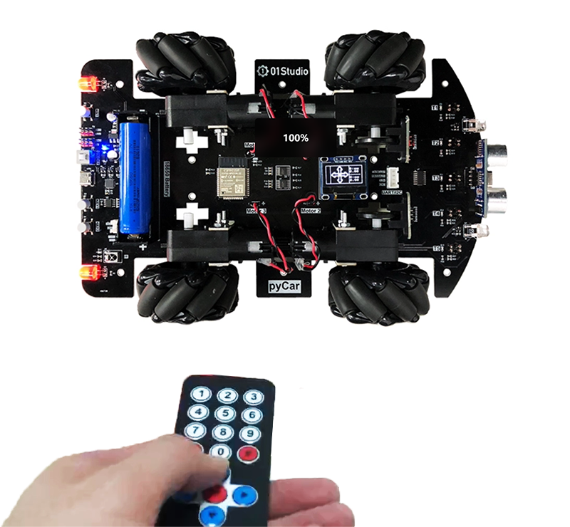

# 麦克纳姆轮小车

## 前言

pyCar可以支持直径小于70mm的麦克纳母轮子（TT接口），从而实现全向麦克纳姆轮小车，直接更换轮子即可。[点击购买>>](https://item.taobao.com/item.htm?id=666390881947)



## 实验目的

使用红外遥控器控制麦克纳姆轮pyCar小车。

## 实验讲解

使用麦克纳姆轮可以让小车实现全向移动，也就是除了前进后退，还有左右以及斜45°平移。参考下图：



关于麦克纳姆轮详细工作原理可以参考文章：[麦克纳姆轮的工作原理是什么？](https://www.zhihu.com/question/51812779/answer/576185197)

关于小车红外遥控实验前面章节已经有详细讲解，这里不再重复，具体参考：

[pyCar红外遥控器教程>>](../sub_modules/ir.md)

01Studio pyCar的car.py库文件已经将麦克纳姆轮控制接口封装好。使用方法如下：

## CAR对象

### 构造函数

```python
Car = car.CAR()
```
构造pyCar对象。

### 使用方法
```python
Car.up()
```
前移。

<br></br>

```python
Car.down()
```
后移。

<br></br>

```python
Car.left()
```
左移。

<br></br>

```python
Car.right()
```
右移。

<br></br>

```python
Car.up_left()
```
左前移。

<br></br>

```python
Car.up_right()
```
右前移。

<br></br>

```python
Car.down_left()
```
左后移。

<br></br>

```python
Car.down_right()
```
右后移。

<br></br>

```python
Car.clockwise()
```
顺时针旋转。

<br></br>

```python
Car.Counterclockwise()
```
逆时针旋转。

<br></br>

```python
Car.stop()
```
停止。

<br></br>

更多用法请阅读官方文档：https://pycar.01studio.cc/zh-cn/latest/manual/quickref.html

<br></br>

代码编写流程如下：



## 参考代码

```python
'''
实验名称：使用红外遥控器控制pyCar（麦克纳姆轮）
版本：v1.0
作者：CaptainJackey
'''

#导入相关模块
from car import CAR
import time

#初始化pyCar
Car = CAR()
time.sleep_ms(300) #等待稳定

#车灯状态
light_state = 0 

while True:
    
    key = Car.getIR() #读取红外传感器

    if key != None: #有按键按下
        
        #按键2，前移
        if key == 0x46:
            
            Car.up()
            time.sleep(1)
            Car.stop()
        
        #按键8，后移
        if key == 0x15:
            
            Car.down()
            time.sleep(1)
            Car.stop()

        #按键4，左移
        if key == 0x44:
            
            Car.left()
            time.sleep(1)
            Car.stop()

        #按键6，右移
        if key == 0x43:
            
            Car.right()
            time.sleep(1)
            Car.stop()

        #按键1，左前移
        if key == 0x45:
            
            Car.up_left()
            time.sleep(1)
            Car.stop()   

        #按键3，右前移
        if key == 0x47:
            
            Car.up_right()
            time.sleep(1)
            Car.stop()

        #按键7，左后移
        if key == 0x07:
            
            Car.down_left()
            time.sleep(1)
            Car.stop()

        #按键9，右后移
        if key == 0x09:
            
            Car.down_right()
            time.sleep(1)
            Car.stop()

        #按键*，逆时针旋转
        if key == 0x16:
            
            Car.Counterclockwise()
            time.sleep(1)
            Car.stop()   

        #按键#，顺时针旋转
        if key == 0x0d:
            
            Car.clockwise()
            time.sleep(1)
            Car.stop()
            
        #按键OK，车灯开关
        if key == 28: 
            
            light_state = not light_state
            Car.light(light_state)

```

## 实验结果

将相关示例程序的所有代码文件和car.py库文件发送至pyCar文件系统，通过遥控器便可控制麦克纳姆轮小车各种动作。



有兴趣用户可以根据前面蓝牙遥控车章节修改代码，改成使用pyController遥控器蓝牙控制。