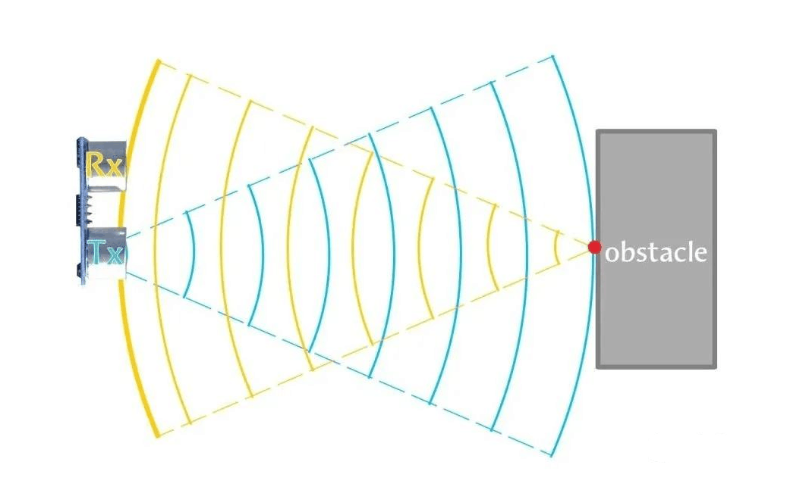
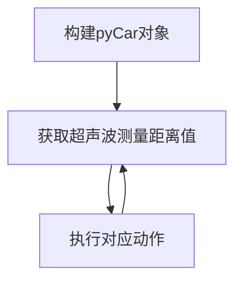
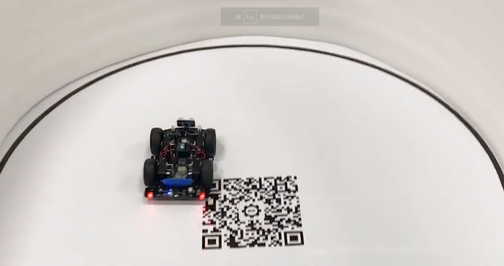

# 超声波避障小车

## 前言

想知道你的扫地机器人是怎么避开障碍物么？当它遇到墙、桌子会自动转向，pyCar车头配备了超声波传感器，也可以实现这个功能。



## 实验目的

编程实现小车行驶避障。

## 实验讲解

关于小车移动和超声波实验前面章节已经有详细讲解，这里不再重复，具体参考：

[pyCar移动动作教程>>](../sub_modules/movement.md)

[pyCar超声波测距教程>>](../sub_modules/ultrasonic.md)

这里我们使用一个最简单的控制方式，那就是当小车实时检测超声波距离值，当距离少于某个设定值时，小车随机左右转向，大于此设定值则正常直线行走。

有了前面学习的积累，可以通过编程轻松实现相关功能。代码编写流程如下：



## 参考代码

```python
'''
实验名称：超声波避障小车
版本：v1.0
作者：01Studio
平台：pyCar
'''

#导入相关模块
from car import CAR
import time,random

#初始化pyCar
Car = CAR()
time.sleep_ms(300) #等待稳定

turn_node = 1

while True:


    #距离少于50cm就转弯
    if 0 < int(Car.getDistance()) < 50 :
        
        #从0和1中随机生成一个数决定左右转向
        if turn_node == 1:
            
            turn_direct = random.randint(0,1)
            turn_node = 0
        
        #1右转，0左转。
        if turn_direct:
            
            Car.turn_right(mode=1)
            
        else:
            
            Car.turn_left(mode=1)
        
    else: #走直线
        
        Car.forward()
        turn_node = 1
        
    time.sleep_ms(50) #适当延时调整响应速度

```

上面代码加入了一个随机转向设置，实现小车遇到障碍物时候随机左转或右转。

## 实验结果

将相关示例程序的所有代码文件和car.py库文件发送至pyCar文件系统，便可实现上电运行小车避障功能。



小车避障的原理非常简单，有兴趣的用户可以调整代码中的参数，打造一台适合自己的避障小车。