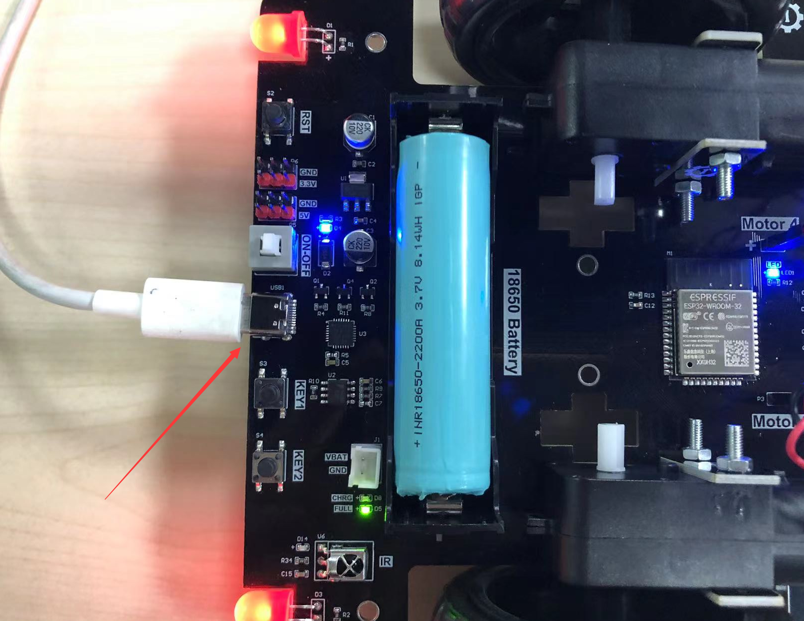
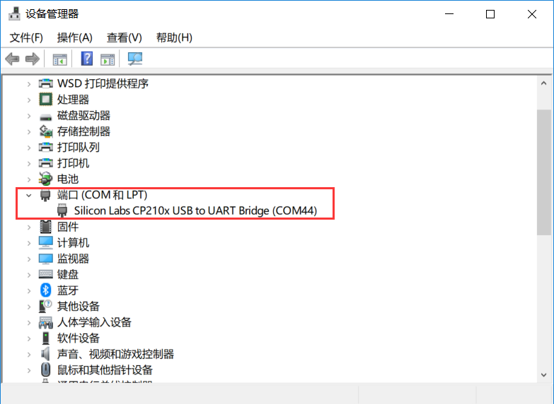
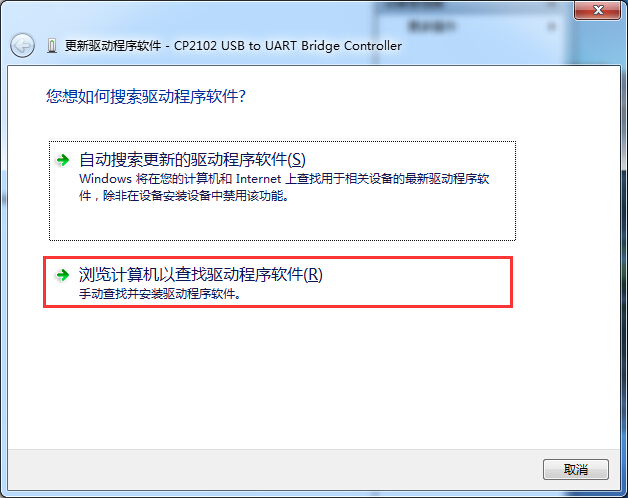
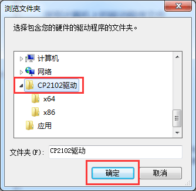

# 驱动安装

主要是安装USB转串口驱动。我们将pyCar开发板通过type-C数据线连接到电脑，打开pyCar开关。

如果你的操作系统是Win10以上版本,一般情况下能自动安装。鼠标右键点击 “我的电脑” —属性—设备管理器： 出现串口号说明安装成功，如下图所示。**（驱动芯片为CP210x或CH910x均为正常）**

**如果无法安装，请手动安装驱动，方法如下：**

不能自动安装时候，设备会出现黄色叹号，这时候点击设备右键，选择“更新驱动程序”，选择“浏览计算机查找驱动”：

驱动路径选择：零一科技（01Studio）MicroPython开发套件配套资料\01-开发工具\01-Windows\串口终端工具\CP210x驱动，注意查看文件夹里面的文件如果没解压要先解压。 点击确认后即可自动安装：

安装成功后如下图：

