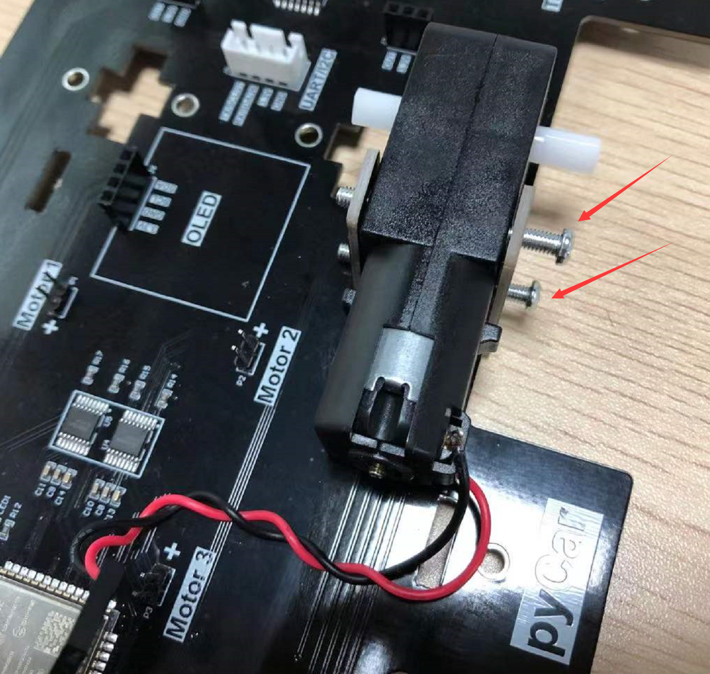

# pyCar组装

pyCar小车采用PCB一体化设计，无需焊接，组装非常简单，以下是详细的安装步骤：

拿到pyCar套件后先检查默认发货清单配件是否齐全。

## 电机

将电机固定柱从底盘底部往上插入。

放进电机，注意电机引线焊接处朝外。

将2个长螺丝从外侧插入，穿过电机固定柱和电机孔。

使用螺母拧紧固定。

安装电机后如感觉有点松动属于正常现象，不影响行驶使用，想紧一点的话可以在电机和底板接触面垫个纸片或贴个胶布再装电机。

使用同样的方法将4路电机组装好，注意引线焊接处均朝外。

## 轮胎

接下来安装轮胎，电机和轮子是长条形TT接口，务必对准后方可以插入。

轮胎安装时请用手指将电机和底盘按紧，避免插入过程损坏固定柱导致松动。

用同样方法将4个论坛组装好。

## 码盘和测速传感器

将码盘安装到前轮位置：

按图示位置插入2个测速传感器。

## OLED显示屏

直接插入到显示屏接口即可。

## 超声波传感器

车头处插上超声波传感器。

## 接线

将电机引线接到pyCar底盘排针，注意红色接正极（开发板丝印“+”）。

同样方法将4个电机引线接好。

## 锂电池

最后安装锂电池，注意电池正负极要与底盘丝印方向一致。

## 开机测试

按下车尾的开关，灯亮说明供电正常。

转动2个前轮，测速器上的红色灯有闪亮说明检测到转动，测速正常。若没有可以前后掰动传感器适当调整位置。

至此，pyCar组装完成：

