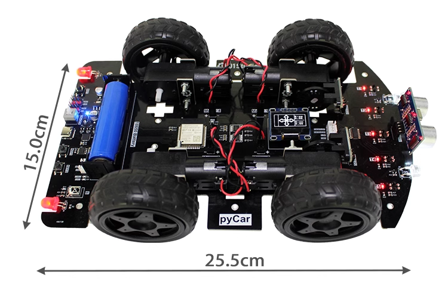

# pyCar简介

pyCar是由01Studio(01科技)发起的MicroPython开源小车项目。[点击购买>>](https://item.taobao.com/item.htm?id=663109305555)

Micropython是指使用Python做各类嵌入式硬件设备编程。MicroPython发展势头强劲，01Studio一直致力于Python嵌入式编程，特此推出pyDrone开源项目，旨在让MicroPython变得更加流行。使用MicroPython，你可以轻松地实现小车的前进、后台、巡线、避障、红外遥控，WiFi蓝牙遥控等功能。

## 硬件资源

01Studio pyCar使用乐鑫科技ESP32主控。

## 详细参数

|  产品参数 |
|  :---:  | ---  |
| 主控  | ESP32-WROOM-32 （Flash:4MBytes）;支持WiFi/BLE |
| 电机  | x4：TT马达（1:48），支持PWM调速 |
| 光电传感器  | x5：用于巡线 |
| 码盘测速  | x2 |
| 超声波传感器  | 避障 |
| 显示屏  | 0.96寸OLED显示屏，分辨率128x64 |
| 红外接收头  | x1 |
| 车头灯  | x2：白色高亮，可编程 |
| 车尾灯  | x2：红色，常亮 |
| LED  | x4    ● 充电中指示灯：红色    ● 充满电指示灯：绿色    ● 电源指示灯：蓝色    ● 可编程LED：蓝色 |
| 按键  | x3：1个复位键 + 2个可编程按键 |
| TYPE-C口  | 烧录/调试/充电多合一 |
| 扩展接口  | xh-1.25mm-4P, UART/I2C接口（跟超声波传感器接口复用）|
| 锂电池  | 18650，2200mAh |
| 开关  | 自锁开关 |

## 尺寸图

