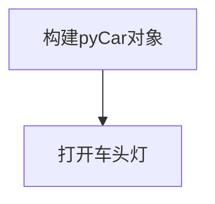
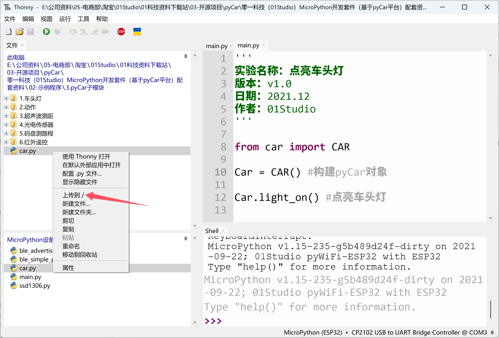
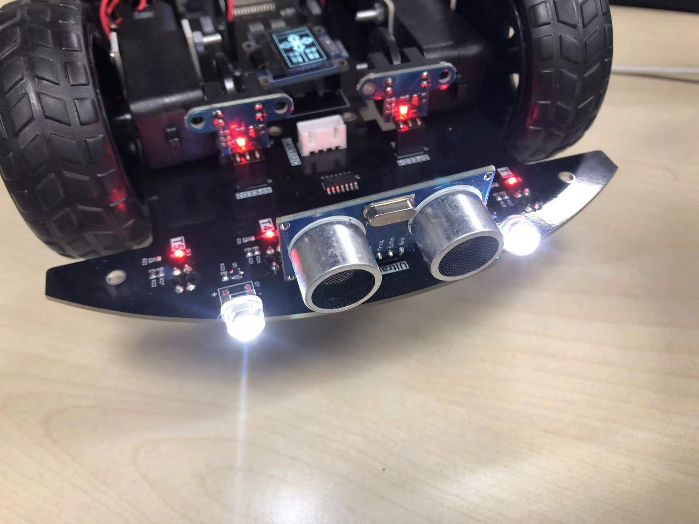

# 车头灯

## 前言
pyCar带有2个车头草帽灯，这2个车头灯是可以控制的。本节我们就来学习如何通过pyCar的库文件实现最简单的车头灯控制。

## 实验目的
点亮车头灯。

## 实验讲解

前面我们学习过过点亮LED灯内容，那是通过machine的GPIO库实现，这里我们直接通过car.py里面的模块来实现，底层实现原理一样，但是这样再封装了一层，使用会更直观一点。

## CAR对象

### 构造函数

```python
Car = car.CAR()
```
构造pyCar对象。

### 使用方法
```python
Car.light_on()
```
打开车头灯。

<br></br>

```python
Car.light_off()
```
关闭车头灯。

<br></br>

```python
Car.light(value=0)
```

使用value赋值方式开关。

- `value`：车头灯亮灭值
    
    - `0`：关闭；
    - `1`：打开。


<br></br>

更多用法请阅读官方文档：https://pycar.01studio.cc/zh-cn/latest/manual/quickref.html

<br></br>

上表对car.py里面的车头灯使用方法做了详细说明，我们只需要导入car.py，构建对象后即可直接控制车头灯。

代码编写流程如下：



## 参考代码

```python
'''
实验名称：点亮车头灯
版本：v1.0
作者：01Studio
'''

from car import CAR

Car = CAR() #构建pyCar对象

Car.light_on() #点亮车头灯

```

## 实验结果

由于本节例程需要用的pyCar库函数，所以需要将car.py上传到开发板文件系统。



连接开发板后在Thonny IDE中运行上述代码, 可以看到车头灯成功点亮。



从第一个车头灯实验不难看到，pyCar库的封装让其变动简单易用。接下来我们将学习更多的功能应用。