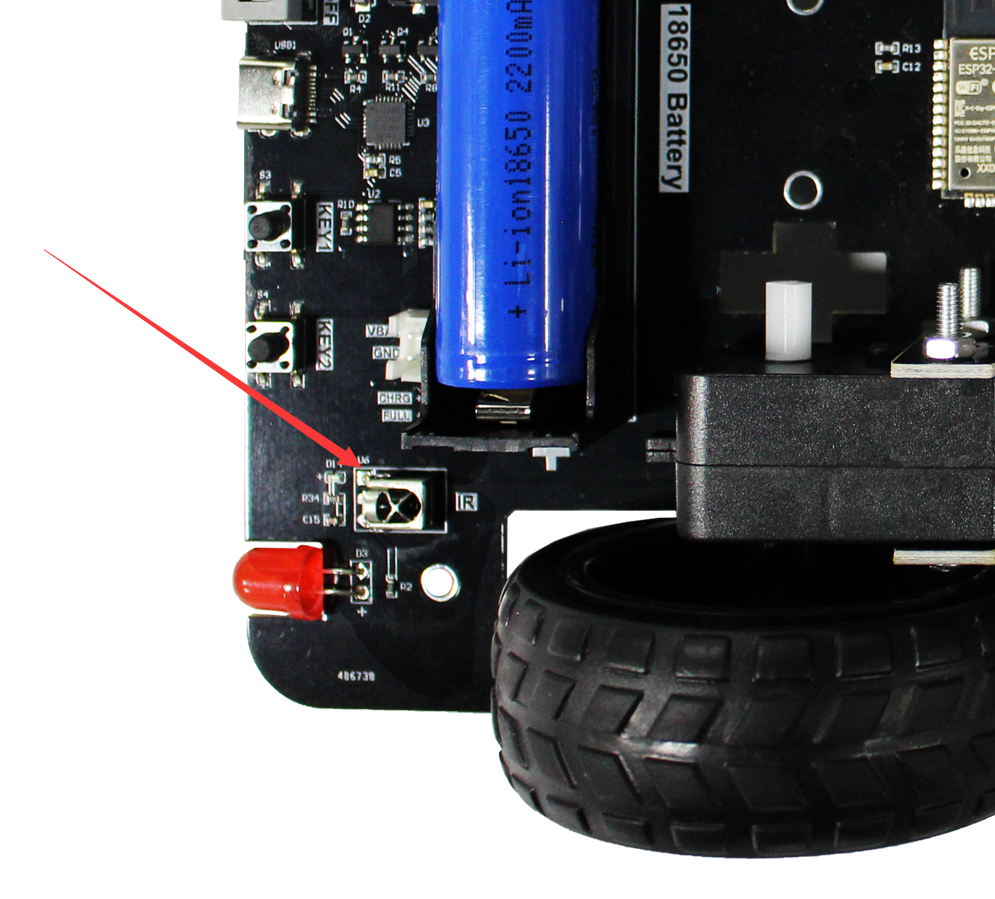
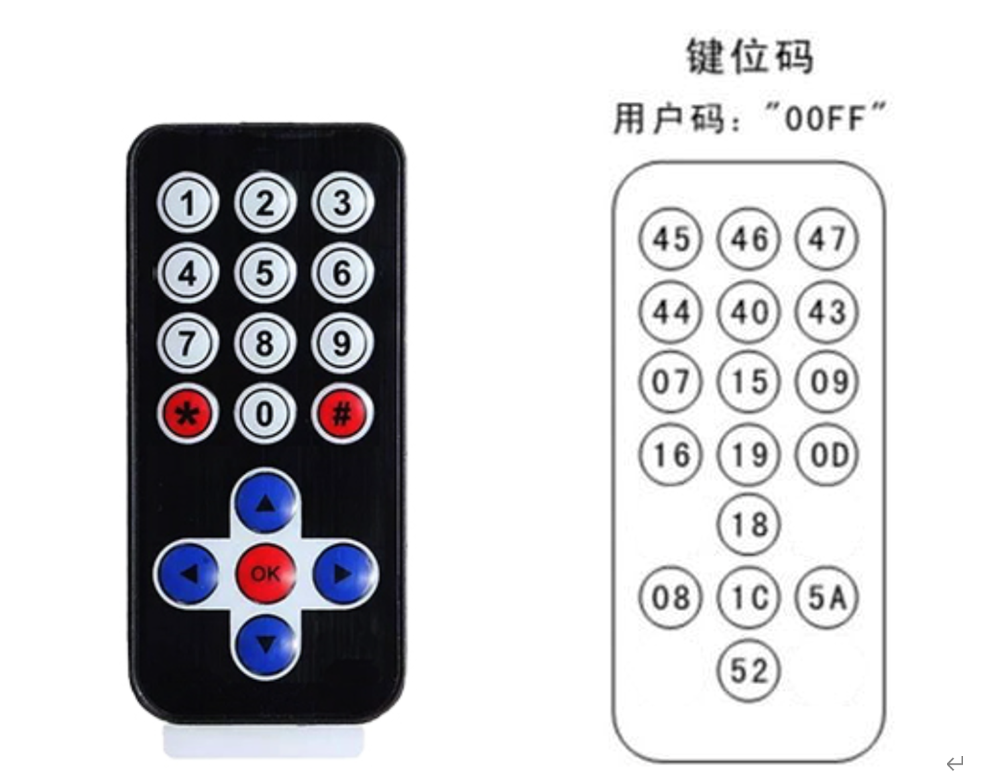
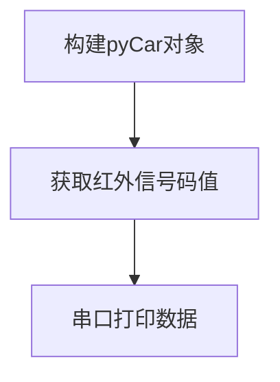
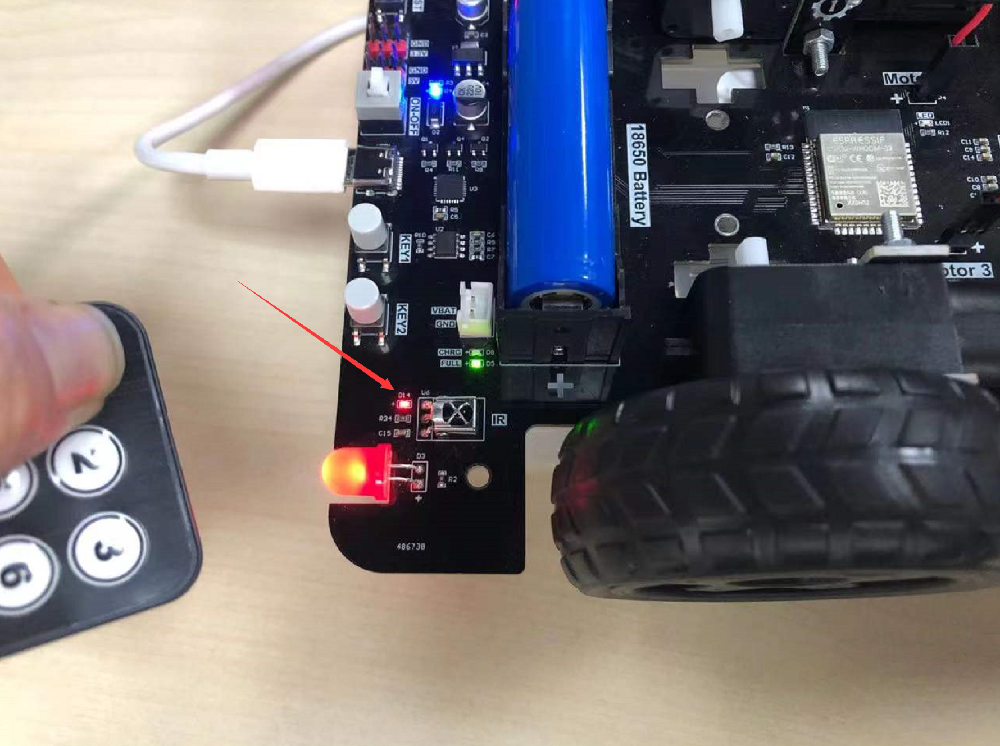
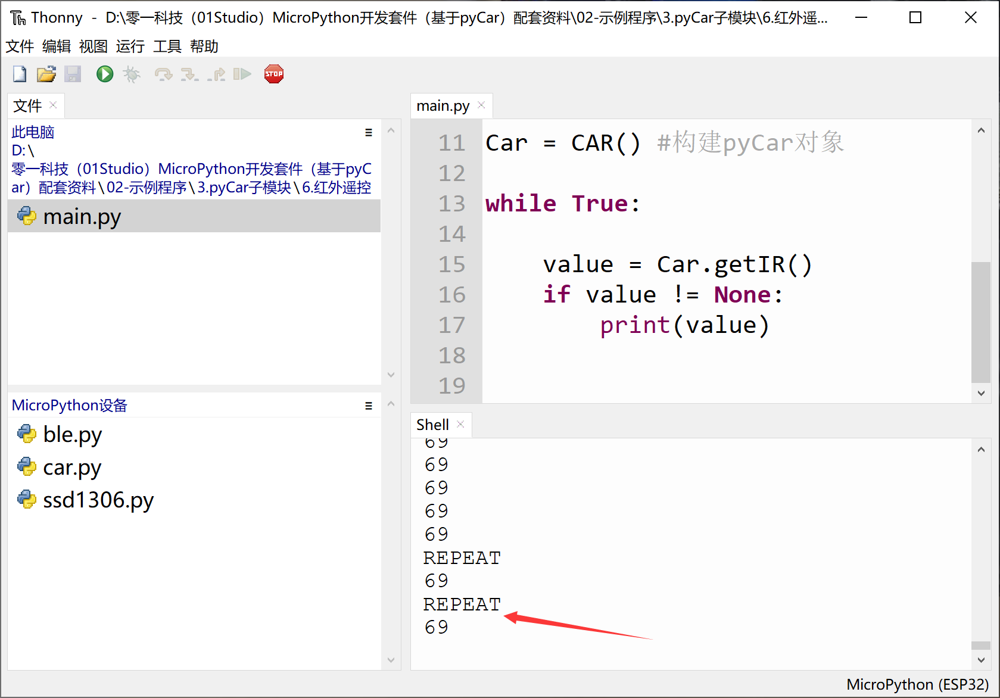

# 红外遥控器

## 前言

本节来学习一下如何使用小车接收红外遥控器数据。

## 实验目的

获取红外遥控器发出的编码。

## 实验讲解

pyCar的右后轮位置集成了红外一体接收头，可以接收市面上大部分的红外遥控器发出的信号。



我们可以使用配套的红外遥控器进行本实验，遥控器每个按键对应的码如下图，16进制。



如果用C来开发，需要使用指定时序读取红外信号，然后再解码。编程会非常繁琐，而使用micropython库编程，直接调用相关函数即可（其实也少不了解码的步骤，只是已经封装好了库，我们直接使用即可），使用方法如下：

## CAR对象

### 构造函数

```python
Car = car.CAR()
```
构造pyCar对象。

### 使用方法
```python
Car.getIR()
```
返回红外解码值，连续按下的情况会在返回1次值后一直返回‘REPEAT’字符。当没有信号时候返回None。

<br></br>

更多用法请阅读官方文档：https://pycar.01studio.cc/zh-cn/latest/manual/quickref.html

红外解码的使用方法也非常简单，编程流程如下：



## 参考代码

```python
'''
实验名称：pyCar红外遥控解码
版本：v1.0
作者：01Studio
'''

from car import CAR
import time

Car = CAR() #构建pyCar对象

while True:
    
    value = Car.getIR()
    if value != None:
        print(value)    
```

## 实验结果

运行代码，用遥控器对着pyCar红外接收头按下按键，可以看到红外接收头旁边的指示灯闪亮，表示有接收到信号：



终端打印相应的数据：



学习了本节后，便可通过检测红外按键来控制小车各项功能，在后面综合实验中会涉及红外遥控车相关内容。