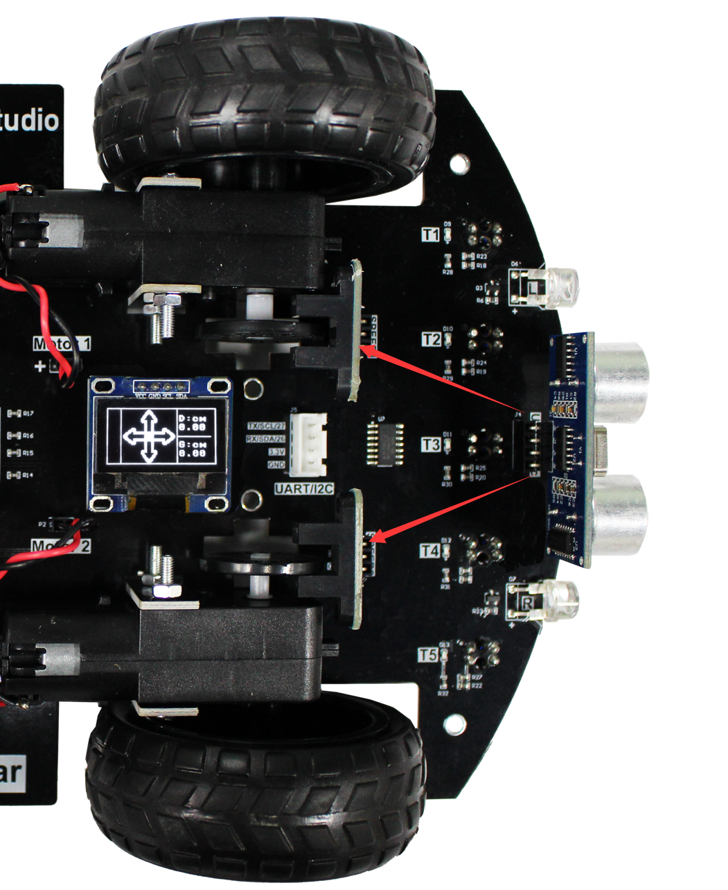
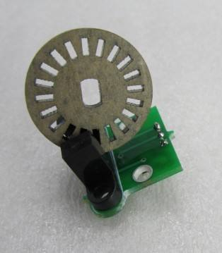
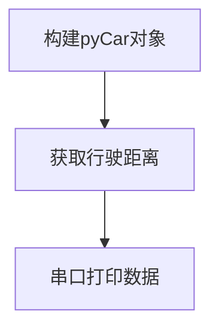
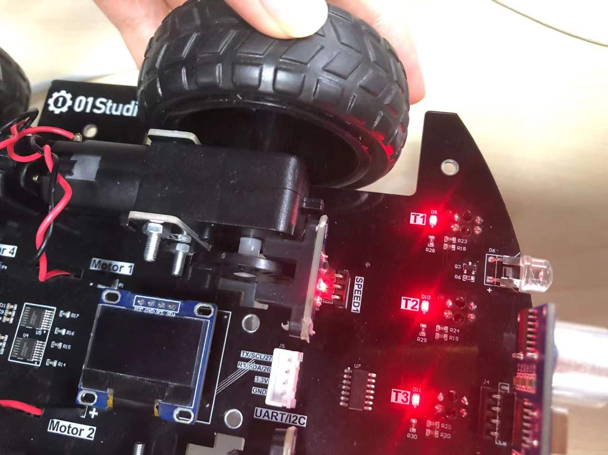
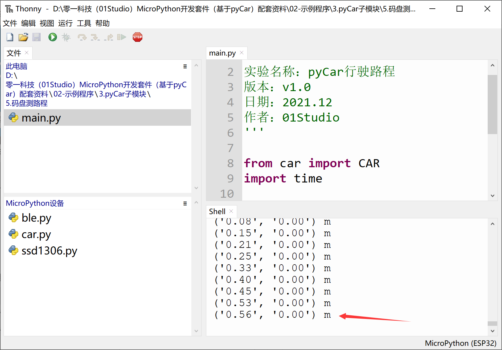

# 码盘测路程

## 前言

本节来学习一下如何使用小车上的码盘测试小车行驶路程。

## 实验目的

测量pyCar行驶路程。

## 实验讲解

我们先来看看码盘测速原理，pyCar前轮2路电机安装了编码盘和配套的光电测速模块。



码盘的原理很简单，硬件看下图，就是一个个等距离的孔，电机带动码盘转动，光电对管便产生一系列方波，通过计算某一段时间内方波信号的数量便可知道码盘转动了多少圈，再结合车轮的直径，便可计算这段时间内小车行驶的路程。



计算方法已经集成在car.py文件，如想了解代码原理可以打开car.py文件查看，使用方法如下：

## CAR对象

### 构造函数

```python
Car = car.CAR()
```
构造pyCar对象。

### 使用方法
```python
Car.getDgetJourney()
```
返回行驶路程，单位m。

<br></br>

更多用法请阅读官方文档：https://pycar.01studio.cc/zh-cn/latest/manual/quickref.html

从上面介绍可以看到，只需要1行代码即可实现驶路程值的测量，代码编写流程如下： 



## 参考代码

```python
'''
实验名称：pyCar行驶路程
版本：v1.0
作者：01Studio
'''

from car import CAR
import time

Car = CAR() #构建pyCar对象

while True:
    
    value = Car.getJourney()
    print(str(value) + ' m')
    time.sleep(1)
    
```

## 实验结果

运行代码，用手转动前轮



可以看到行驶路程的变化：



通过micropython库模块非常简单就实现了行驶路程的应用。接口返回的是2路轮子行驶路程值，实际使用过程中只需要使用其中一路或着将两路值求平均即可。