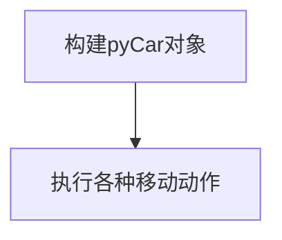
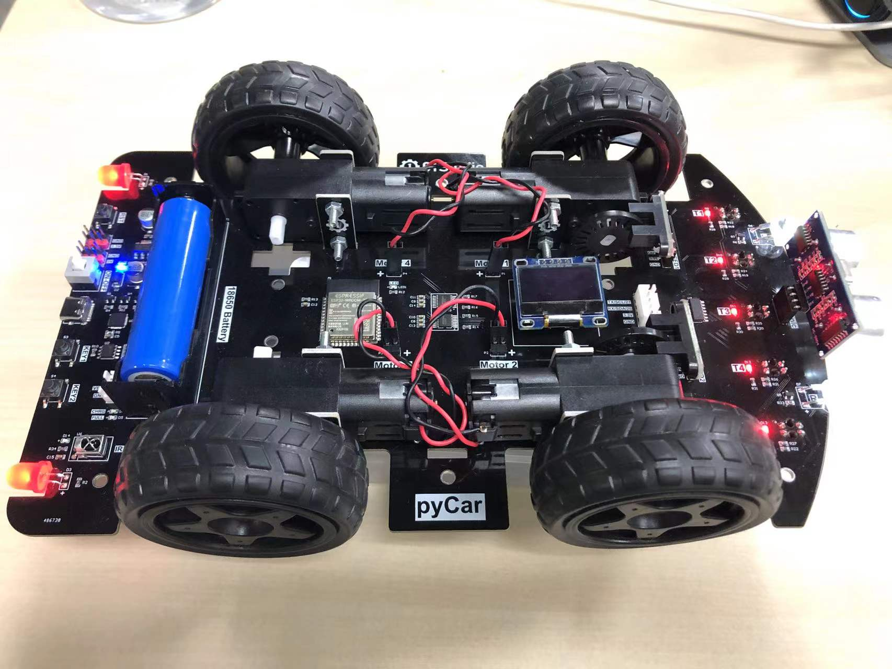

# 移动

## 前言

pyCar带有4路直流电机，每路可以单独控制。本节我们学习小车的各种移动动作。

## 实验目的

编程实现小车前进、后台、左右转向各种动作。

## 实验讲解

上一节我们感受到car.py封装后的易用性，这节还是一样，构建小车是一样的，只是调用不同的函数来实现各种动作。具体说明如下：

## CAR对象

### 构造函数

```python
Car = car.CAR()
```
构造pyCar对象。

### 使用方法
```python
Car.forward()
```
前进。

<br></br>

```python
Car.backward()
```
后退。

<br></br>

```python
Car.turn_left(mode=0)
```
左转。
- `mode` : 转动模式
    - `0`: 小幅度转动，单排轮子工作；
    - `1`：大幅度转动，双排轮子同时工作，可实现原地旋转。

<br></br>

```python
Car.turn_right(mode=0)
```
右转。
- `mode` : 转动模式
    - `0`: 小幅度转动，单排轮子工作；
    - `1`：大幅度转动，双排轮子同时工作，可实现原地旋转。

<br></br>

```python
Car.stop()
```
停止。

<br></br>

更多用法请阅读官方文档：https://pycar.01studio.cc/zh-cn/latest/manual/quickref.html

<br></br>

通过上表我们了解了小车的动作函数后，可以通过编程轻松实现相关功能。代码编写流程如下： 



## 参考代码

```python
'''
实验名称：pyCar各种移动动作
版本：v1.0
作者：01Studio
'''

from car import CAR
import time

Car = CAR() #构建pyCar对象

Car.forward() #前进
time.sleep(1)

Car.backward() #后台
time.sleep(1)

Car.turn_left() #左转
time.sleep(1)

Car.turn_right() #右转
time.sleep(1)

Car.stop() #停止

```

## 实验结果

本实验适合[离线运行](../getting_start/run_offline.md)，将代码以main.py上传到开发板文件系统根目录，然后按下复位键，可以看到小车执行各种移动动作。

