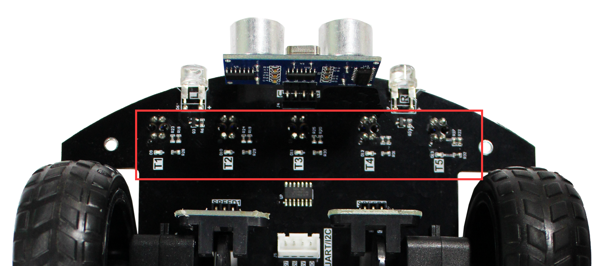
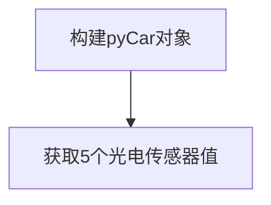
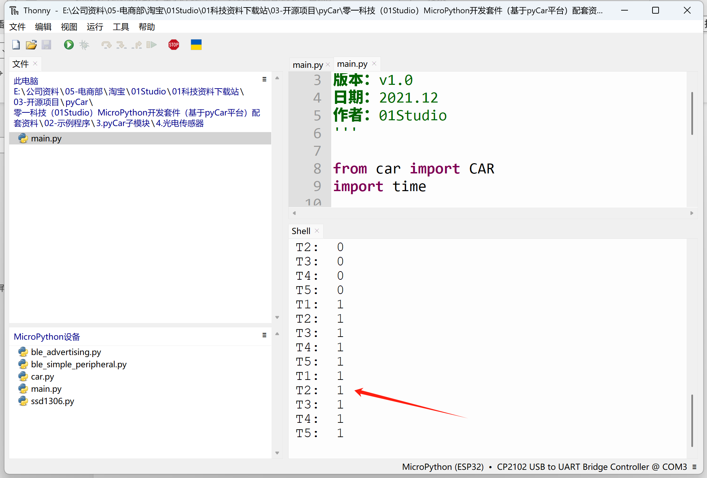
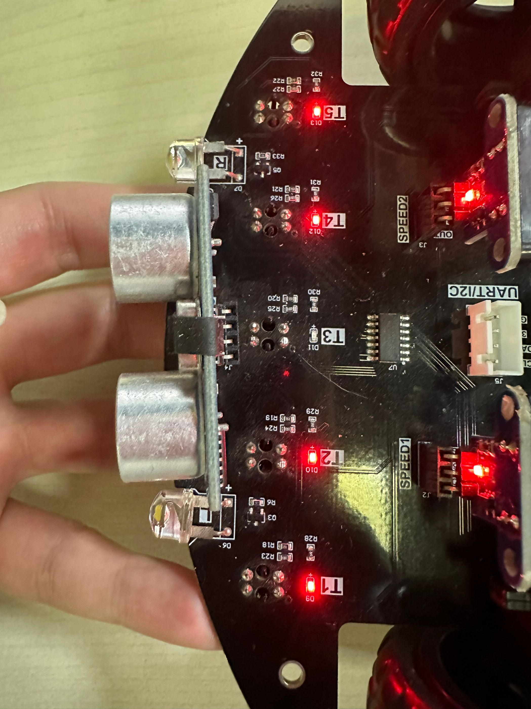

# 光电传感器

## 前言

pyCar的车头下方有5路光电传感器，当车在白色路面行驶时（反光性比较好），全部指示灯熄灭，输出高电平。当遇到黑色赛道（无反光），对应的传感器指示灯亮，输出低电平。常用于巡线实验。



## 实验目的

编程实现光电传感器值测量。

## 实验讲解

光电传感器本质是判断IO口的高低电平，对象具体说明如下：

## CAR对象

### 构造函数

```python
Car = car.CAR()
```
构造pyCar对象。

### 使用方法
```python
CAR.T1()
```
返回光电传感器T1值，布尔类型。

<br></br>

```python
CAR.T2()
```
返回光电传感器T2值，布尔类型。

<br></br>

```python
CAR.T3()
```
返回光电传感器T3值，布尔类型。

<br></br>

```python
CAR.T4()
```
返回光电传感器T4值，布尔类型。

<br></br>

```python
CAR.T5()
```
返回光电传感器T5值，布尔类型。

<br></br>


更多用法请阅读官方文档：https://pycar.01studio.cc/zh-cn/latest/manual/quickref.html

<br></br>

代码编写流程如下： 



## 参考代码

```python
'''
实验名称：pyCar光电传感器
版本：v1.0
作者：01Studio
'''

from car import CAR
import time

Car = CAR() #构建pyCar对象

#打印5路光电传感器状态

while True:

    print('T1: ',Car.T1())
    print('T2: ',Car.T2())
    print('T3: ',Car.T3())
    print('T4: ',Car.T4())
    print('T5: ',Car.T5())
    
    time.sleep_ms(1000)
```

## 实验结果

运行代码，可以看到终端打印5个光电传感器值。



用手遮挡传感器，可以看到值变化，小车对应的红色指示灯亮灭跟着变化。



光电传感器主要用于巡线实验，在后面综合实验中会涉及巡线小车相关内容。