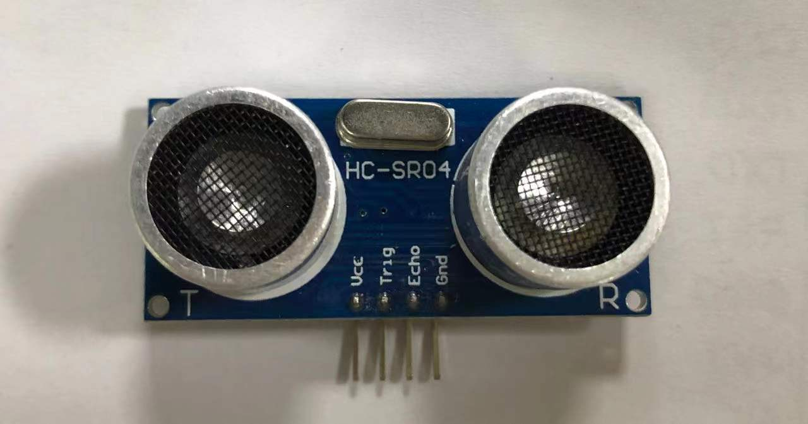
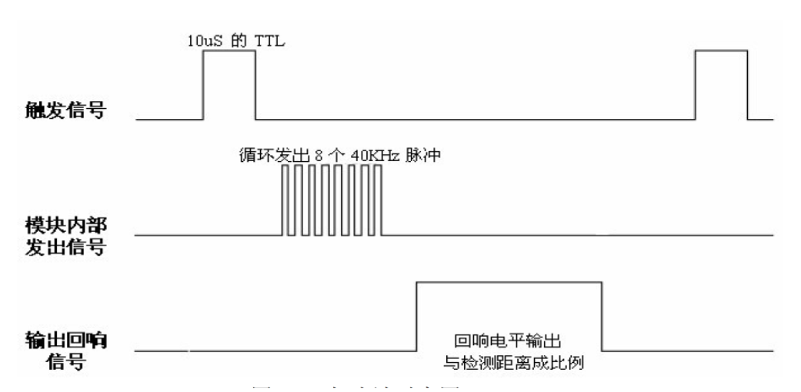
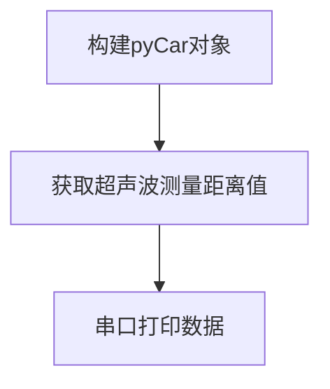
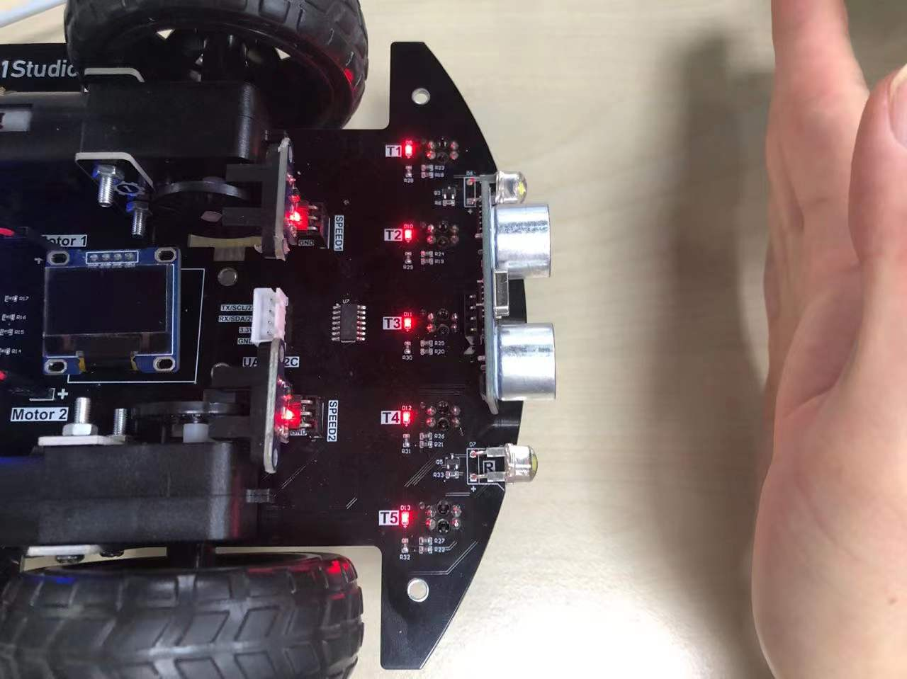
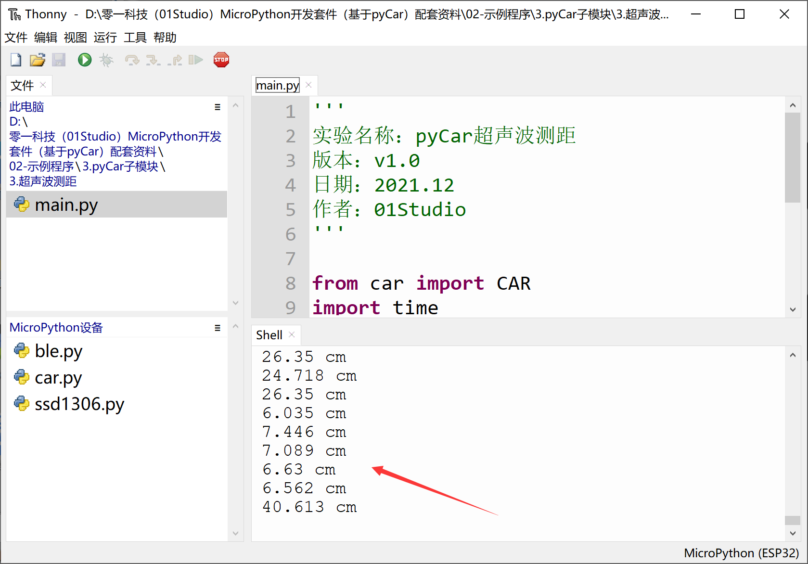

# 超声波测距

## 前言

超声波传感器是一款测量距离的传感器。其原理是利用声波在遇到障碍物反射接收结合声波在空气中传播的速度计算的得出。在测量、避障小车，无人驾驶等领域都有相关应用。

## 实验目的

测量车头与障碍物之间的距离。

## 实验讲解

我们先来看看超声波传感器模块的介绍：



|  功能参数 |
|  :---:  | ---  |
| 传感器  | HCSR04 |
| 供电电压  | 3.3V |
| 工作电流  | <20mA |
| 工作温度  | -20 - 85℃ |
| 接口定义  | ● VCC：供电3.3V <br></br> ● TRIG：发射 <br></br> ● ECHO：接收 <br></br> ● GND：电源地 |
| 通讯信号  | IO数字接口 |
| 测量距离  | 2 - 450 cm |
| 测量精度  | 0.5cm |

超声波传感器模块使用两个IO口分别控制超声波发送和接收，工作原理如下：

1.	给超声波模块接入电源和地；
2.	给脉冲触发引脚（trig）输入一个长为20us的高电平方波；
3.	输入方波后，模块会自动发射8个40KHz的声波，与此同时回波引脚（echo）端的电平会由0变为1；（此时应该启动定时器计时）
4.	当超声波返回被模块接收到时，回波引 脚端的电平会由1变为0；（此时应该停止定时器计数），定时器记下的这个时间即为超声波由发射到返回的总时长；
5.	根据声音在空气中的速度为340米/秒，即可计算出所测的距离。

要学习和应用传感器，学会看懂传感器的时序图是很关键的，所以我们来看一下超声波传感器HCSR04的时序触发图。



以上普及了超声波传感器的原理，我们已经将其集成在car.py文件，如想了解代码原理可以打开car.py文件查看代码实现原理。使用MicroPython开发的用户只需要直接使用即可。使用方法如下：


## CAR对象

### 构造函数

```python
Car = car.CAR()
```
构造pyCar对象。

### 使用方法
```python
Car.getDistance()
```
获取车头超声波传感器距离值，单位cm。

<br></br>

更多用法请阅读官方文档：https://pycar.01studio.cc/zh-cn/latest/manual/quickref.html

从上面介绍可以看到，只需要1行代码即可实现超声波距离值的测量，代码编写流程如下： 



## 参考代码

```python
'''
实验名称：pyCar超声波测距
版本：v1.0
作者：01Studio
'''

from car import CAR
import time

Car = CAR() #构建pyCar对象

while True:
    
    value = Car.getDistance()
    print(str(value) + ' cm')
    time.sleep(1)

```

## 实验结果

用手掌或障碍物在车头的超声波传感器模块移动，可以看到REPL打印的距离变化：





通过micropython库模块非常简单就实现了对超声波传感器测距的应用。这让我们再一次感受到了MicroPython的魅力。赶快动手制作自己的避障小车和其他好玩的创作吧。