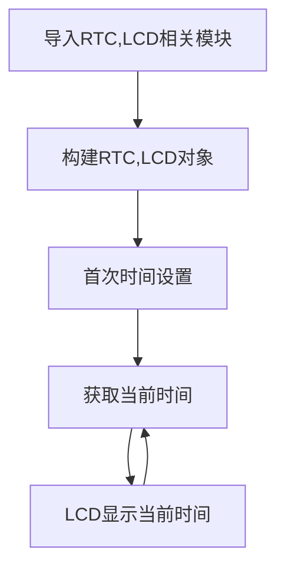
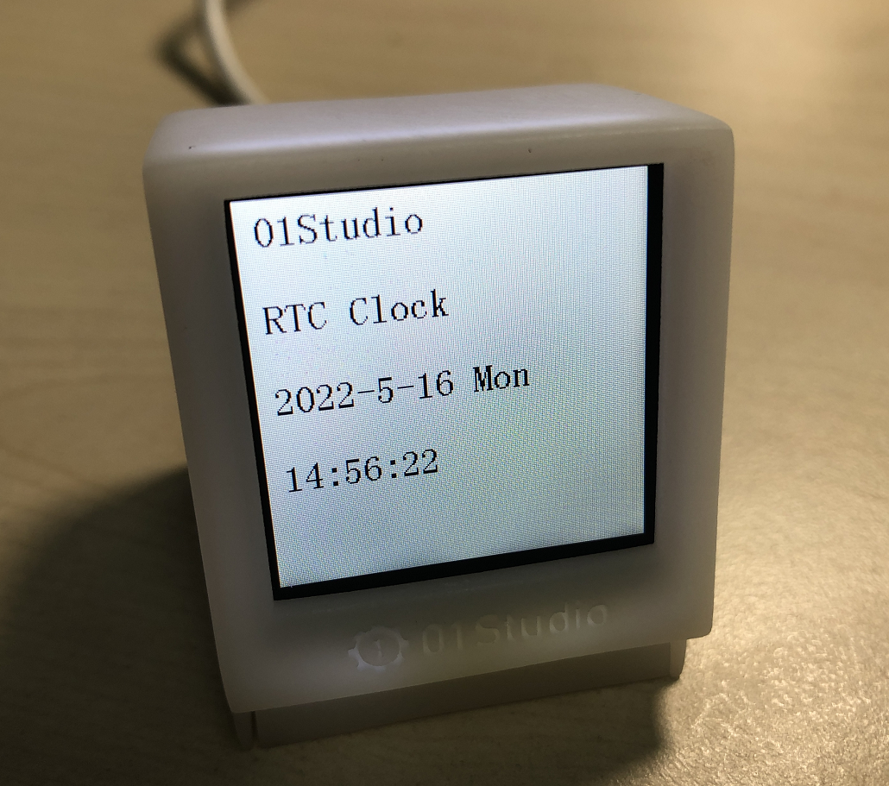

# RTC实时时钟

## 前言
时钟可以说我们日常最常用的东西了，手表、电脑、手机等等无时无刻不显示当前的时间。可以说每一个电子爱好者心中都希望拥有属于自己制作的一个电子时钟，接下来我们就用MicroPython开发板来制作一个属于自己的电子时钟。


## 实验目的

学习RTC编程和制作电子时钟，使用LCD显示。

## 实验讲解

实验的原理是读取RTC数据，然后通过LCD显示。毫无疑问，强大的MicroPython已经集成了内置时钟函数模块。位于machine的RTC模块中，具体介绍如下：

## RTC对象

### 构造函数
```python
rtc = machine.RTC()
```
构建RTC对象，RTC对象位于machine模块下。

### 使用方法
```python
rtc.datetime((2024, 1, 1, 0, 0, 0, 0, 0))
```
设置RTC日期和时间。(2024, 1, 1, 0, 0, 0, 0, 0)按顺序分别表示（年，月，日，星期，时，分，秒，微妙），其中星期使用0-6表示星期一到星期日。

<br></br>

```python
rtc.datetime()
```
获取当前RTC时间。返回元组：（年，月，日，星期，时，分，秒，微妙），其中星期使用0-6表示星期一到星期日。

更多用法请阅读官方文档：<br></br>
https://docs.micropython.org/en/latest/library/machine.RTC.html#machine-rtc

<br></br>

熟悉RTC使用方法后，我们通过代码实现首次上电如果检测到未设置时间可以先设置时间，然后周期打印获取的时间信息，代码编程流程图如下：




## 参考代码

```python
'''
实验名称：RTC实时时钟
版本：v1.0
日期：2022.5
作者：01Studio
'''

# 导入相关模块
from machine import Pin, RTC, Timer
from tftlcd import LCD15

# 定义星期和时间（时分秒）显示字符列表
week = ['Mon', 'Tues', 'Wed', 'Thur', 'Fri', 'Sat', 'Sun']
time_list = ['', '', '']

#定义常用颜色
RED = (255,0,0)
GREEN = (0,255,0)
BLUE = (0,0,255)
BLACK = (0,0,0)
WHITE = (255,255,255)

########################
# 构建1.5寸LCD对象并初始化
########################
d = LCD15(portrait=1) #默认方向竖屏

#填充白色
d.fill(WHITE)

#显示标题
d.printStr('01Studio',10,5,color=BLACK,size=2) # 首行显示01Studio
d.printStr('RTC Clock',10,55,color=BLACK,size=2) # 次行显示实验名称

# 初始化RTC
rtc = RTC()

# 首次上电配置时间，按顺序分别是：年，月，日，星期，时，分，秒，次秒级；这里做了
# 一个简单的判断，检查到当前年份不对就修改当前时间，开发者可以根据自己实际情况来
# 修改。
if rtc.datetime()[0] != 2022:
    rtc.datetime((2022, 4, 1, 4, 0, 0, 0, 0))

def RTC_Run(tim):

    datetime = rtc.datetime()  # 获取当前时间

    # 显示日期，字符串可以直接用“+”来连接
    d.printStr(str(datetime[0]) + '-' + str(datetime[1]) + '-' + str(datetime[2]) + ' ' + week[datetime[3]],10,105,color=BLACK,size=2)

    # 显示时间需要判断时、分、秒的值否小于10，如果小于10，则在显示前面补“0”以达
    # 到较佳的显示效果
    for i in range(4, 7):
        if datetime[i] < 10:
            time_list[i - 4] = "0"
        else:
            time_list[i - 4] = ""

    # 显示时间
    d.printStr(time_list[0] + str(datetime[4]) + ':' + time_list[1] + str(datetime[5]) + ':' + time_list[2] + str(datetime[6]),10,155,color=BLACK,size=2)

#开启RTOS定时器
tim = Timer(-1)
tim.init(period=300, mode=Timer.PERIODIC, callback=RTC_Run) #周期300ms

```

## 实验结果

在Thonny IDE运行代码，可以看到时钟开始跑起来。



通过Thonny IDE连接开发板后会自动同步RTC时间。RTC实时时钟的可玩性很强，我们还可以根据自己的风格来设定数字显示位置，以及加上一些属于自己的字符标识。打造自己的电子时钟。