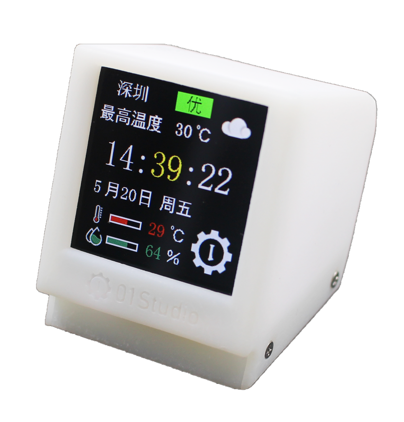
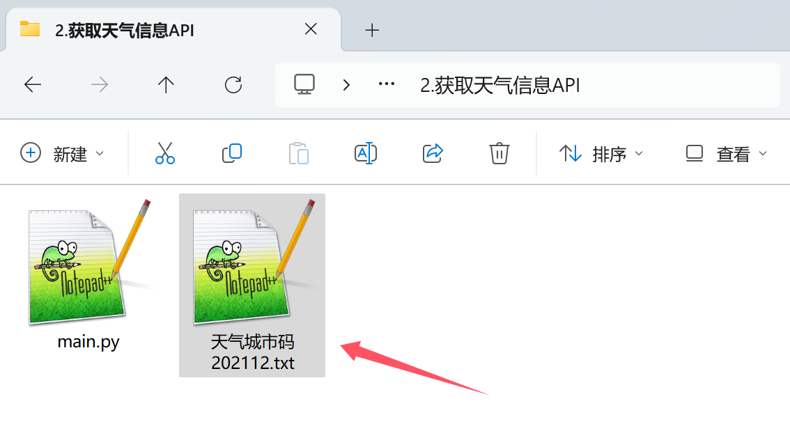
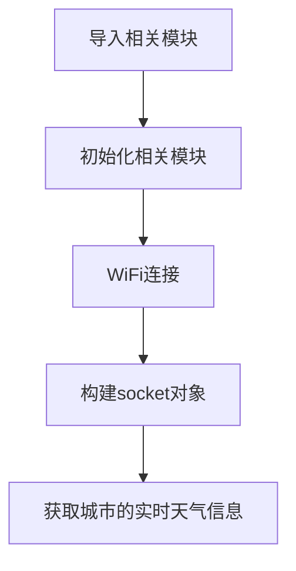
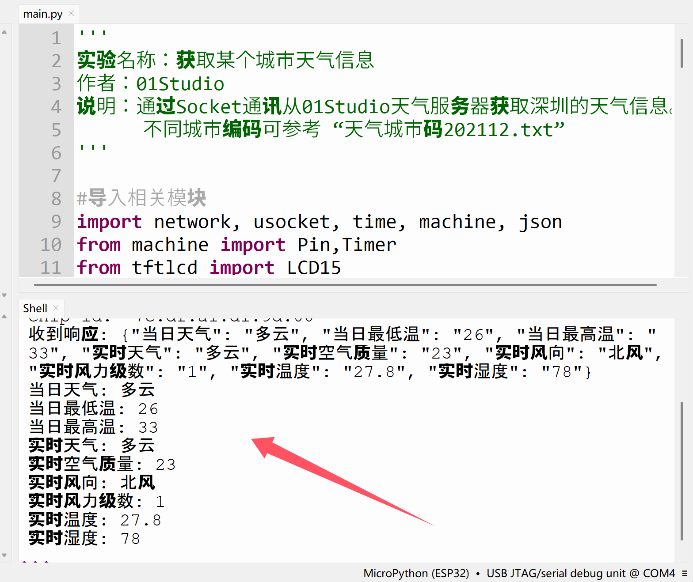

# 获取天气信息（API）

## 前言

pyClock天生是为了天气时钟而设，获取天气方式很多，可以通过网页爬虫或特定天气服务商提供的API接口来实现。为此01Studio搭建了一个天气信息服务器API接口，通过简单的socket通讯即可获取全国2000多城市天气信息。



## 实验目的

编程实现pyClock通讯获取城市天气信息。

## 实验讲解

本节用到socket，可参考前面[Socket通讯>>](../network/socket.md)章节内容，这里不再重复。

## 01Studio城市天气API

- `服务器地址`：weather.01studio.cc
- `端口`：10241

**发送格式**：

发送内容为json字符串，包含城市名称、城市编码、产品信息、chip_id、软件版本号。

例：深圳

```json
{
'city':'深圳',    
'citycode': '101280601',
'product':'pyClock',
'chip_id':'7c:df:a1:d1:bb:00',
'version':'2.5.0'
}   
```

**返回信息：**

返回当前城市9个天气信息，格式为json。

例：

```json
{
"当日天气": "多云", 
"当日最低温": "26",
 "当日最高温": "33", 
 "实时天气": "多云", 
 "实时空气质量": "23", 
 "实时风向": "北风", 
 "实时风力级数": "1", 
 "实时温度": "27.8", 
 "实时湿度": "78"
 }
```

全国城市编码表可以在本节例程文件夹里面找到。




熟悉了天气API接口格式后，我们本节通过来获取一下某个城市的天气信息，编程思路如下：




## 参考代码

```python

'''
# Copyright (c) [2025] [01Studio]. Licensed under the MIT License.

实验名称：获取某个城市天气信息
作者：01Studio
说明：通过Socket通讯从01Studio天气服务器获取深圳的天气信息。
      不同城市编码可参考 “天气城市码202112.txt”
'''

#导入相关模块
import network, usocket, time, machine, json
from machine import Pin,Timer

#WIFI连接函数
def WIFI_Connect():
    
    global mac_str

    WIFI_LED=Pin(2, Pin.OUT) #初始化WIFI指示灯

    wlan = network.WLAN(network.STA_IF) #STA模式
    wlan.active(True)                   #激活接口
    start_time=time.time()              #记录时间做超时判断
    
    if not wlan.isconnected():
        print('Connecting to network...')
        wlan.connect('01Studio', '88888888') #输入WIFI账号密码

        while not wlan.isconnected():

            #LED闪烁提示
            WIFI_LED.value(1)
            time.sleep_ms(300)
            WIFI_LED.value(0)
            time.sleep_ms(300)

            #超时判断,15秒没连接成功判定为超时
            if time.time()-start_time > 15 :
                print('WIFI Connected Timeout!')
                wlan.active(False) #反激活WiFi
                break

    if wlan.isconnected(): #连接成功
        
        #LED点亮
        WIFI_LED.value(1)

        #串口打印网络IP等信息
        print('network information:', wlan.ifconfig())
        
        return True

    else:
        return False

#获取天气信息
def weather_get():
    
    #获取Chip_ID(即MAC地址)，并转换为十六进制字符串格式
    chip_id_str = ':'.join([f"{b:02x}" for b in machine.unique_id()])
    print('chip id: ', chip_id_str)
    
    #要发送给服务器数据
    send_info = {
        'city':'深圳',    
        'citycode': '101280601',
        'product':'pyClock',
        'chip_id':chip_id_str,
        'version':'2.5.0'
        }    

    send_info_str = json.dumps(send_info) #转成json字符串
    
    
    try:
        # 创建socket对象
        s=usocket.socket()
        
        #域名解析
        addr_info = usocket.getaddrinfo('weather.01studio.cc', 10241) 
        addr = addr_info[0][-1]
        
        #连接服务器
        s.connect(addr)

        # 设置接收超时时间为30秒
        s.settimeout(20.0)
        
        # 发送数据
        s.send(send_info_str)

        data = s.recv(256)
        print('收到响应:', data.decode('utf-8'))
        
        
        #json转成数组
        rev_data = json.loads(data.decode('utf-8'))       
        
        weather = [
                    rev_data['当日天气'],
                    rev_data['当日最低温'],
                    rev_data['当日最高温'],
                    rev_data['实时天气'],
                    rev_data['实时空气质量'],
                    rev_data['实时风向'],
                    rev_data['实时风力级数'],
                    rev_data['实时温度'],
                    rev_data['实时湿度'],
                ]
                   
        print('当日天气:',weather[0])
        print('当日最低温:',weather[1])
        print('当日最高温:',weather[2])
        print('实时天气:',weather[3])
        print('实时空气质量:',weather[4])
        print('实时风向:',weather[5])
        print('实时风力级数:',weather[6])
        print('实时温度:',weather[7])
        print('实时湿度:',weather[8])
        
        # 关闭socket连接
        s.close()

    except Exception as e:
        print('error:', e)
        try:
            s.close()
        except:
            pass

if WIFI_Connect(): #WiFi连接成功
    
    weather_get() #获取天气信息

```

将上面代码中的：

```python
wlan.connect('01Studio', '88888888') #输入WIFI账号密码
```

**改成自己的无线路由器账号密码，只支持2.4G信号。不支持5G或者2.4G&5G混合信号。**

## 实验结果

运行代码，可以看到pyClock成功从01Studio服务器获取深圳的天气信息并在终端显示。


