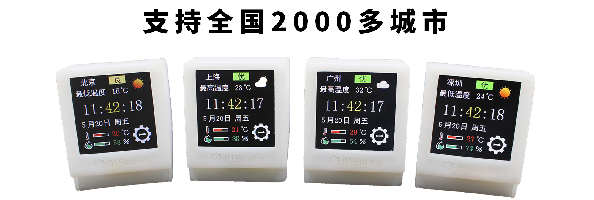

# 目录

- **开箱指南**

    - [pyClock简介](./intro/intro.md)
    - [使用说明](./intro/assembly.md)

- [**开发板资料下载**](./download.md)

- [**Python3基础知识**](./python_learn.md)

- **开发环境搭建**

    - [安装开发软件Thonny IDE](./getting_start/ide.md)
    - [驱动安装](./getting_start/driver.md)
    - [REPL串口交互调试](./getting_start/repl.md)
    - [文件系统](./getting_start/file_system.md)
    - [第1个代码测试](./getting_start/demo.md)
    - [代码离线运行](./getting_start/run_offline.md)
    - [固件更新](./getting_start/firmware.md)

- **基础实验**

    - [GPIO介绍](./basic_examples/gpio_intro.md) 
    - [点亮第1个LED](./basic_examples/led.md) 
    - [按键](./basic_examples/key.md) 
    - [外部中断](./basic_examples/exti.md)
    - [定时器](./basic_examples/timer.md)  
    - [LCD显示屏](./basic_examples/lcd.md)
    - [RTC实时时钟](./basic_examples/rtc.md) 

- **WiFi应用**

    - [连接无线路由器](./network/connect_wifi.md) 
    - [Socket通讯](./network/socket.md) 
    - [MQTT通讯](./network/mqtt.md) 

- **天气时钟综合实验**

    - [网络时钟](./clock/network_clock.md) 
    - [获取天气信息（API）](./clock/weather_api.md) 
    - [出厂例程](./clock/default_demo.md) 

- [**更新说明**](./update.md)