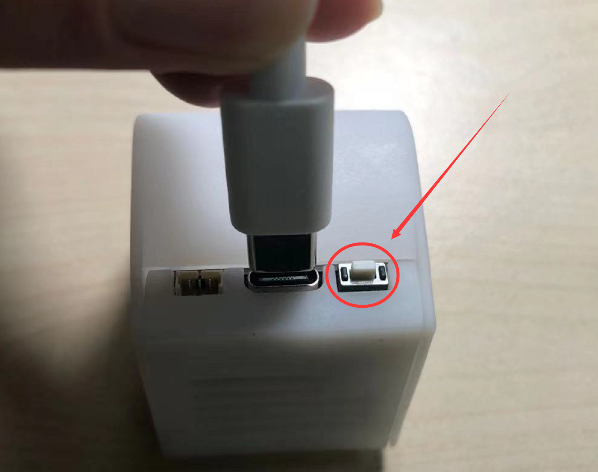
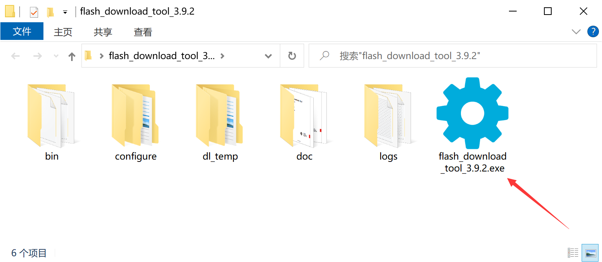
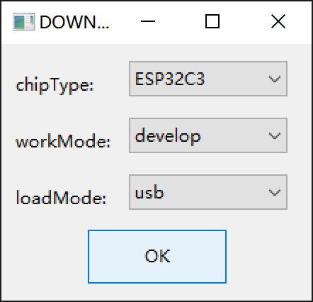
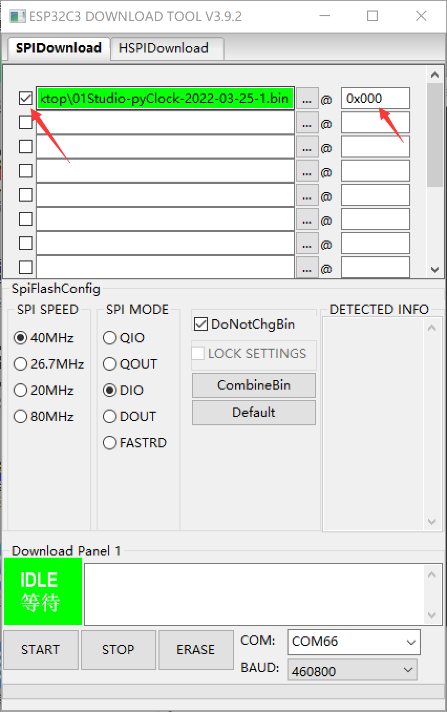
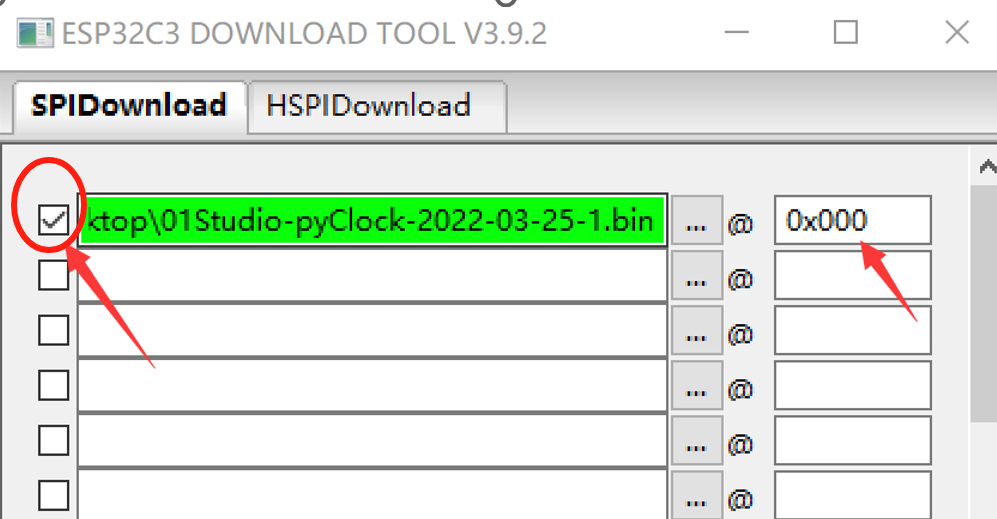
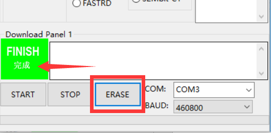
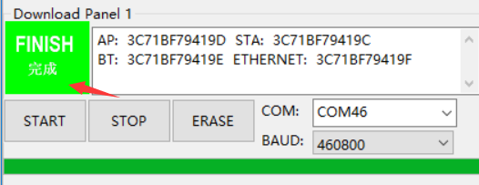

# 固件更新

我们的开发板出厂已经烧录好了固件，当用户遇到故障或者需要升级固件时，可以使用本教程操作.

由于pyClock使用USB进行下载连接，由于没有自动下载电路，因此先让开发板进入下载模式，方法如下：

按着的背后的按键（BOOT）键不放，然后插入TYPE-C线上电，这么操作开发板上电即进入下载模式。

:::tip 提示
下载模式的COM号和普通编程模式的COM号不一致，可以通过我的电脑--设备管理器查看以判断是否已经进入下载模式。
:::

找到路径：**零一科技（01Studio）MicroPython开发套件配套资料\01-开发工具\01-Windows\固件更新工具\flash_download_tools_v3.9.2** 下的flash_download_tools_v3.9.2.exe软件，双击打开。

看到弹出配置窗口。芯片选择：ESP32S3；工作模式：develop；下载模式：USB。然后点击OK :

选择SPIDownload，在下图箭头位置点击，选择要烧录固件。固件位置位于：**零一科技（01Studio）MicroPython开发套件配套资料\03-相关固件目录下**。 

其它配置选项也请参考下图，注意下载地址是0x000。（COM串口是选择自己的串口，可以在设备管理器查询。）

固件前面的空白框记得打√。

配置好后，先点击“ERASE”按钮刷除模块里面内容。点击软件下方“ERASE”按钮，刷除成功后，左边绿色框出现完成字样。

刷除成功后，点击“START”按钮开始烧录，烧录完成有左边绿色框出现“完成”字样。完成后记得点”stop”按钮或者关闭软件释放串口。

升级完成后需要重新拔插一下TPYE-C线复位一下开发板，即可使用。
