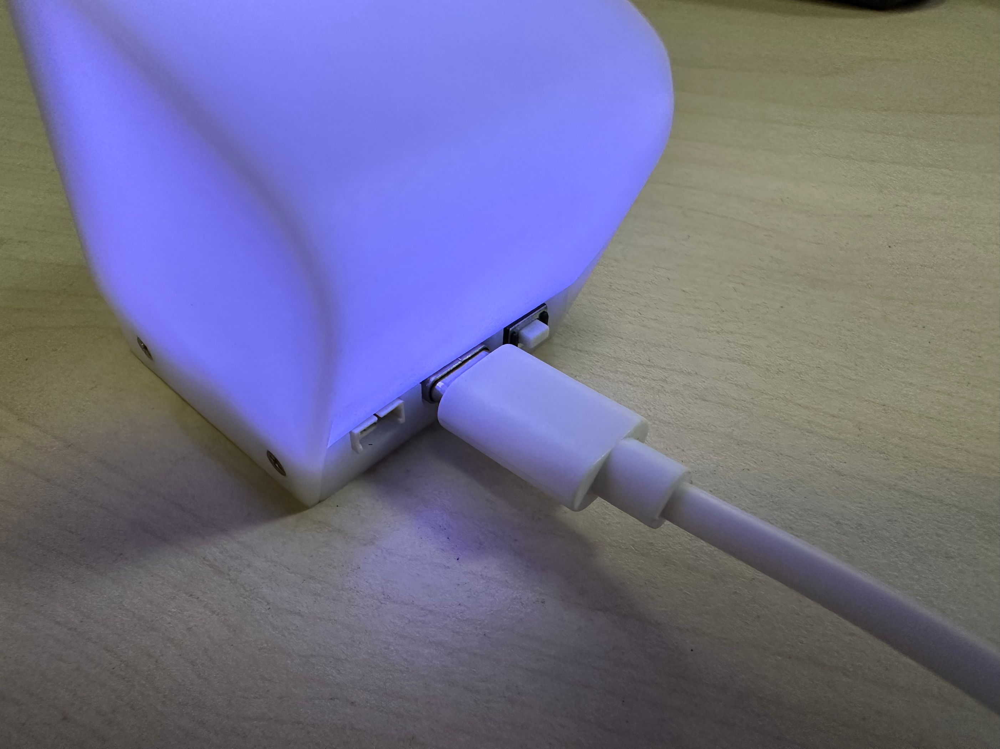
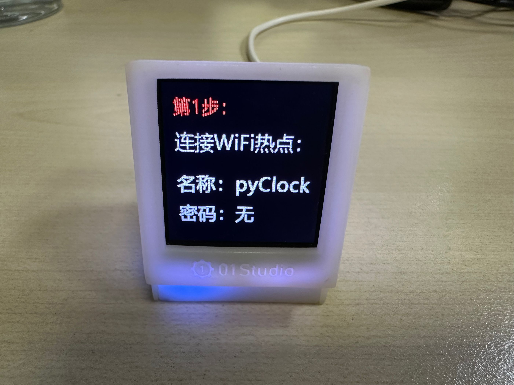
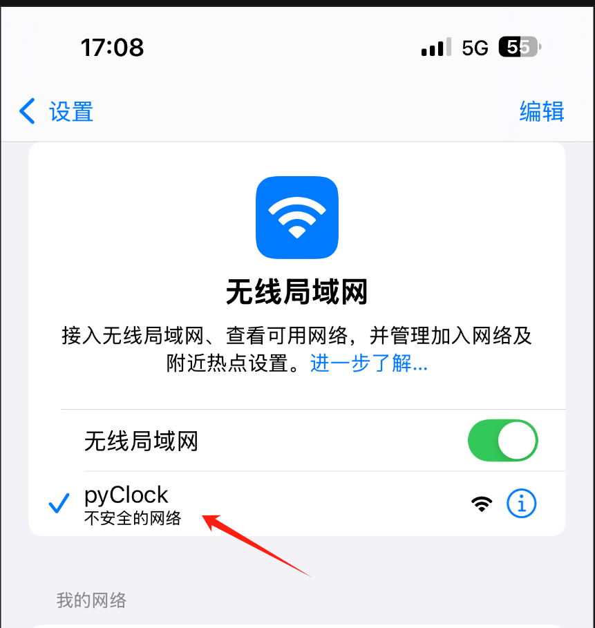
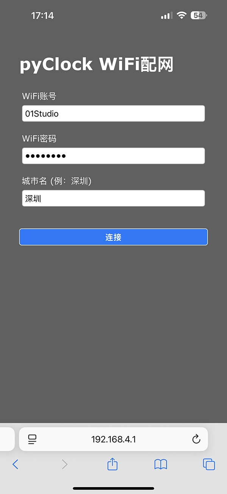
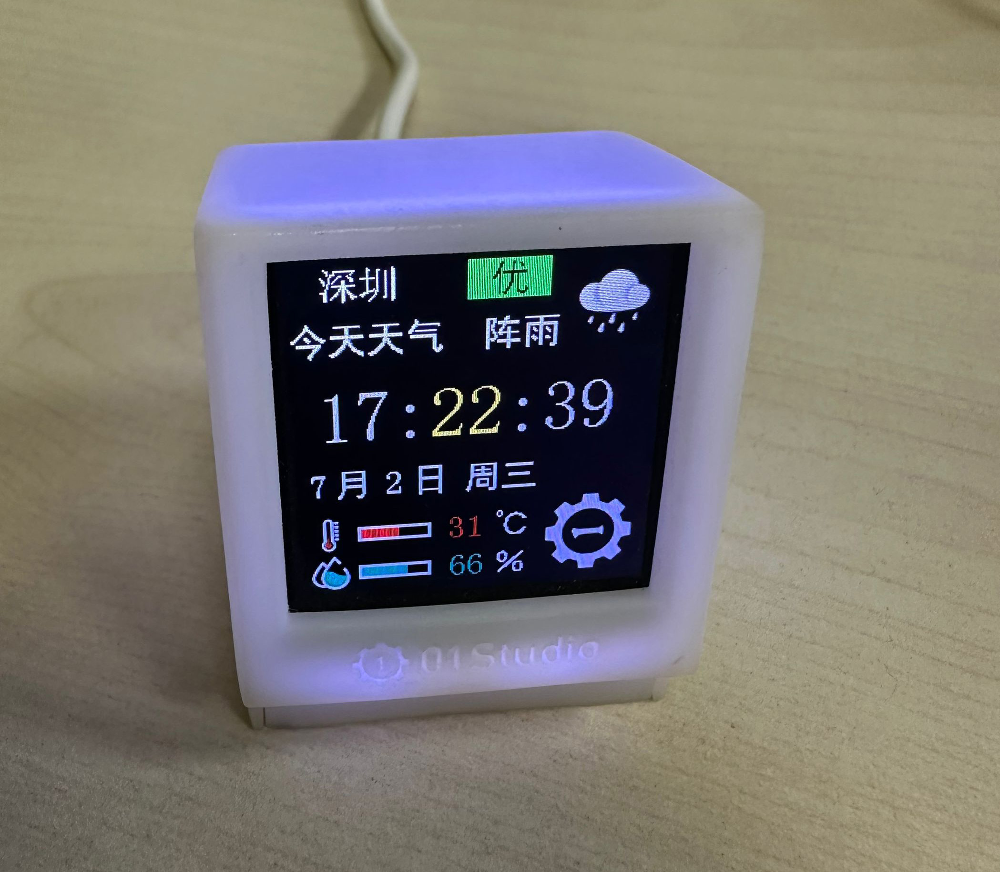
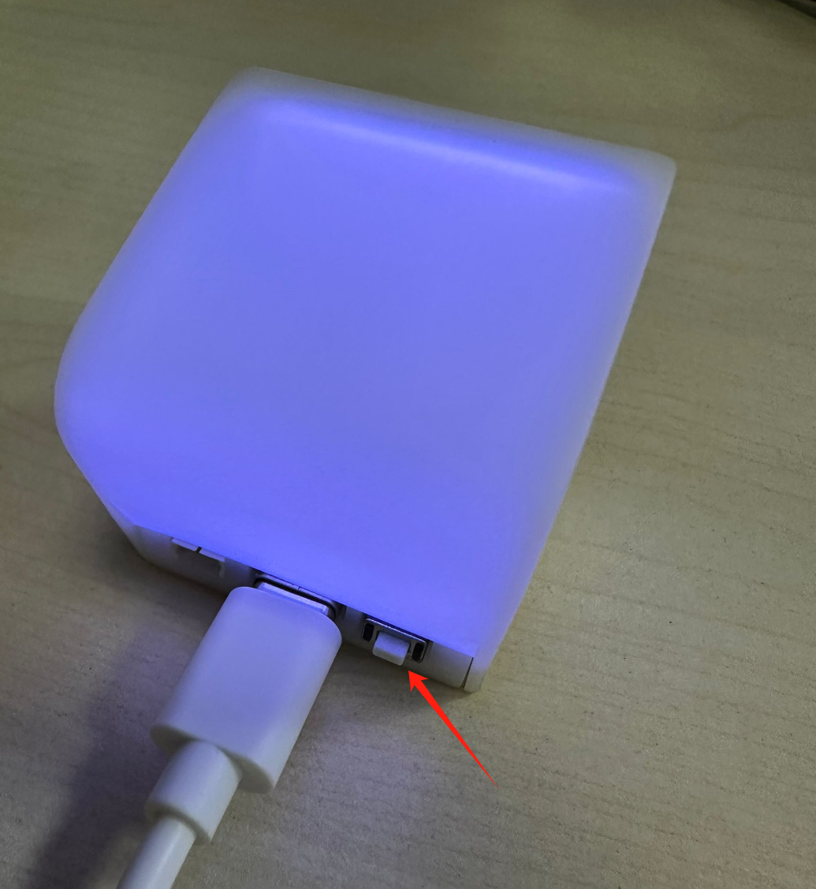
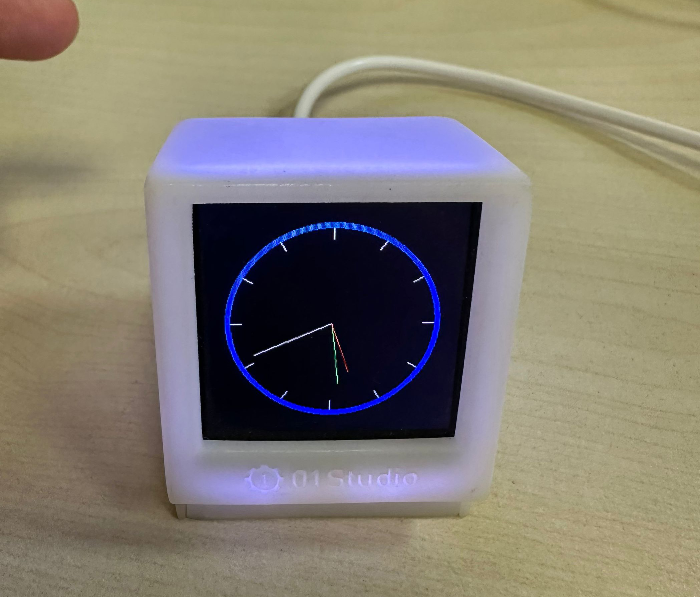
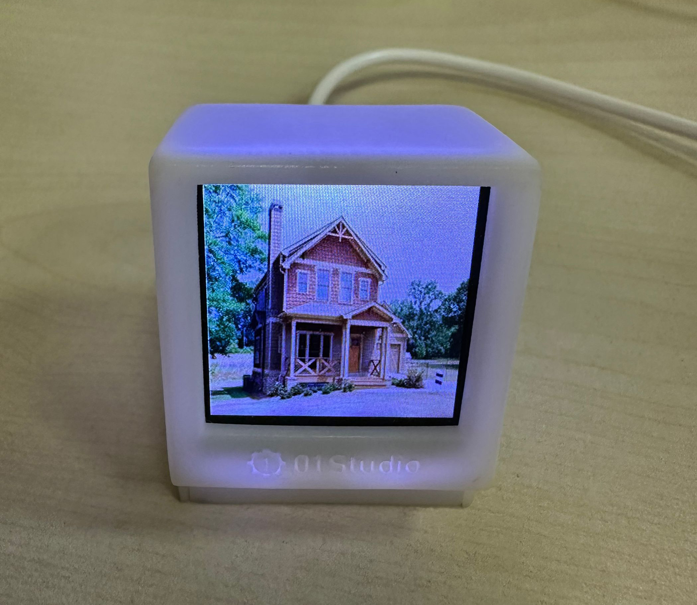
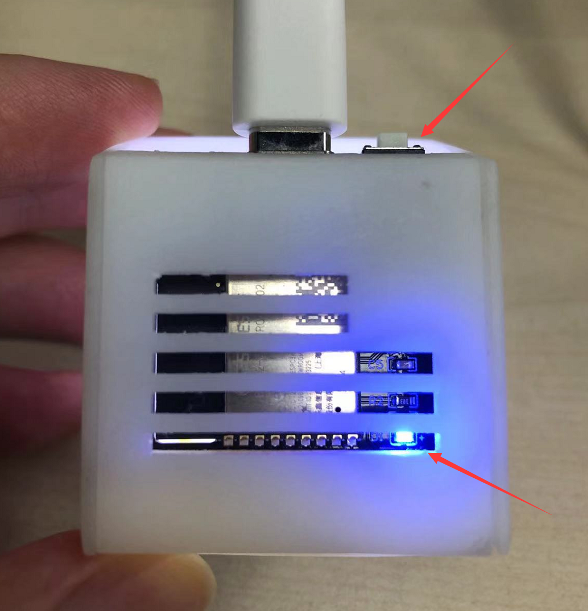

# 使用说明

## 配置网络和城市信息

pyClock有白色和黑色2个版本，出厂已经组装好并烧录好出厂代码，上电只需手机简单配网即可使用。下面是详细的配网步骤。

使用TYPE-C供电，可以接电源适配器或者电脑。

可以看到LCD出现下面界面：

这时候使用手机能搜索到名称为`pyClock`的热点，点击连接（无需密码）：

成功连接pyClock热点后，时钟界面出现第提示操作，使用浏览器登录 **192.168.4.1** 地址：

接下来在手机浏览器配置相关信息：

- `WiFi账号`：你家里或者办公室等能上网的WiFi账号，只支持2.4G信号。**(不支持2.4G或 2.4G&5G混频信号)**
- `WiFi密码`：WiFi密码
- `城市名`: 你要获取的天气信息城市名称，例如: 深圳

输入后点击`连接`按钮，这时候手机会将这些相关信息发送给pyClock，pyClock开始连接你家里的WiFi网络，连接成功后会同步时间、天气信息，如下图表示配置成功：

pyClock每隔30分钟回自动更新一次天气信息。

## 切换主题

pyClock自带3款主题，分别是天气时钟、极简表盘和相册，默认显示天气时钟主题，用户可以通过短按pyClock后面按键实现循环切换主题。

- `极简表盘`

- `相册`

## 恢复出厂设置

当你想修改城市或者WiFi网络时，可以长按pyClock背面按键5秒以上，蓝灯常亮，即表示已经恢复出厂设置。

