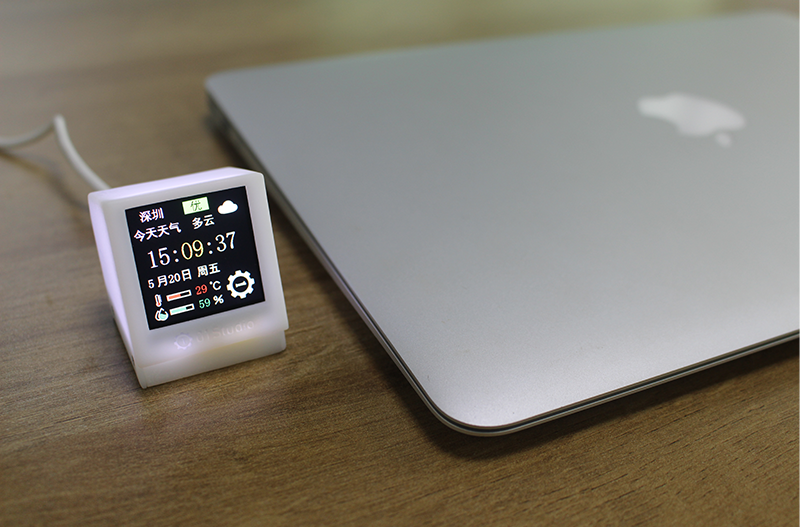
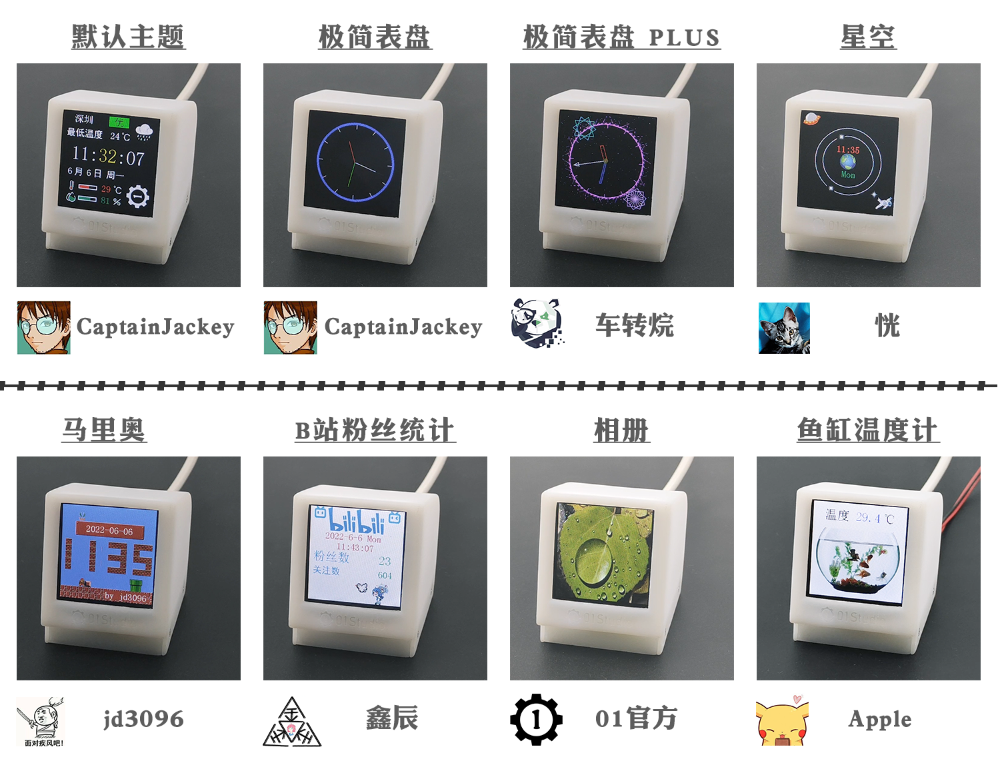
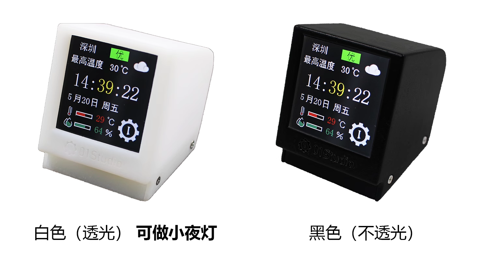
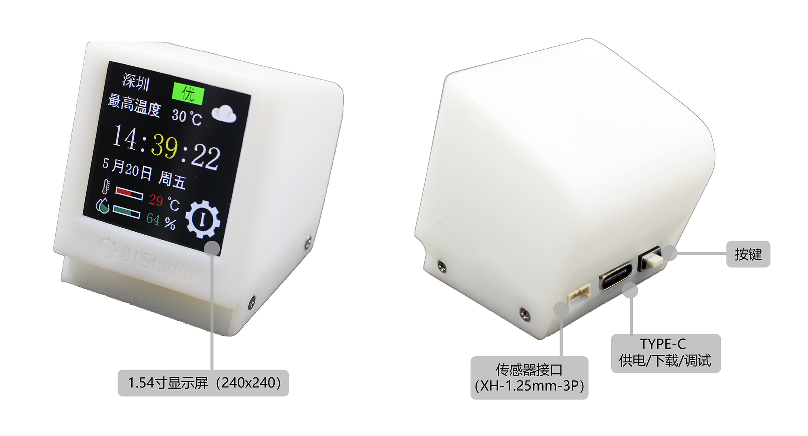
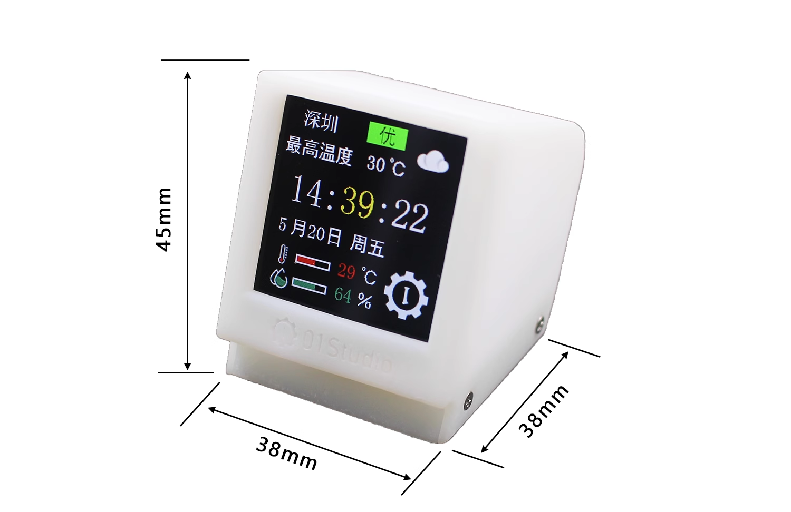

# pyClock简介

pyClock是由01Studio(01科技)发起的MicroPython开源天气时钟项目。**01Studio同时提供天气信息云平台，用户可以通过简单的API实现实时天气获取，目前天气信息支持中国地区（含港澳台）。**

Micropython是指使用Python做各类嵌入式硬件设备编程。MicroPython发展势头强劲，01Studio一直致力于Python嵌入式编程，特此推出pyDrone开源项目，旨在让MicroPython变得更加流行。使用MicroPython，你可以轻松地实现AP配网、API获取天气信息，各类时钟和天气UI界面。

## 产品特色

- 即插即用，只需要首次手机简单配网；

- 支持全国2000多个城市天气（含港澳台）；

- 支持MicroPython编程二次开发，简单易用；

- 预留传感器接口；

- 黑白两种颜色可选。

## 硬件资源

01Studio pyClock使用乐鑫科技ESP32-C3主控。

## 详细参数

|  产品参数 |
|  :---:  | ---  |
| 主控  | ESP32-C3 （Flash:4MBytes）;支持WiFi/BLE |
| LED  | x1 可编程LED：蓝色 |
| 按键  | x1：可编程按键 |
| 显示屏  | 1.54寸，分辨率240x240 |
| 扩展接口  | xh-1.25mm-3P, 传感器接口 |
| TYPE-C口  | 烧录/调试/充电多合一 |
| 外观  | 白色和黑色可选 |

## 尺寸图

