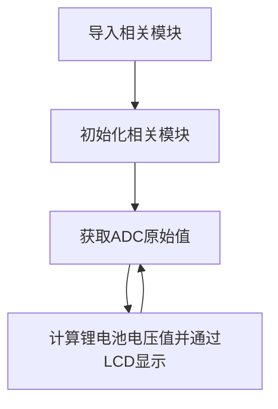
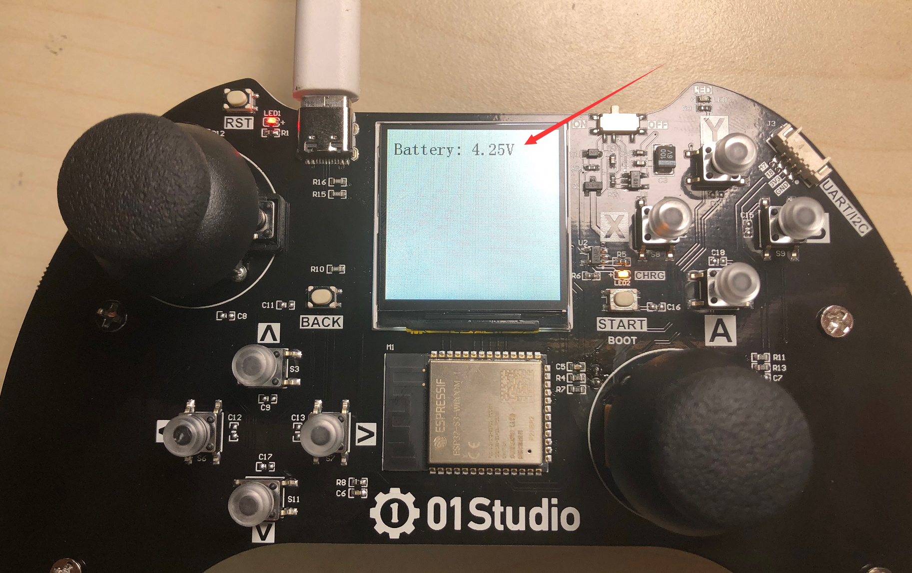

# 电池电量（ADC）

## 前言

上一节我们学习了摇杆（ADC）的使用，pyController上带有锂电池和锂电池电压测量电量，通过电压测量我们可以判断电池电量。

## 实验目的

通过编程调用MicroPython的内置ADC函数，实现电池电量测量。

## 实验讲解

pyController装有3.7V的锂电池（充满电可达4.2V）。但ESP32-S3的IO耐压是3.3V，因此我们可以通过一个分压电路实现对高于3.3V电压值的测量。电路原理图如下：


从上图可以看到锂电池通过2个电阻分压，接到了GPIO2。因此可得到电池VBAT与实际测量电压ADC的对应关系：VBAT / (40.2K+10K) = ADC / 10K ;
即：**VBAT = ADC * 5.02**

ESP32-S3的ADC默认量程为0-1V（0-4095），我们来看看ADC模块的构造函数和使用方法。

## ADC对象

### 构造函数
```python
adc = machine.ADC(Pin(id))
```
构建ADC对象，ADC引脚对应如下：

- `Pin(id)` ：支持ADC的Pin对象，如：Pin(2) 。


### 使用方法
```python
adc.read()
```
获取ADC值，测量精度是12位，返回0-4095（对应电压0-1V）。

<br></br>

```python
adc.atten(attenuation)
```
配置衰减器。配置衰减器能增加电压测量范围，以牺牲精度为代价的。
- `attenuation` ：衰减设置。
    - `ADC.ATTN_0DB` ：0dB衰减，最大测量电压1.00V。（默认配置）
    - `ADC.ATTN_2_5DB` ： 2.5dB 衰减, 最大输入电压约为 1.34v；
    - `ADC.ATTN_6DB` ：6dB 衰减, 最大输入电压约为 2.00v；
    - `ADC.ATTN_11DB` ：11dB 衰减, 最大输入电压约为3.3v


更多用法请阅读官方文档：<br></br>
https://docs.micropython.org/en/latest/esp32/quickref.html#adc-analog-to-digital-conversion

<br></br>

先导入相关模块，然后初始化模块。在循环中不断读取GPIO2的ADC值，然后计算锂电池电压，通过LCD显示，每隔1秒读取一次，具体如下：




## 参考代码

```python
'''
实验名称：电池电量（ADC）
版本：v1.0
日期：2022.4
作者：01Studio
说明：测量摇杆原始ADC值。
'''

#导入相关模块
from tftlcd import LCD15
from machine import Pin,ADC,Timer

#定义常用颜色
RED = (255,0,0)
GREEN = (0,255,0)
BLUE = (0,0,255)
BLACK = (0,0,0)
WHITE = (255,255,255)

########################
# 构建1.5寸LCD对象并初始化
########################
d = LCD15(portrait=1) #默认方向竖屏

#填充白色
d.fill(WHITE)

#电池电压测量引脚初始化
adc = ADC(Pin(2))

def ADC_Test(tim):

    #采集ADC值并计算电池电压值,0.97为误差调整值，用户可以自行调整，接近1即可。
    v = adc.read()/4095*5.02*0.97
    
    #显示原始值
    d.printStr('Battery: '+str('%.2f'%v)+'V  ',10,15,color=BLACK,size=2)
    
    #串口REPL打印
    print('Battery: '+str('%.2f'%v)+'V  ')

#开启定时器
tim = Timer(1)
tim.init(period=1000, mode=Timer.PERIODIC, callback=ADC_Test) #周期1s
```

## 实验结果

运行代码，可以看到LCD显示测量的电池电压值。



这一节我们学习了电池电量测量，当电压不足时候，就可以充电了。[充电教程>>](../intro/charge.md)