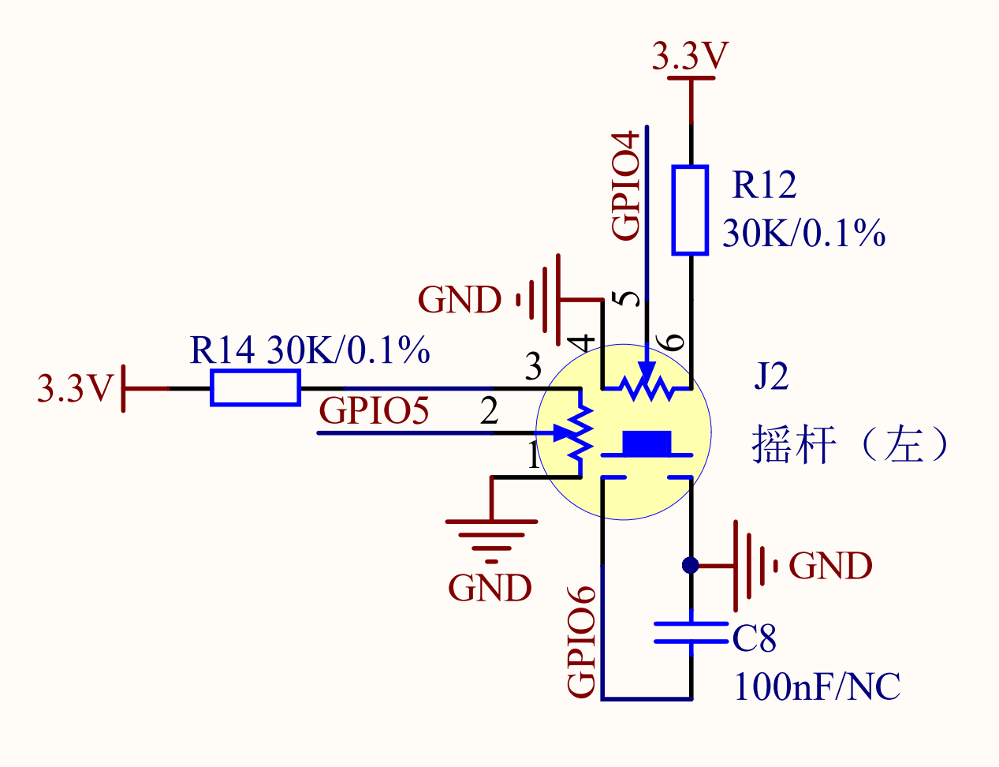
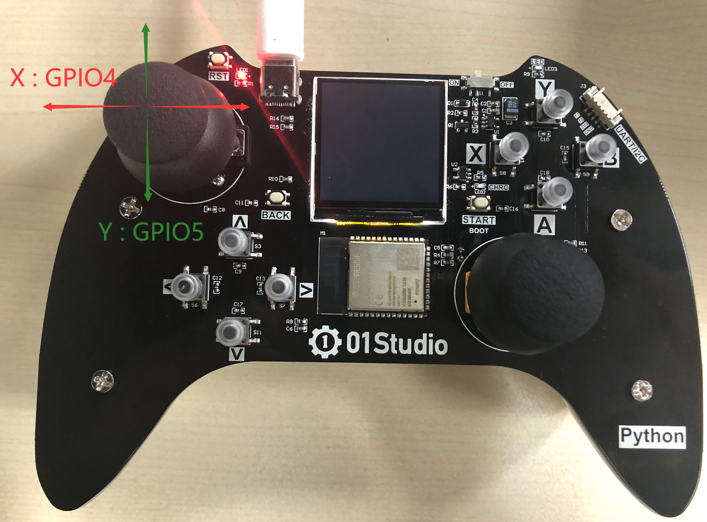
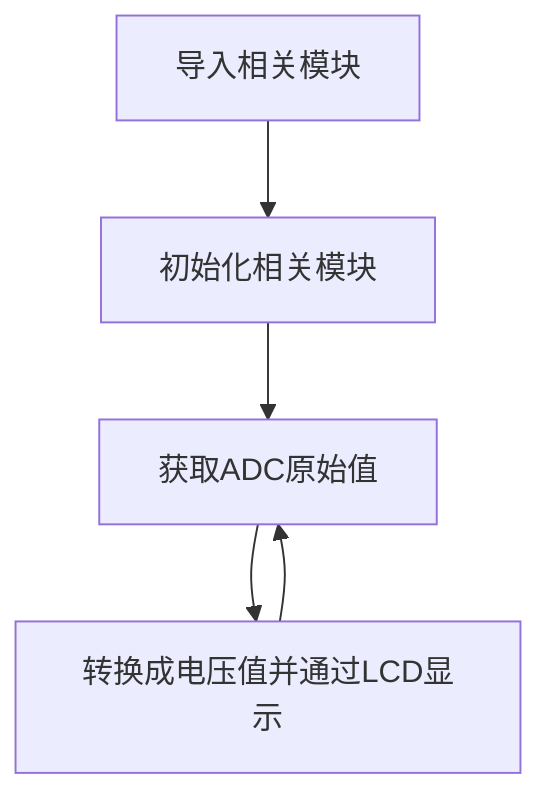
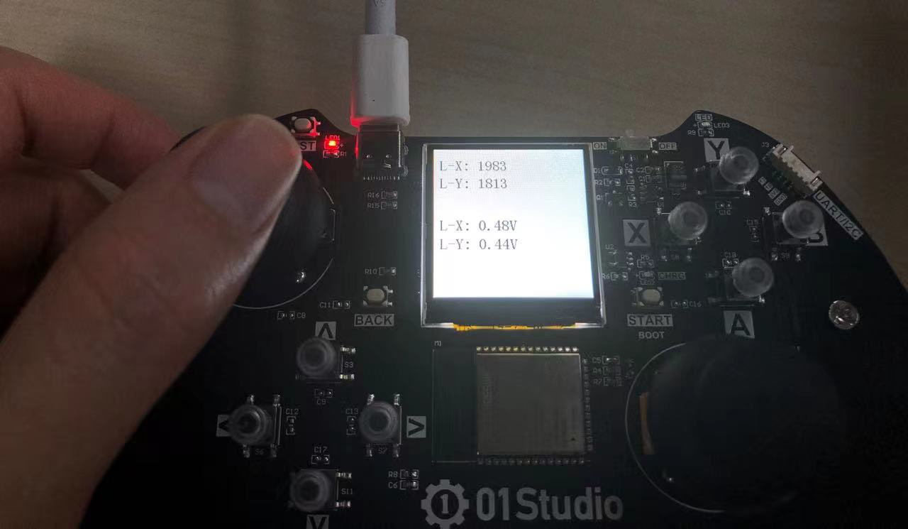

# 摇杆（ADC）

## 前言
ADC(analog to digital conversion) 模拟数字转换。意思就是将模拟信号转化成数字信号，由于单片机只能识别二级制数字，所以外界模拟信号常常会通过ADC转换成其可以识别的数字信息。常见的应用就是将变化的电压转成数字信号实现对电压值测量。

pyDrone上带有锂电池电压测量电路，通过电压测量我们可以判断电池电量。

## 实验目的

通过编程调用MicroPython的内置ADC函数，实现摇杆原始电压值测量。

## 实验讲解

pyController有左右两路摇杆，本节以左边摇杆为例进行实现，我们先来看看原理图。



从上图可以看到摇杆的X/Y两个方向分别连接了GPIO4和GPIO5，摇杆的内置电阻是10K欧姆，串联了1个30K欧姆，使得实际测量电压为0~0.825V（3.3除以4），这是因为ESP32 ADC输入最大量程默认为1V。



实际上ESP32-S3主控通过对GPIO引脚的ADC值来判断摇杆的方向, ESP32-S3的ADC默认量程为0-1V（0-4095），我们来看看ADC模块的构造函数和使用方法。

## ADC对象

### 构造函数
```python
adc = machine.ADC(Pin(id))
```
构建ADC对象，ADC引脚对应如下：

- `Pin(id)` ：支持ADC的Pin对象，如：Pin(2) 。


### 使用方法
```python
adc.read()
```
获取ADC值，测量精度是12位，返回0-4095（对应电压0-1V）。

<br></br>

```python
adc.atten(attenuation)
```
配置衰减器。配置衰减器能增加电压测量范围，以牺牲精度为代价的。
- `attenuation` ：衰减设置。
    - `ADC.ATTN_0DB` ：0dB衰减，最大测量电压1.00V。（默认配置）
    - `ADC.ATTN_2_5DB` ： 2.5dB 衰减, 最大输入电压约为 1.34v；
    - `ADC.ATTN_6DB` ：6dB 衰减, 最大输入电压约为 2.00v；
    - `ADC.ATTN_11DB` ：11dB 衰减, 最大输入电压约为3.3v


更多用法请阅读官方文档：<br></br>
https://docs.micropython.org/en/latest/esp32/quickref.html#adc-analog-to-digital-conversion

<br></br>

你没看错，就这么简单，两句函数就可以获得ADC数值。我们将在本实验中让我们来理顺一下编程逻辑。先导入相关模块，然后初始化模块。在循环中不断读取摇杆X（GPIO4）和Y（GPIO5）的ADC值，转化成电压值后通过LCD显示，每隔300毫秒读取一次，代码编程流程图如下：




## 参考代码

```python
'''
实验名称：摇杆（ADC）
版本：v1.0
日期：2022.4
作者：01Studio
说明：测量摇杆原始ADC值。
'''

#导入相关模块
from tftlcd import LCD15
from machine import Pin,ADC,Timer

#定义常用颜色
RED = (255,0,0)
GREEN = (0,255,0)
BLUE = (0,0,255)
BLACK = (0,0,0)
WHITE = (255,255,255)

########################
# 构建1.5寸LCD对象并初始化
########################
d = LCD15(portrait=1) #默认方向竖屏

#填充白色
d.fill(WHITE)

#摇杆ADC引脚初始化
adc_x = ADC(Pin(4))
adc_y = ADC(Pin(5))


def ADC_Test(tim):

    #采集ADC值
    v_x = adc_x.read()
    v_y = adc_y.read()
    
    #显示原始值
    d.printStr('L-X: '+str(v_x)+'    ',10,15,color=BLACK,size=2)
    d.printStr('L-Y: '+str(v_y)+'    ',10,45,color=BLACK,size=2)
    
    #显示电压值
    d.printStr('L-X: '+str('%.2f'%(v_x/4095))+'V    ',10,115,color=BLACK,size=2)
    d.printStr('L-Y: '+str('%.2f'%(v_y/4095))+'V    ',10,145,color=BLACK,size=2)
    
    #串口REPL打印
    print('adc_x: ',v_x,str('%.2f'%(v_x/4095)))
    print('adc_y: ',v_y,str('%.2f'%(v_y/4095)))

#开启定时器
tim = Timer(1)
tim.init(period=300, mode=Timer.PERIODIC, callback=ADC_Test) #周期300ms
```

## 实验结果

运行代码，推动摇杆，可以看到LCD显示电压值数据的变化。



这一节我们学习了摇杆原始值的获取，主要是ADC的应用，通过ADC的变化，我们就可以实现一些线性功能的控制，比如油门加速。