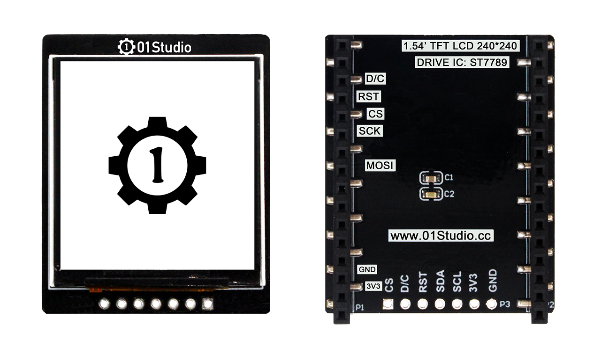
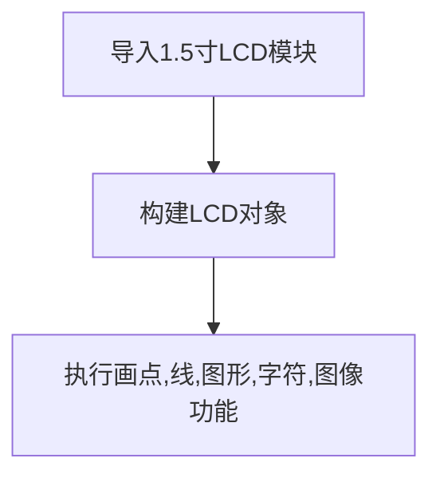
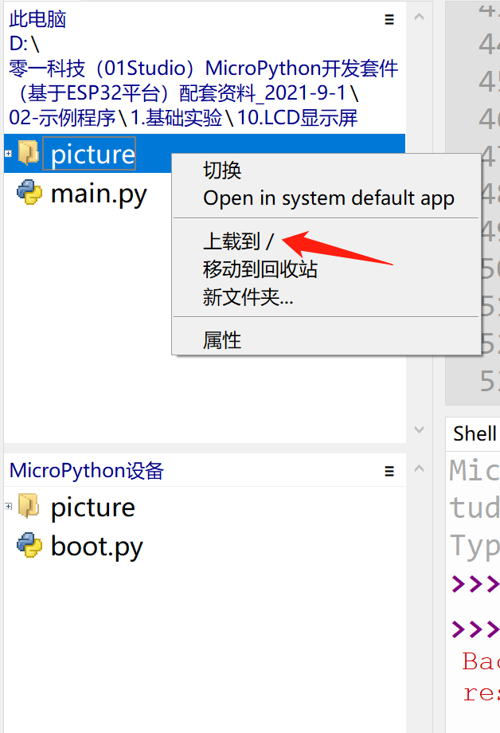
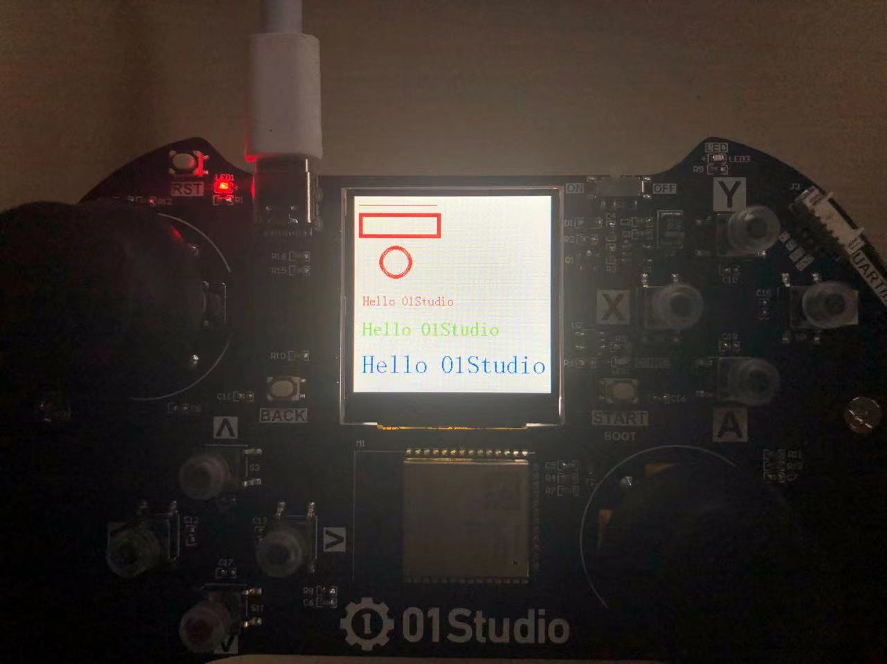
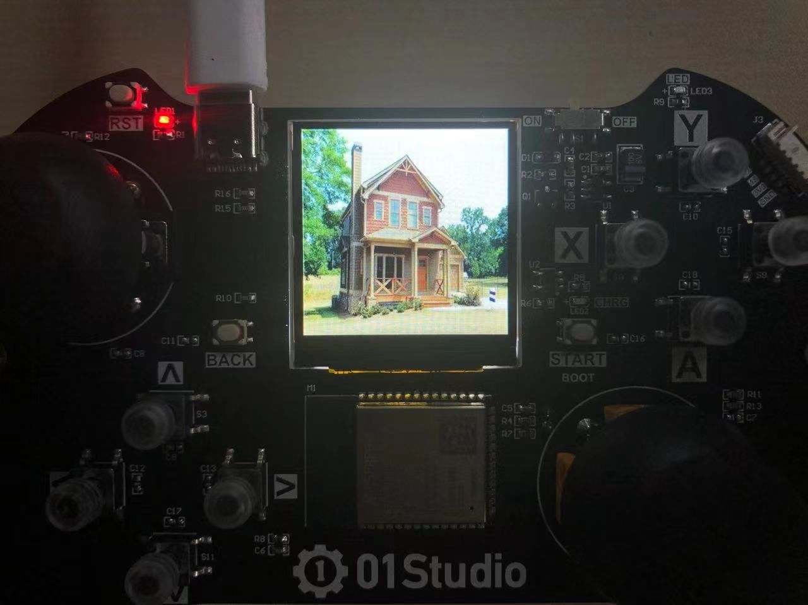
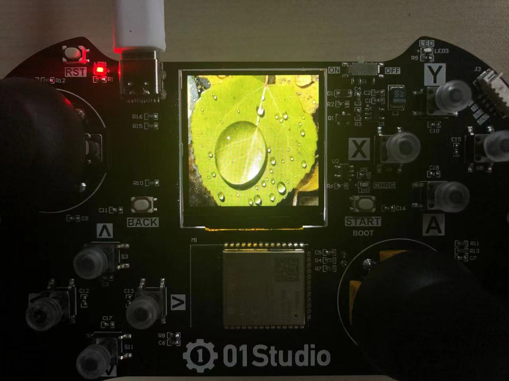
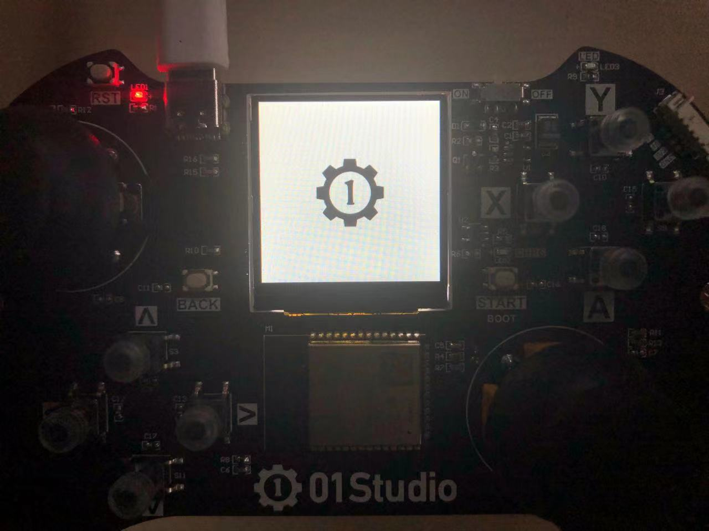

# LCD显示屏

## 前言

前面学习了按键输入设备后，这一节我们来学习输出设备LCD显示屏，其实之前的 LED 灯也算是输出设备，因为它们确切地告诉了我们硬件的状态。只是相对于只有亮灭的 LED 而言，显示屏可以显示更多的信息，体验更好。

这章稍微复杂一点，但我们把它放在了前面来学习，是因为学会了显示屏的使用，那么在后面的实验中可玩性就更强了。

## 实验目的

通过MicorPython编程方式实现LCD的各种显示功能，包括画点、线、矩形、圆形、显示英文、显示图片等。

## 实验讲解

我们先来看看pyController上1.5寸LCD的参数介绍：



|  产品参数 |
|  :---:  | ---  |
| 供电电压  | 3.3V |
| 屏幕尺寸  | 1.54寸 |
| 分辨率  | 240*240 |
| 颜色参数  | TFT彩色 |
| 驱动芯片  | ST7789 |
| 通讯方式  | SPI总线 |

实验用的LCD是1.54寸，驱动是的ST7789，使用SPI方式跟ESP32-S3通信，按以往嵌入式C语言开发，我们需要对ST7789进行编程实现驱动，然后再建立各种描点、划线、以及显示图片函数。

使用MicroPython其实也需要做以上工作（底层开发），但由于可读性和移植性强的特点，我们只需要搞清各个对象函数使如何使用即可。总的来说和前面实验一样，有构造函数和功能函数。构造函数解决的是初始化问题，告诉开发板该外设是怎么接线，初始化参数如何，而功能函数解决的则是使用问题，我们基于自己的需求直接调用相关功能函数，实现自己的功能即可！

我们管这些函数的集合叫驱动，驱动可以是预先在固件里面，也可以通过.py文件存放在开发板文件系统。也就是说工程师已经将复杂的底层代码封装好，我们顶层直接使用python开发即可，人生苦短。我们来看看pyController开发板1.54寸LCD的构造函数和使用方法。


## LCD15对象

### 构造函数
```python
tftlcd.LCD15(portrait=1)
```
构建一个1.5寸LCD对象，参数如下：

- ``portrait`` LCD显示方向：

    - ``1`` - 竖屏，240*240，开发板默认方向；
    - ``2`` - 横屏，240*240 ，1基础上顺时针旋转90°；	
    - ``3`` - 竖屏，240*240 ，1基础上顺时针旋转180°；		
    - ``4`` - 横屏，240*240 ，1基础上顺时针旋转270°。	

### 使用方法
```python
LCD15.fill(color)
```
全屏填充。

- ``color`` RGB颜色数据，如:(255,0,0)表示红色。

<br></br>

```python
LCD15.drawPixel(x,y,color)
```
画点:

- ``x`` 横坐标；
- ``y`` 纵坐标；
- ``color`` RGB颜色数据，如:(255,0,0)表示红色。

<br></br>

```python
LCD15.drawLine(x0,y0,x1,y1,color)
```
画线段:

- ``x0`` 起始横坐标；
- ``y0`` 起始纵坐标；
- ``x1`` 结束横坐标；
- ``y1`` 结束纵坐标；
- ``color`` RGB颜色数据，如:(255,0,0)表示红色。

<br></br>

```python
LCD15.drawRect(x,y,width,height,color,border=1,fillcolor=None)
```
画矩形:

- ``x`` 起始横坐标；
- ``y`` 起始纵坐标；
- ``width`` 宽度；
- ``height`` 高度；
- ``color`` 边框颜色，RGB颜色数据，如:(255,0,0)表示红色。
- ``border`` 边框宽度，单位为像素，默认=1；
- ``fillcolor`` 填充颜色，RGB颜色数据，如:(255,0,0)表示红色,默认=None表示不填充。

<br></br>

```python
LCD15.drawCircle(x,y,radius,color,border=1,fillcolor=None)
```
画圆:

- ``x`` 圆心横坐标；
- ``y`` 圆心纵坐标；
- ``radius`` 半径；
- ``color`` 边框颜色，RGB颜色数据，如:(255,0,0)表示红色。
- ``border`` 边框宽度，单位为像素，默认=1；
- ``fillcolor`` 填充颜色，RGB颜色数据，如:(255,0,0)表示红色,默认=None表示不填充。

<br></br>

```python
LCD15.printStr(text,x,y,color,backcolor=None,size=2)
```
写字符:

- ``text`` 字符，string类型；
- ``x`` 起始横坐标；	
- ``y`` 起始纵坐标；
- ``color`` 字体颜色，RGB颜色数据，如:(255,0,0)表示红色。
- ``backcolor`` 字体背景颜色，RGB颜色数据，如:(255,0,0)表示红色,默认=None。
- ``size`` 字体尺寸，默认=2表示标准尺寸：

    - ``1`` - 小号；
    - ``2`` - 标准；
    - ``3`` - 中号；
    - ``4`` - 大号；

<br></br>

```python
LCD15.Picture(x,y,filename)
```
显示图片，支持图片格式：jpg/bmp。最大尺寸240*240

- ``x`` 起始横坐标；
- ``y`` 起始纵坐标；
- ``filename`` 路径+名称，如："/cat.jpg"。（‘/’表示开发板的板载flash的根目录。）

<br></br>

更多用法请阅读官方文档：<br></br>
https://docs.01studio.cc/library/tftlcd/tftlcd.LCD15.html

<br></br>

有了上面的对象构造函数和使用说明，编程可以说是信手拈来了，我们在实验中将以上功能都跑一遍，先看看编程流程图：




## 参考代码

```python
'''
实验名称：1.5寸LCD液晶显示屏(240x240)
版本：v1.0
日期：2022.4
作者：01Studio
实验平台：pyController遥控手柄
说明：通过编程实现LCD的各种显示功能，包括填充、画点、线、矩形、圆形、显示英文、显示图片等。
'''

#导入相关模块
from tftlcd import LCD15
import time

#定义常用颜色
RED = (255,0,0)
GREEN = (0,255,0)
BLUE = (0,0,255)
BLACK = (0,0,0)
WHITE = (255,255,255)

########################
# 构建1.5寸LCD对象并初始化
########################
d = LCD15(portrait=1) #默认方向竖屏

#填充白色
d.fill(WHITE)

#画点
d.drawPixel(5, 5, RED)
 
#画线段
d.drawLine(5, 10, 100, 10, RED)
 
#画矩形
d.drawRect(5, 20, 100, 30, RED, border=5)

#画圆
d.drawCircle(50, 80, 20, RED, border=5)
 
#写字符,4种尺寸
d.printStr('Hello 01Studio', 10, 120, RED, size=1)
d.printStr('Hello 01Studio', 10, 150, GREEN, size=2)
d.printStr('Hello 01Studio', 10, 190, BLUE, size=3)

time.sleep(5) #等待5秒

#显示图片
d.Picture(0,0,"/picture/1.jpg")
time.sleep(3)
d.Picture(0,0,"/picture/2.jpg")
time.sleep(3)
d.Picture(0,0,"/picture/01studio.jpg")
```

## 实验结果

将示例程序的素材文件上传到pyController开发板。（也可以只上传单张图片，注意修改代码中文件的路径即可。）




在Thonny IDE运行代码, 可以看到LCD依次显示相关内容。

- 点、线、字符等显示。



- 图片显示。







通过本实验我们体验到了LCD使用micropython开发的简单和灵活性。我们轻松实现了LCD的各种常规操作，让用户将精力放在应用。相信随着micropython库函数的日益成熟，其性能和可玩性将变得更强！

如需显示中文，请查看[01Studio全系列LCD 中文显示教程>>](https://forum.01studio.cc/t/topic/82)