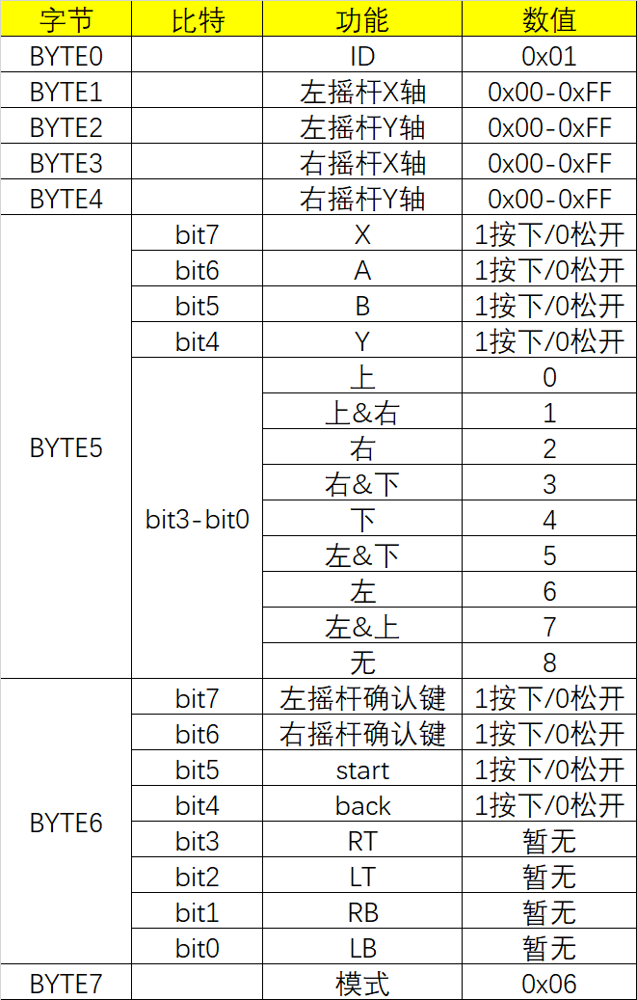
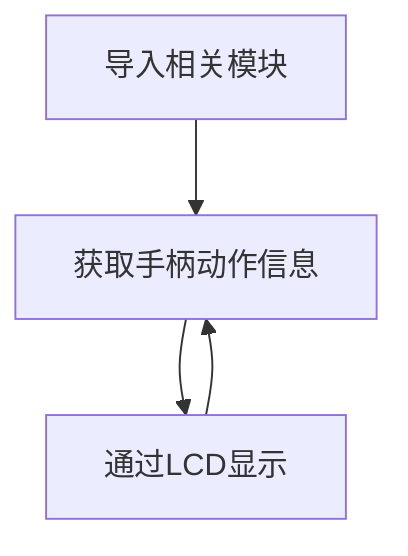
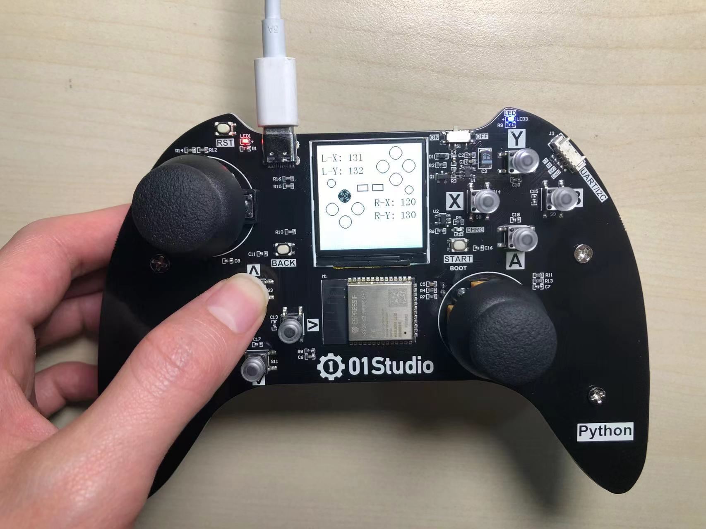

# 按键和摇杆

## 前言

pyController手柄有10个可编程按键以及2个360度摇杆，本节我们来学习如何利用底层封装好的micropython库来快速实现手柄所有按键或摇杆相关动作。


## 实验目的

编程实现手柄按键、摇杆等动作获取，并通过LCD展示。

## 实验讲解

市面上比较流行的手柄有XBOX和PS2手柄，还有其它厂家的。不同厂家的硬件大同小异，而手柄协议通常不一样，我们可以根据实际情况定义自己的一套协议。

01Studio定义的pyController手柄协议如下，一共8个字节的数据，涵盖了全部按键摇杆触发行为，为了方便用户理解，我们做了一个简表：



该协议参考了罗技手柄的协议，感兴趣用户可以查看，链接如下：https://blog.csdn.net/liudijiang/article/details/86693435

上述协议的硬件信息采集已经在01Studio micropython底层固件封装好，用户只需要简单的python语句即可调用。相关对象说明如下：

## CONTROLLER对象

### 构造函数
```python
gamepad = controller.CONTROLLER()
```
构建手柄对象。

### 使用方法
```python
gamepad.read()
```
读取手柄和摇杆数据。返回8字节元组，代表手柄按键和摇杆的所有数据。协议明细见前面简表。

例：(1,135,131,125,132,8,0,6)

<br></br>

```python
gamepad.deinit()
```
注销手柄对象。

<br></br>

更多用法请阅读文档：<br></br>
https://pycontroller.01studio.cc/zh-cn/latest/manual/quickref.html

<br></br>

我们使用一个示例对协议进行详细讲解：

示例：(1, 135, 131, 125, 132, 8, 0, 6)

|  BYTE0 |  BYTE1 |  BYTE2 |  BYTE3 |  BYTE4 |  BYTE5 |  BYTE6 |  BYTE7 |
|  :---:  | :---:  |  :---:  | :---:  |  :---:  | :---:  |  :---:  | :---:  |
|  1 |  135 |  131 |  125 |  132 |  8 |  0 |  6 |

- BYTE0 : 1

值为1，表示ID，是固定值。

- BYTE1 : 135

左摇杆X轴的值，范围0~255，135表示摇杆在大概在中间的位置。

- BYTE2 : 131

左摇杆Y轴的值，范围0~255，131表示摇杆在大概在中间的位置。

- BYTE3: 125

右摇杆X轴的值，范围0~255，125表示摇杆在大概在中间的位置。

- BYTE4 : 132

右摇杆Y轴的值，范围0~255，132表示摇杆在大概在中间的位置。

- BYTE5 : 8

BYTE5每个比特都有含义，因此需要转成二进制来看。8是 00001000。根据前面协议表可以看到表示没有任何对应的按键按下。

- BYTE6 : 0

BYTE6每个比特都有含义，因此需要转成二进制来看。0是 00000000。根据前面协议表可以看到表示没有任何对应的按键按下。

- BYTE7 : 6

BYTE7表示模式，目前只有一种模式，6是固定值。

有了这个协议，我们就可以编程实现手柄动作信息实时采集，并用LCD显示。代码编写流程如下：




## 参考代码

```python
'''
实验名称：手柄控制
版本：v1.0
日期：2022.4
作者：01Studio
说明：通过获取手柄动作信息在LCD显示
'''

import controller,time
from tftlcd import LCD15

#构建手柄对象
gamepad = controller.CONTROLLER()

########################
# 构建1.5寸LCD对象并初始化
########################
d = LCD15(portrait=1) #默认方向竖屏

#常用颜色定义
WHITE = (255,255,255)
BLACK = (0,0,0)
RED = (255,0,0)
BLUE = (0,0,255)

d.fill(WHITE) #填充白色

#相关图形显示，用于展示动作
d.drawCircle(60,115,15,color=BLACK,border=2,fillcolor=WHITE)
d.drawCircle(60,175,15,color=BLACK,border=2,fillcolor=WHITE)
d.drawCircle(30,145,15,color=BLACK,border=2,fillcolor=WHITE)
d.drawCircle(90,145,15,color=BLACK,border=2,fillcolor=WHITE)

d.drawCircle(180,20,15,color=BLACK,border=2,fillcolor=WHITE)
d.drawCircle(180,80,15,color=BLACK,border=2,fillcolor=WHITE)
d.drawCircle(150,50,15,color=BLACK,border=2,fillcolor=WHITE)
d.drawCircle(210,50,15,color=BLACK,border=2,fillcolor=WHITE)

d.drawCircle(30,85,10,color=BLACK,border=2,fillcolor=WHITE)
d.drawCircle(210,105,10,color=BLACK,border=2,fillcolor=WHITE)

d.drawRect(90, 90, 25, 15, color=BLACK, border=2, fillcolor=WHITE)
d.drawRect(125, 90, 25, 15, color=BLACK, border=2, fillcolor=WHITE)


while True:
    
    v = gamepad.read()
    
    print(v) #REPL打印
        
    #摇杆数据
    d.printStr('L-X: '+str(v[1])+'  ',10,15,color=BLACK,size=2)
    d.printStr('L-Y: '+str(v[2])+'  ',10,45,color=BLACK,size=2)
    
    d.printStr('R-X: '+str(v[3])+'  ',130,120,color=BLACK,size=2)
    d.printStr('R-Y: '+str(v[4])+'  ',130,150,color=BLACK,size=2)
    
    #按键动作判断并显示
    L = v[5]%16
    if L == 0: #上
        d.drawCircle(60,115,15,color=BLACK,border=2,fillcolor=BLACK)
        time.sleep_ms(200)
        d.drawCircle(60,115,15,color=BLACK,border=2,fillcolor=WHITE)

    if L == 4: #下
        d.drawCircle(60,175,15,color=BLACK,border=2,fillcolor=BLACK)
        time.sleep_ms(200)
        d.drawCircle(60,175,15,color=BLACK,border=2,fillcolor=WHITE)

    if L == 6: #左
        d.drawCircle(30,145,15,color=BLACK,border=2,fillcolor=BLACK)
        time.sleep_ms(200)
        d.drawCircle(30,145,15,color=BLACK,border=2,fillcolor=WHITE)
        
    if L == 2: #右
        d.drawCircle(90,145,15,color=BLACK,border=2,fillcolor=BLACK)
        time.sleep_ms(200)
        d.drawCircle(90,145,15,color=BLACK,border=2,fillcolor=WHITE)
    
    
    if v[5] & 1<<4: #Y
        d.drawCircle(180,20,15,color=BLACK,border=2,fillcolor=BLACK)
        time.sleep_ms(200)
        d.drawCircle(180,20,15,color=BLACK,border=2,fillcolor=WHITE)
    
    if v[5] & 1<<6: #A
        d.drawCircle(180,80,15,color=BLACK,border=2,fillcolor=BLACK)
        time.sleep_ms(200)
        d.drawCircle(180,80,15,color=BLACK,border=2,fillcolor=WHITE)
        
    if v[5] & 1<<7: #X
        d.drawCircle(150,50,15,color=BLACK,border=2,fillcolor=BLACK)
        time.sleep_ms(200)
        d.drawCircle(150,50,15,color=BLACK,border=2,fillcolor=WHITE)
    
    if v[5] & 1<<5: #B
        d.drawCircle(210,50,15,color=BLACK,border=2,fillcolor=BLACK)
        time.sleep_ms(200)
        d.drawCircle(210,50,15,color=BLACK,border=2,fillcolor=WHITE)
    
    if v[6] & 1<<4: #back
        d.drawRect(90, 90, 25, 15, color=BLACK, border=2, fillcolor=BLACK)
        time.sleep_ms(200)
        d.drawRect(90, 90, 25, 15, color=BLACK, border=2, fillcolor=WHITE)

    if v[6] & 1<<5: #start
        d.drawRect(125, 90, 25, 15, color=BLACK, border=2, fillcolor=BLACK)
        time.sleep_ms(200)
        d.drawRect(125, 90, 25, 15, color=BLACK, border=2, fillcolor=WHITE)
    
    if v[6] & 1<<6: #右摇杆确认键
        d.drawCircle(210,105,10,color=BLACK,border=2,fillcolor=BLACK)
        time.sleep_ms(200)
        d.drawCircle(210,105,10,color=BLACK,border=2,fillcolor=WHITE)

    if v[6] & 1<<7: #左摇杆确认键
        d.drawCircle(30,85,10,color=BLACK,border=2,fillcolor=BLACK)
        time.sleep_ms(200)
        d.drawCircle(30,85,10,color=BLACK,border=2,fillcolor=WHITE)
    
        
    time.sleep_ms(20) #20ms检测一次

```

## 实验结果

运行代码，我们可以看到LCD显示出手柄信息，当推动摇杆或者按下某个按键时候，LCD显示对应动作的变化。



使用micropython非常简单就实现了手柄各个动作的获取，到这里我们已经可以利用这些东西来实现个性化控制，后面将会结合WiFi、蓝牙无线，打造自己的无线遥控手柄。