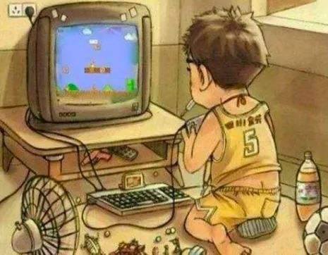
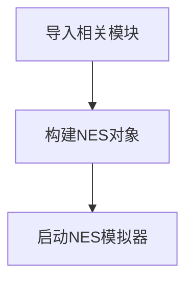
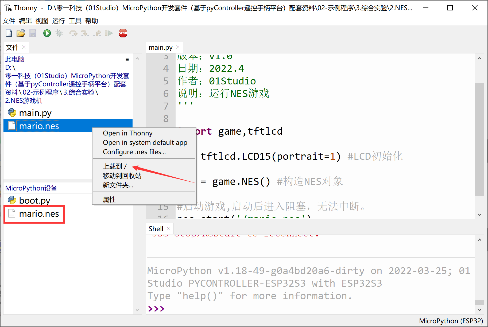
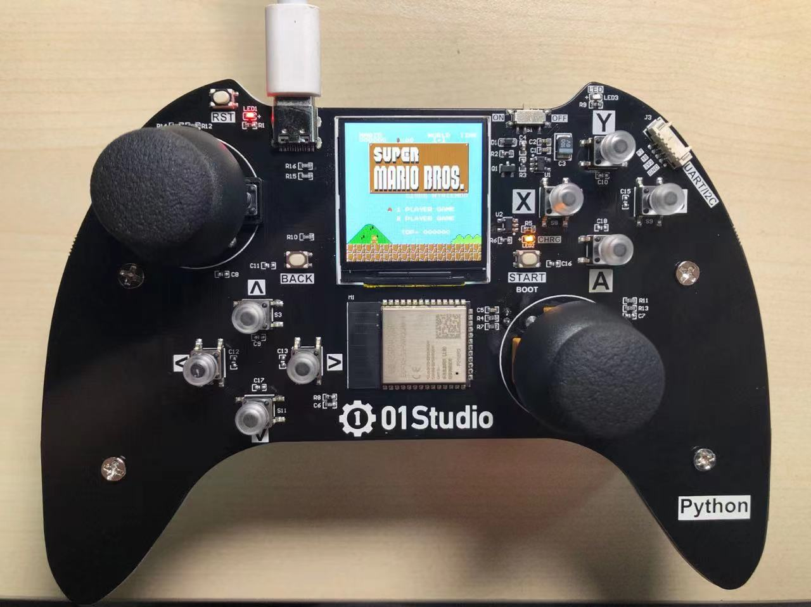
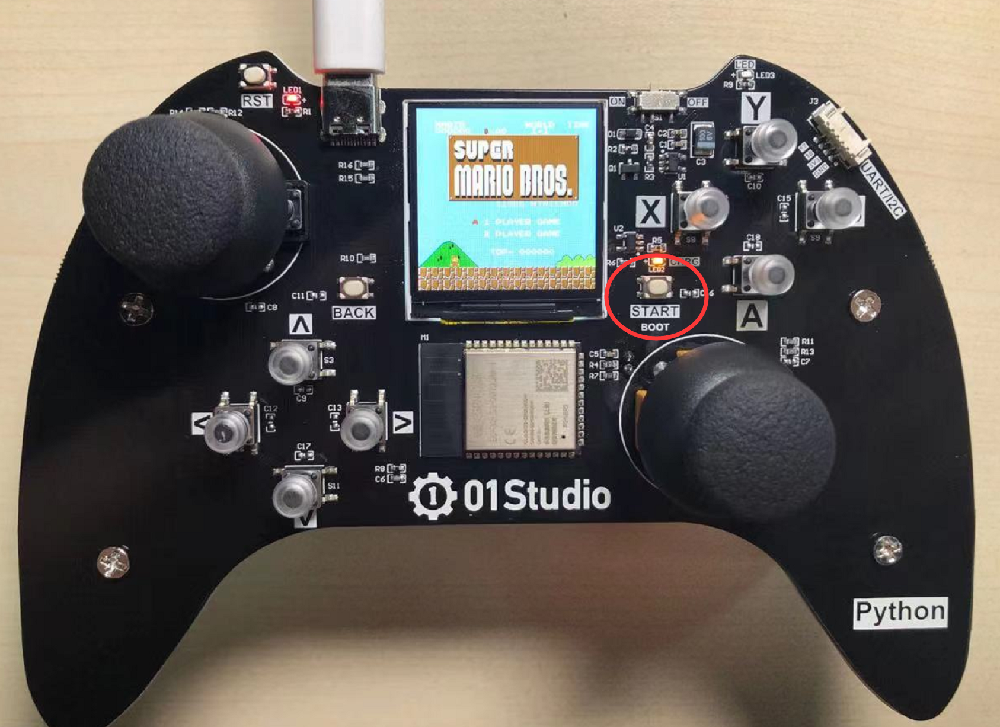
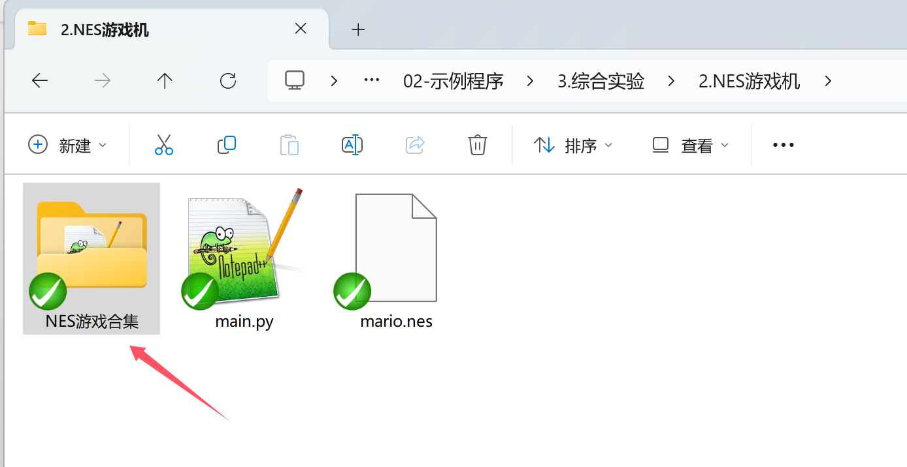

# NES游戏机

## 前言

80后90后或许记得当年风靡全国的小霸王游戏机，记得那超级玛丽、魂斗罗、冒险岛等经典游戏，而pyController上有一个液晶屏，结合手柄的摇杆和按键完全可以打造一个游戏机。



## 实验目的

编程实现NES游戏机。

## 实验讲解

NES游戏是日本任天堂公司发布的游戏，体积非常小，近年来经常被移植到各类MCU开发板上，01Studio将其移植到了ESP32，并通过micropython顶层轻松实现游戏文件的加载和运行。

NES相关对象说明如下：

## NES对象

### 构造函数
```python
nes = game.NES()
```
构建nes游戏对象。

### 使用方法
```python
nes.start(file)
```
启动nes游戏模拟器。启动成功后进入阻塞，无法运行其它代码。

-  `file`: 游戏路径+名称，如：’/mario.nes’ 表示flash根目录下的mario.nes文件。NES对象已经整合手柄摇杆按键，无需额外初始化。

<br></br>

```python
nes.deinit()
```
注销nes对象。

<br></br>

更多用法请阅读文档：<br></br>
https://pycontroller.01studio.cc/zh-cn/latest/manual/quickref.html

<br></br>

只需要一句代码即可运行NES游戏，代码编写流程如下：




## 参考代码

```python
'''
实验名称：NES游戏机
版本：v1.0
日期：2022.4
作者：01Studio
说明：运行NES游戏
'''

import game,tftlcd

d = tftlcd.LCD15(portrait=1) #LCD初始化

nes = game.NES() #构造NES对象

#启动游戏,启动后进入阻塞，无法中断。
nes.start('/mario.nes') 

```

## 实验结果

需要将例程代码的mario.nes游戏文件传输到开发板根目录。也可以新建文件夹上传，比如新建一个nes文件夹，将游戏文件放里面，再上传。那么文件路径就需要跟着修改。

即将代码：

```python
nes.start('/mario.nes') 
```

代码就需要修改成：

```python
nes.start('/nes/mario.nes') 
```



运行代码，可以看到NES游戏成功运行，出现超级玛丽游戏界面。



‘back’键是选择，按‘start’键开始。左边摇杆和上下左右键是方向，手柄右边A、B键是功能键，X和Y键是重新开始游戏。用户可以自己探索。




在micropython的加持下，我们将NES的使用定义得非常简单，用户只需要更换nes文件和代码中文件名称即可玩转各类nes游戏。例程中nes文件夹里面有很多经典NES游戏，供大家体验。

