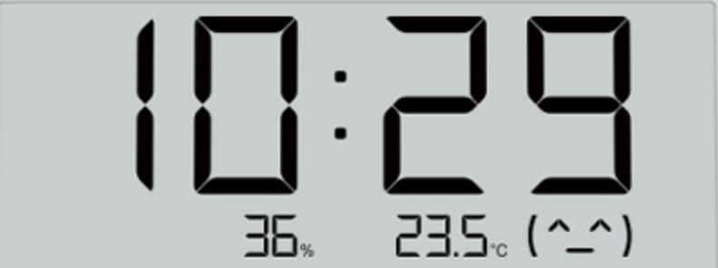
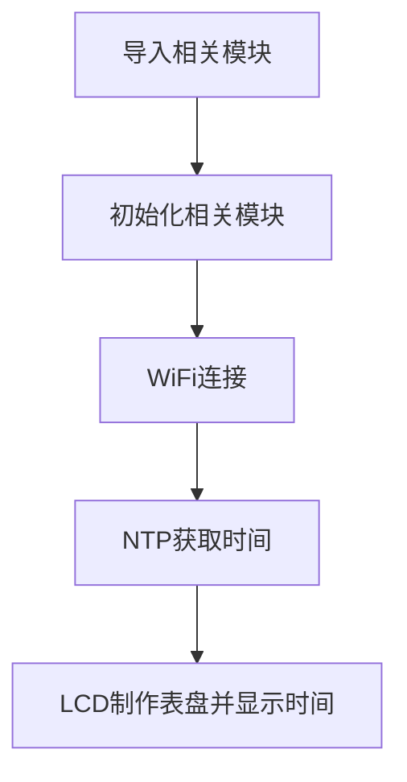
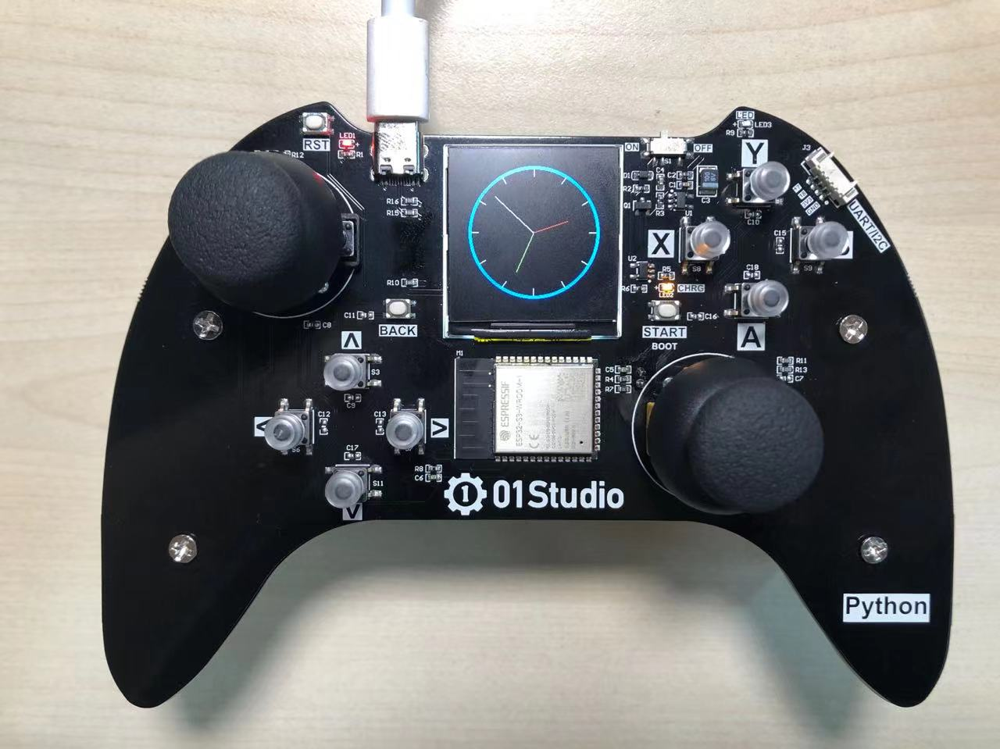

# 网络时钟

## 前言

在前面基础实验我们已经做过一个RTC时钟，日常生活中我们的时钟走着走着可能会出现偏差，这时候最方便的方法就是通过互联网获取当前时间信息，从而更新本地时间。这用到了NTP服务器【Network Time Protocol（NTP）】是用来使计算机时间同步化的一种协议，它可以使计算机对其服务器或时钟源（如石英钟，GPS等等)做同步化，它可以提供高精准度的时间校正。



## 实验目的

编程实现NTP时钟，通过LCD显示。

## 实验讲解

Micropython基于ESP32平台的库自带了RTC实时时钟以及NTP功能，也就是说我们可以结合之前的内容，可以轻松编程实现在线时钟同步。Wifi连接的相关对象用法这里不再重复，参考[连接无线路由器](../network/connect_wifi.md)章节内容。

先来看看NTP对象用法。

## ntptime对象

### 构造函数
```python
import ntptime
```
直接导入模块。

### 使用方法
```python
ntptime.settime()
```
将当前RTC时间设置成NTP获取的时间。

说明：获取的是伦敦时间，北京位于东八区，如需转换成北京时间需要将小时+8，其它不变。

<br></br>

我们可以结合前面的LCD章节内容，打造一个时间表盘，让时间可视化更直观，编程思路如下：




## 参考代码

```python
'''
实验名称：网络时钟
版本：v1.0
日期：2022.4
作者：01Studio
实验平台：pyController遥控手柄
说明:在线获取实时时间，然后通过LCD表盘显示
'''

#导入相关模块
from tftlcd import LCD15
from machine import RTC,Pin
import time,math,ntptime,network

#WiFi账号密码，修改成自己的。
SSID='01Studio' # wiFi账号
KEY='88888888'  # WiFi密码

#定义常用颜色
RED = (255,0,0)
GREEN = (0,255,0)
BLUE = (0,0,255)
BLACK = (0,0,0)
WHITE = (255,255,255)

########################
# 构建1.5寸LCD对象并初始化
########################
d = LCD15(portrait=1) #默认方向竖屏

#填充白色
d.fill(BLACK)

#WIFI连接函数,连接成功后更新时间
def WIFI_Connect():

    WIFI_LED=Pin(46, Pin.OUT) #初始化WIFI指示灯
    
    wlan = network.WLAN(network.STA_IF) #STA模式
    wlan.active(True)                   #激活接口
    start_time=time.time()              #记录时间做超时判断

    if not wlan.isconnected():
        print('connecting to network...')
        wlan.connect(SSID, KEY) #WIFI账号密码连接

        while not wlan.isconnected():

            #LED闪烁提示
            WIFI_LED.value(1)
            time.sleep_ms(300)
            WIFI_LED.value(0)
            time.sleep_ms(300)
            
            #超时判断,15秒没连接成功判定为超时
            if time.time()-start_time > 15 :
                print('WIFI Connected Timeout!')
                break

    if wlan.isconnected():

        #串口打印信息
        print('network information:', wlan.ifconfig())

        for i in range(5): #最多尝试获取5次时间
            try:
                ntptime.settime() #获取的是伦敦时间
                print("ntp time: ",rtc.datetime())
                time.sleep_ms(500)
                return None

            except:
                print("Can not get time!")

#画圆
d.drawCircle(120, 120, 100, BLUE, border=5)
for i in range(12):
    
    x0 = 120+round(95*math.sin(math.radians(i*30)))
    y0 = 120-round(95*math.cos(math.radians(i*30)))
    x1 = 120+round(85*math.sin(math.radians(i*30)))
    y1 = 120-round(85*math.cos(math.radians(i*30)))
    d.drawLine(x0, y0, x1, y1, WHITE)

rtc = RTC() #构建RTC时钟对象

#连接WiFi并获取时间
WIFI_Connect()

while True:   
    
    datetime = rtc.datetime() #获取当前时间
    second = datetime[6]
    minute = datetime[5]
    hour = (datetime[4]+8)%12 #北京时间是东八区，+8
    
    #秒钟处理
    
    #清除上一帧
    x0 = 120+round(80*math.sin(math.radians(second*6-6)))
    y0 = 120-round(80*math.cos(math.radians(second*6-6)))
    d.drawLine(x0, y0, 120, 120, BLACK)
    
    #显示
    x1 = 120+round(80*math.sin(math.radians(second*6)))
    y1 = 120-round(80*math.cos(math.radians(second*6)))
    d.drawLine(x1, y1, 120, 120, WHITE)
    
    #分钟处理
    
    #清除上一帧
    x0 = 120+round(65*math.sin(math.radians(minute*6-6)))
    y0 = 120-round(65*math.cos(math.radians(minute*6-6)))
    d.drawLine(x0, y0, 120, 120, BLACK)
    
    #显示
    x1 = 120+round(65*math.sin(math.radians(minute*6)))
    y1 = 120-round(65*math.cos(math.radians(minute*6)))
    d.drawLine(x1, y1, 120, 120, GREEN)
        
    #时钟处理

    #清除上一帧
    x0 = 120+round(55*math.sin(math.radians(hour*30+int(minute/12)*6-6)))
    y0 = 120-round(55*math.cos(math.radians(hour*30+int(minute/12)*6-6)))
    d.drawLine(x0, y0, 120, 120, BLACK)
    
    #显示
    x1 = 120+round(55*math.sin(math.radians(hour*30+int(minute/12)*6)))
    y1 = 120-round(55*math.cos(math.radians(hour*30+int(minute/12)*6)))
    d.drawLine(x1, y1, 120, 120, RED)
    
    time.sleep_ms(200) #显示间隔200ms

```

上述代码表盘部分主要运用了画圆、画线、通过三角函数计算时、分、秒针的两点然后连线。使用简单的代码便实现了表盘。

## 实验结果

运行代码，可以看见当成功获取NTP时间后，LCD实时显示时间。



本节结合了NTP、WiFi、RTC以及tftlcd库内容，实现了一个简易的实时时钟，但UI明显是比较简洁的，有兴趣的用户可以结合前面内容，尝试实现自己精美的UI时钟界面。