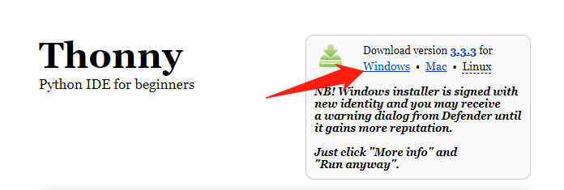
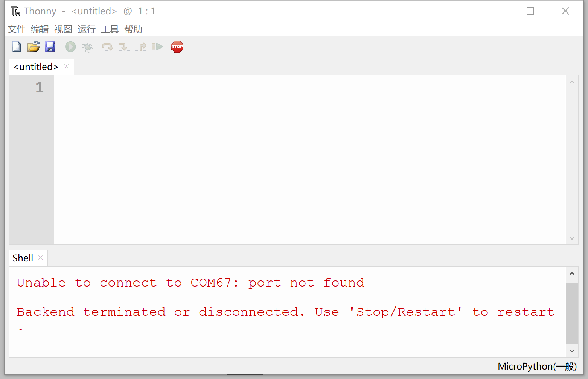

# 安装开发软件Thonny IDE

开发软件是指我们用来写代码的工具，Python 拥有众多的编程器，如果你之前已经熟练掌握python或已经使用python开发，那么可以直接使用你原来习惯的开发软件来编程。如果你是初学者或者喜欢简单而快速应用，我们使用官方推荐的Thonny Python IDE。

Thonny Python IDE是一款开源软件，以极简方式设计，对MicroPython的兼容性非常友善。而且支持Windows、Mac OS、Linux、树莓派。由于开源，所以软件迭代速度非常快，功能日趋成熟。

该软件可以在 零一科技（01Studio）MicroPython开发套件配套资\01-开发工具\01-Windows\MicroPython开发软件(IDE)\Thonny 下获取。默认提供Windows的安装包。当然你也可以在在 https://thonny.org/ 下载最新版，选择自己的电脑系统进行下载安装即：

具体安装方法如下：

下载完成后直接双击打开安装即可，安装完成后可以在桌面看到相关图标，打开软件如下：

至此，Thonny安装完成。关于如何在Thonny上使用pyController，我们在接下来的章节将详细讲解。