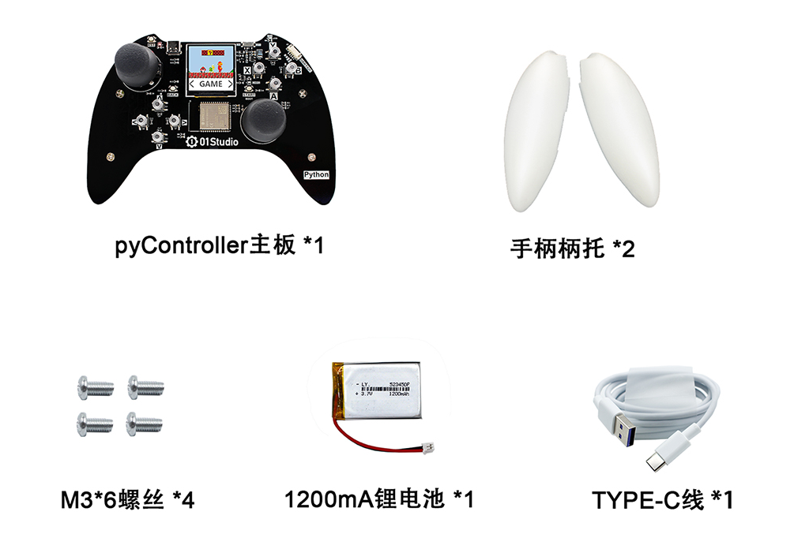
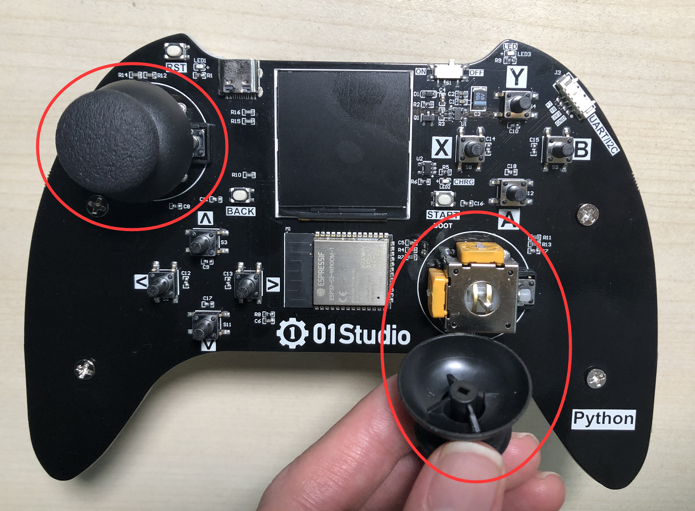
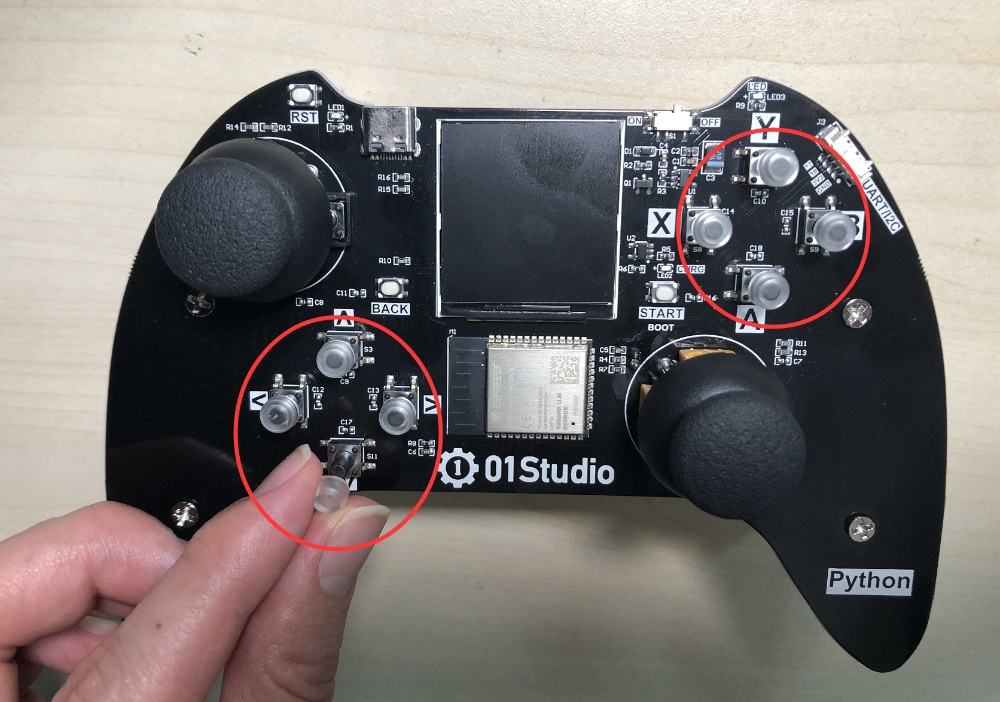
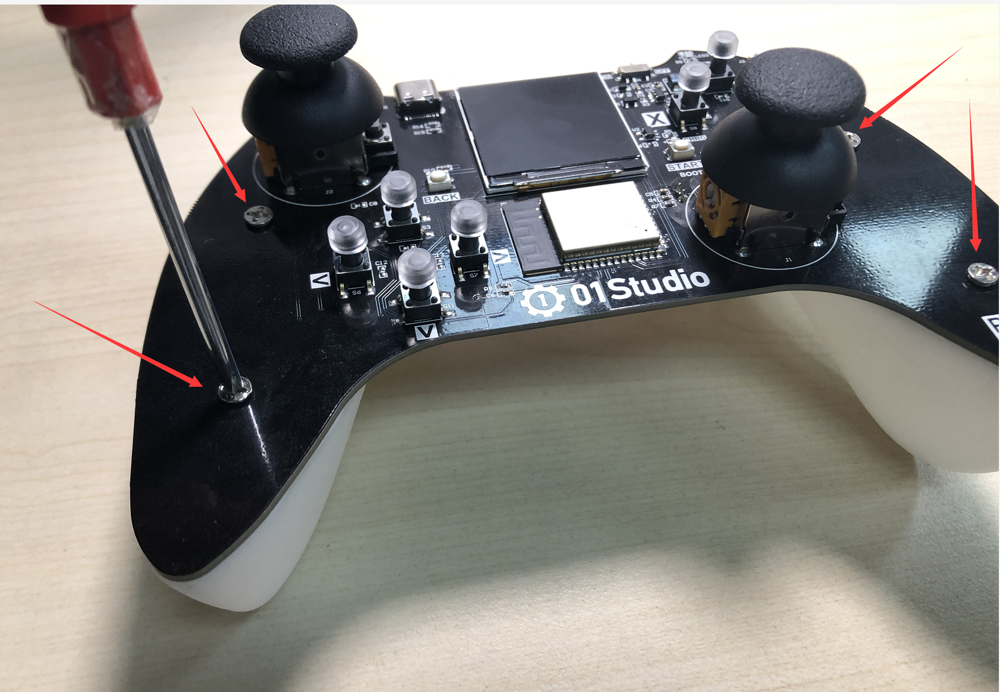
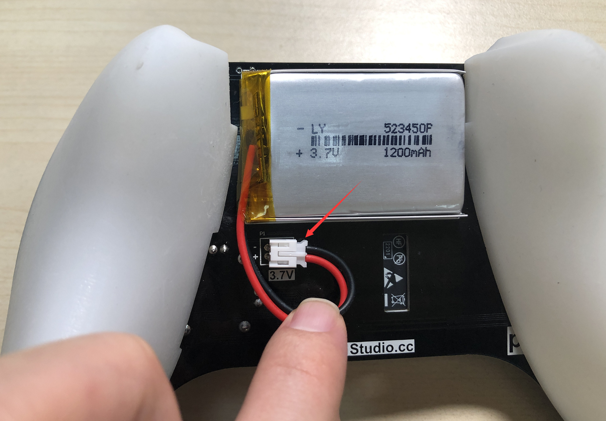
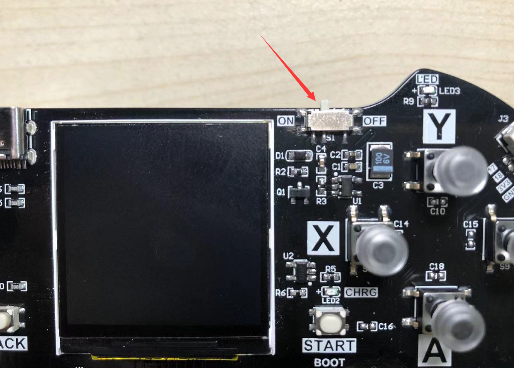
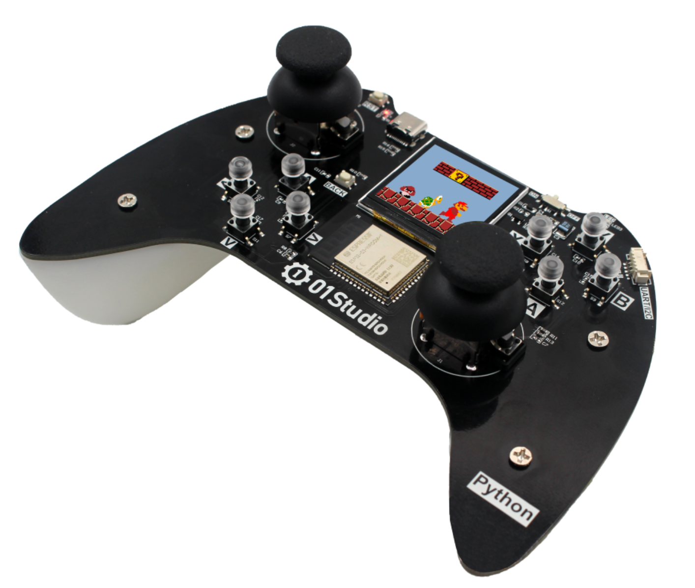

# pyController组装

pyController遥控手柄采用PCB一体化设计，无需焊接，组装非常简单，以下是详细的安装步骤：

拿到pyController套件后先检查默认发货清单配件是否齐全。

## 安装摇杆帽和按键帽

安装摇杆帽，直接插入即可。

安装8个硅胶按键帽，直接套上即可。

## 安装柄托

安装左右两个柄托，使用配套的螺丝拧紧。

## 锂电池和开关

将背面锂电池电源线接上。

电源开关位于右上角拨码开关，ON是开，OFF是关。

至此，pyController组装完成。

