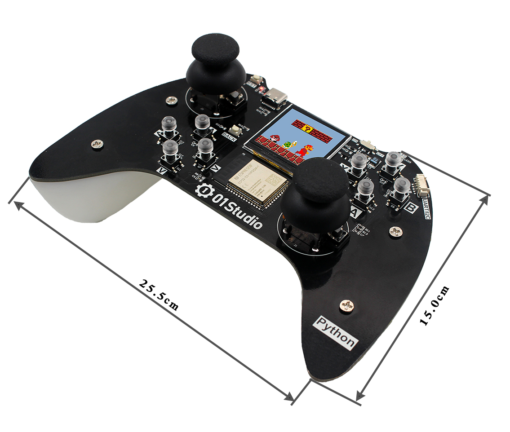

# pyController简介

pyController是由01Studio(01科技)发起的MicroPython开源游戏/遥控手柄项目。

Micropython是指使用Python做各类嵌入式硬件设备编程。MicroPython发展势头强劲，01Studio一直致力于Python嵌入式编程，特此推出pyDrone开源项目，旨在让MicroPython变得更加流行。使用MicroPython，你可以轻松地实现手柄控制、NES游戏、蓝牙WiFi遥控等功能。

## 硬件资源

01Studio pyDrone使用乐鑫科技ESP32-S3(N8R2)主控。

## 基本参数

## 详细参数

|  产品参数 |
|  :---:  | ---  |
| 主控  | ESP32-S3-WROOM-1 （N8R2，Flash:8MBytes，RAM:2MBytes）;支持WiFi/BLE |
| LED  | x3    ● 电源指示灯：红色    ● 充电指示灯：橙色    ● 可编程LED：蓝色 |
| 按键  | x11：1个复位键 + 11个功能键 |
| 摇杆  | x2：360°带确认键 |
| 显示屏  | 1.54寸，分辨率240x240 |
| 锂电池  | 1200mAh |
| TYPE-C口  | 烧录/调试/充电多合一 |
| 扩展接口  | xh-1.25mm-4P, UART/I2C接口 |
| 开关  | 拨码开关 |

## 尺寸图

