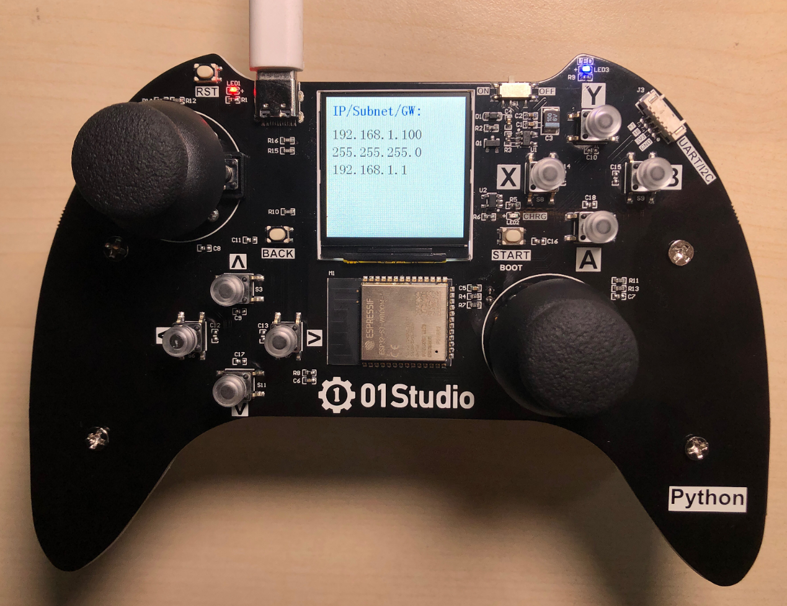

# 连接无线路由器

## 前言
WIFI是物联网中非常重要的角色，现在基本上家家户户都有WIFI网络了，通过WIFI接入到互联网，成了智能家居产品普遍的选择。而要想上网，首先需要连接上无线路由器。这一节我们就来学习如何通过MicroPython编程实现连上路由器。

## 实验目的
编程实现连接路由器，将IP地址等相关信息通过串口终端打印（只支持2.4G网络）。

## 实验讲解

连接路由器上网是我们每天都做的事情，日常生活中我们只需要知道路由器的账号和密码，就能使用电脑或者手机连接到无线路由器，然后上网冲浪。

MicroPython已经集成了network模块，开发者使用内置的network模块函数可以非常方便地连接上路由器。但往往也有各种连接失败的情况，如密码不正确等。这时候我们只需要再加上一些简单的判断机制，避免陷入连接失败的死循环即可！

我们先来看看network基于WiFi（WLAN模块）的构造函数和使用方法。

## network对象

### 构造函数
```python
wlan = network.WLAN(interface_id)
```
构建WiFi连接对象。 

- `interface_id`: 无线模式：
    - `network.STA_IF`: 客户端（STA）模式;
    - `network.AP_IF`: 热点（AP）模式。

### 使用方法
```python
wlan.active([is_active])
```
激活或停用网络接口。
- `[is_active]`: 激活或停用网络接口，参数为空时返回当前接口状态：
    - `True`: 激活网络接口;
    - `False`: 关闭网络接口。

<br></br>

```python
wlan.scan()
```

扫描允许访问的SSID。

<br></br>

```python
wlan.isconnected()
```
检查设备是否已经连接上。返回 `Ture`:已连接；`False`:未连接。

<br></br>

```python
wlan.connect(ssid,passwork)
```
WIFI连接。
- `ssid`: 账号；
- `passwork` : 密码；

<br></br>

```python
wlan.ifconfig([(ip, subnet, gateway, dns)])
```
配置WiFi信息，当参数为空时表示查看WiFi连接信息。
- `ip`: IP地址；
- `subnet` : 子网掩码；
- `gateway`: 网关地址；
- `dns` : DNS信息。

**例：wlan.ifconfig(('192.168.1.110', '255.255.255.0', '192.168.1.1', '8.8.8.8')) 。**

<br></br>

```python
wlan.disconnected()
```
断开连接。

<br></br>

更多用法请阅读官方文档：<br></br>
https://docs.micropython.org/en/latest/library/network.WLAN.html

从上表可以看到MicroPython通过模块封装，让WIFI联网变得非常简单。模块包含热点AP模块和客户端STA模式，热点AP是指电脑端直接连接开发板发出的热点实现连接，但这样你的电脑就不能上网了，因此我们一般情况下都是使用STA模式。也就是电脑和设备同时连接到相同网段的路由器上。

模块上电后可以先判断是否已经连接到网络，如果是则无需再次连接，否的话则进入WIFI连接状态，指示灯闪烁，连接成功后指示灯常亮，IP等相关信息通过OLED显示和串口打印。另外需要配置超时15秒还没连接成功时执行取消连接，避免因无法连接而陷入死循环。

代码编写流程如下：


```mermaid
graph TD
    导入相关模块 --> 初始化相关模块 --> 检测识别是否已经联网 --否--> 连接WiFi,指示灯闪烁-->连接成功--是--> 打印IP信息并在LCD显示--> 结束;
    检测识别是否已经联网 --是--> 打印IP信息并在LCD显示;
    连接成功--否--> 结束;
```

## 参考代码

```python
'''
实验名称：连接无线路由器
版本：v1.0
日期：2022.4
作者：01Studio
说明：编程实现连接路由器，将IP地址等相关信息通过LCD显示（只支持2.4G网络）。
'''
import network,time
from machine import Pin
from tftlcd import LCD15

#定义常用颜色
RED = (255,0,0)
GREEN = (0,255,0)
BLUE = (0,0,255)
BLACK = (0,0,0)
WHITE = (255,255,255)

########################
# 构建1.5寸LCD对象并初始化
########################
d = LCD15(portrait=1) #默认方向竖屏

#填充白色
d.fill(WHITE)

#WIFI连接函数
def WIFI_Connect():

    WIFI_LED=Pin(46, Pin.OUT) #初始化WIFI指示灯

    wlan = network.WLAN(network.STA_IF) #STA模式
    wlan.active(True)                   #激活接口
    start_time=time.time()              #记录时间做超时判断

    if not wlan.isconnected():
        print('connecting to network...')
        wlan.connect('01Studio', '88888888') #输入WIFI账号密码

        while not wlan.isconnected():

            #LED闪烁提示
            WIFI_LED.value(1)
            time.sleep_ms(300)
            WIFI_LED.value(0)
            time.sleep_ms(300)

            #超时判断,15秒没连接成功判定为超时
            if time.time()-start_time > 15 :
                print('WIFI Connected Timeout!')
                break

    if wlan.isconnected():
        #LED点亮
        WIFI_LED.value(1)

        #串口打印信息
        print('network information:', wlan.ifconfig())
        
        #显示IP信息
        d.printStr('IP/Subnet/GW:',10,10,color=BLUE,size=2)
        d.printStr(wlan.ifconfig()[0],10,50,color=BLACK,size=2)
        d.printStr(wlan.ifconfig()[1],10,80,color=BLACK,size=2)
        d.printStr(wlan.ifconfig()[2],10,110,color=BLACK,size=2)

#执行WIFI连接函数
WIFI_Connect()

```

## 实验结果

将上面代码中的：

```python
wlan.connect('01Studio', '88888888') #输入WIFI账号密码
```

**改成自己的无线路由器账号密码，只支持2.4G信号。不支持5G或者2.4G&5G混合信号。**

下载程序，可以观察到上电后pyController上的LED快速闪烁，连接成功后LED常亮，LCD屏显示当前IP、子网掩发、网关的地址信息。



本节是WIFI应用的基础，成功连接到无线路由器的实验后，后面就可以做socket和MQTT等相关网络通信的应用了。