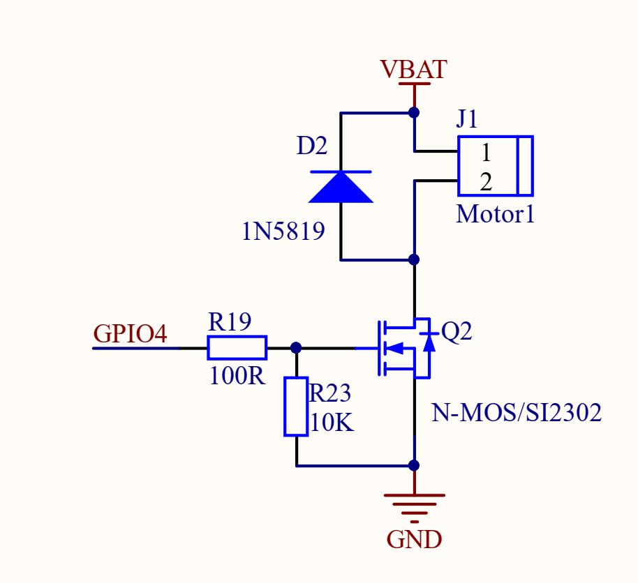
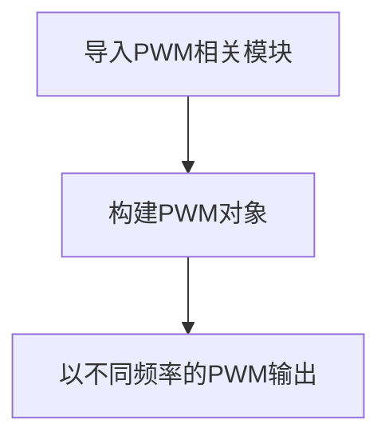
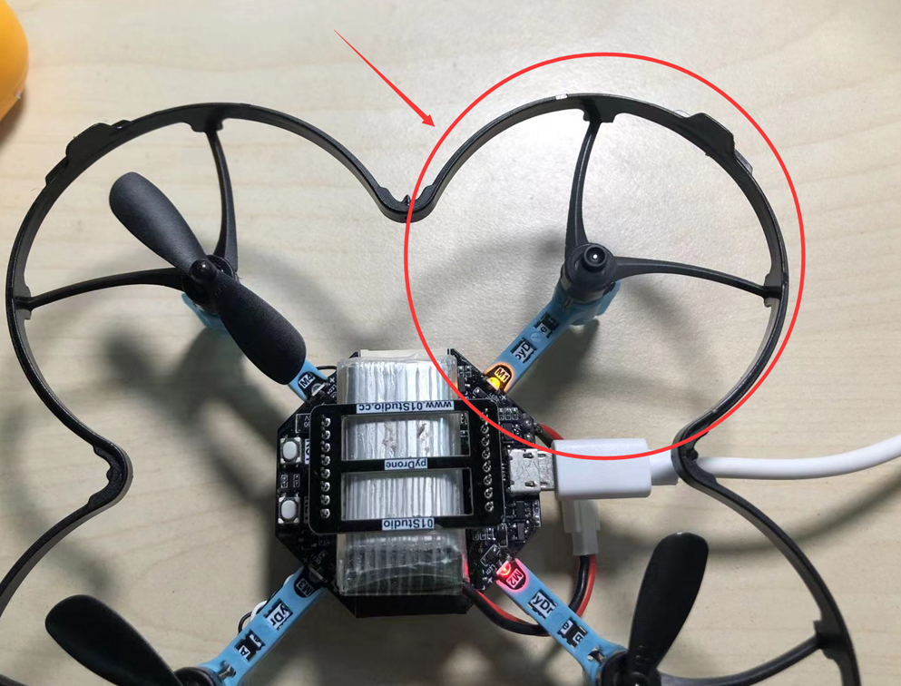

# 空心杯电机（PWM）

## 前言
PWM（脉冲宽度调制）就是一个特定信号输出，主要用于输出不同频率、占空比（一个周期内高电平出现时间占总时间比例）的方波。以实现固定频率或平均电压输出。

pyDrone上有4个716空心杯电机（四轴名称的由来）。今天我们试试用python pwm代码来控制电机的转速，从而学习电机控制原理。


## 实验目的
通过PWM信号控制pyDrone上的空心杯电机转速。

## 实验讲解

电机控制主要用到PWM（脉冲宽度调制），GPIO输出不同频率、占空比（一个周期内高电平出现时间占总时间比例）的方波。以实现固定频率或平均电压输出。

如下图，可以看到当频率固定时，占空比越大（高电平占时间越长），等效电压越高，电机转速就越快。


我们使用电机M1来测试，从下面原理图可以看到电机M1驱动电路连接到主控模块（ESP32-S3模块）的GPIO4。



PWM 可以通过ESP32-S3所有GPIO引脚输出. 所有通道都有1个特定的频率，从0到40M之间（单位是Hz）。占空比的值为0至1023之间。在本实验中我们用到引脚4。先来看看PWM对象和使用方法。


## PWM对象

### 构造函数
```python
pwm = machine.PWM(machine.Pin(id), freq, duty)
```
构建PWM对象，PWM对象位于machine模块下。

- `machine.Pin(id)` ：引脚编号，如Pin(12);
- `freq` ：PWM频率，单位：Hz, 范围：1-40MHz;
- `duty` ：PWM占空比，范围：0-1023;

### 使用方法
```python
pwm.freq([value])
```
设置频率。不传参数返回当前频率。

<br></br>

```python
pwm.duty([value])
```
设置占空比。不传参数返回当前占空比。

<br></br>

```python
pwn.deinit()
```
注销PWM。

<br></br>

更多用法请阅读官方文档：<br></br>
https://docs.micropython.org/en/latest/library/machine.PWM.html#machine-pwm

<br></br>

由于这个主要是调占空比，因此我们只需要固定一个频率即可，飞控通常用10k~15kHz，我们这里用固定10KHz频率。

结合上述讲解，总结出代码编写流程图如下：



## 参考代码

```python
'''
实验名称：PWM
版本：v1.0
日期：2022.4
作者：01Studio
说明：通过不同频率的PWM信号输出，控制空心杯电机M1的转速。
'''

from machine import Pin, PWM
import time

# 初始化PWM, 频率10000Hz，占空比0（占空比范围：0~1023）。
M1 = PWM(Pin(4), freq = 10000 ,duty=0) 

#占空比200输出
M1.duty(200)
time.sleep(1)

#占空比500输出
M1.duty(500)
time.sleep(1)

#占空比1000输出
M1.duty(1000)
time.sleep(1)

#停止
M1.deinit()

```

## 实验结果

在Thonny IDE运行程序，可以看到电机M1以不同转速旋转。



有条件的朋友可以使用示波器测量pyWiFi-ESP32-S3的引脚4接口，观察信号波形的变化：


本节用顶层方式实现了电机控制，旨在了解电机控制原理。在飞控实际飞行过程中对控制实时速度要求非常高。
